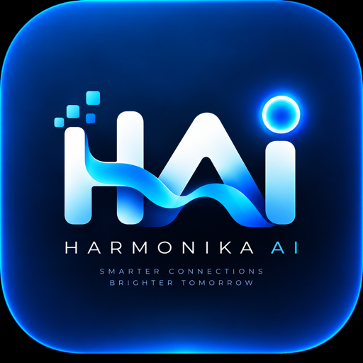
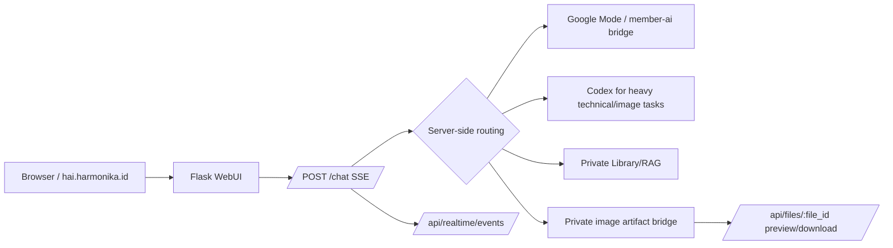

<p align="center">
  
</p>

<h1 align="center">Harmonika AI WebUI</h1>

<p align="center">
  Web chat AI modern untuk <strong>hai.harmonika.id</strong> — streaming realtime, Google Mode orchestration, Codex routing, upload dokumen/gambar, image artifact privat, Library/RAG per device, dan dashboard observability.
</p>

<p align="center">
  <a href="https://hai.harmonika.id"></a>
  
  
  
</p>

<p align="center">
  <a href="#fitur-utama">Fitur</a> ·
  <a href="#arsitektur-ringkas">Arsitektur</a> ·
  <a href="#endpoint-untuk-developer">Endpoint</a> ·
  <a href="#quick-start-local">Quick Start</a> ·
  <a href="#qa--release-check">QA</a>
</p>

---

## Gambaran singkat

Harmonika AI WebUI adalah fork/custom dari `Toy-97/Chat-WebUI` yang dibangun ulang untuk kebutuhan publik Harmonika. Browser cukup memakai endpoint web sederhana; routing engine seperti Google Mode, Codex, image bridge, Library grounding, dan replay stream dikerjakan server-side agar credential/internal engine tidak terekspos ke pelanggan.

> Production saat ini berjalan di `https://hai.harmonika.id` dengan marker asset `20261007-phase326`.

## Fitur utama

| Area | Status | Ringkasan |
| --- | --- | --- |
| 💬 Chat AI umum | ✅ Production | Chat umum, ide, konten, coding ringan, analisa, dan teman ngobrol. |
| ⚡ Streaming realtime | ✅ Production | SSE streaming dengan loading teks/gambar yang dipoles, Stop, Queue, Regenerate, dan replay fallback. |
| 🧭 Google Mode orchestration | ✅ Production | Default untuk jawaban umum, web, file, image input, dan percakapan natural. |
| 🛠️ Codex routing | ✅ Production | Dipakai untuk tugas teknis berat/development dan task gambar privat sesuai policy backend. |
| 📎 Upload dokumen | ✅ Production | PDF, TXT, CSV, DOCX, XLSX; maksimal 3 lampiran/pesan dan batas 10 MB. |
| 🖼️ Upload gambar/vision | ✅ Production | PNG/JPEG/WebP untuk analisis gambar melalui pipeline vision. |
| 🎨 Image generation | ✅ Production | Hasil gambar sebagai artifact privat `file_id`, preview/download via proxy lokal, tanpa public URL permanen. |
| 📚 Library/RAG per device | ✅ Foundation | Upload, search, snippet grounding, toggle Cuplikan/Penuh; tetap tidak mengekspos full text ke UI. |
| 🔎 Referensi web | ✅ Production | Source chips/favicon compact, tanpa menampilkan full URL panjang di bubble. |
| 📊 Admin observability | ✅ Production | `/admin` dan `/api/admin/overview` aggregate-only tanpa isi chat/dokumen/device ID. |

## Tampilan dan UX

- 🧑‍💻 Tampilan chat klasik-modern gaya dashboard: sidebar gelap, topbar putih, chat surface bersih.
- ✍️ Markdown rich: heading, list, tabel, LaTeX, code block dengan tombol salin.
- 🤖 Loading jawaban Phase323: robot typing card solid/readable, skeleton halus, typewriter streaming yang tidak langsung dump saat backend selesai cepat, dan animasi gambar terpisah.
- 📱 Responsif: desktop, mobile, tablet, landscape, keyboard/composer, dan sidebar mobile.
- 🔒 Guard publik: sanitizer Markdown, no public media URL, no terminal/file-manager leak, rate limit, security headers.

## Arsitektur ringkas



Jika GitHub tidak merender diagram Mermaid, ringkasnya:

1. Browser memanggil endpoint web publik.
2. Backend memilih mode/engine secara server-side.
3. Response dikirim streaming ke UI.
4. File/gambar tetap lewat artifact privat, bukan URL publik permanen.

## Endpoint untuk developer

Dokumentasi lengkap endpoint ada di:

➡️ [docs/developer-api-endpoints.md](docs/developer-api-endpoints.md)

Endpoint penting:

| Endpoint | Fungsi |
| --- | --- |
| `POST /chat` | Streaming chat utama. |
| `GET /api/capabilities` | Feature flags dan limit production. |
| `GET /api/readiness` | Status production, gate, roadmap, dan core readiness. |
| `POST /api/attachments/parse` | Parse lampiran sementara untuk chat. |
| `POST /api/images/generations` | Generate gambar via backend server-side. |
| `GET /api/files/{file_id}/preview` | Preview artifact privat. |
| `GET /api/files/{file_id}/download` | Download artifact privat. |
| `GET/POST /api/library/documents` | Library dokumen per device. |
| `POST /api/library/search` | Search snippet Library/RAG. |
| `GET/PUT/POST /api/history` | History lokal web per device. |
| `GET /api/realtime/events` | Replay/resume event stream. |
| `POST /api/realtime/ticket` | Kontrak ticket WSS masa depan; fail-safe jika WSS belum aktif. |
| `GET /api/admin/overview` | Observability aggregate-only. |
| `GET /healthz` | Health check service. |

Contoh streaming:

```bash
curl -N https://hai.harmonika.id/chat \
  -H 'Content-Type: application/json' \
  -H 'Accept: text/event-stream' \
  --data '{"message":"Beri 3 ide promosi usaha makanan rumahan"}'
```

## Quick start local

```bash
python3 -m venv .venv
. .venv/bin/activate
pip install -r requirements.txt

export HAI_PORT=3002
python app.py
```

Buka:

```text
http://127.0.0.1:3002
```

## Environment production

Minimal env yang disarankan:

```bash
HAI_PORT=3002
HAI_FLASK_SECRET=<secret-panjang>
HAI_DEVICE_SECRET=<secret-panjang-berbeda>
HAI_RATE_LIMIT_STORAGE=file
HAI_MEMBER_AI_BASE_URL=https://chat.harmonika.id/v1/member-ai
HAI_MEMBER_AI_TOKEN=<token-server-side-jangan-commit>
```

Credential/API key tidak boleh disimpan di repo. Simpan di secret store atau env server.

## QA & release check

Perintah cepat:

```bash
node --check static/js/scripts.js
python3 -m py_compile app.py scripts/*.py
python3 scripts/hai_gemini_report_qa.py
```

Audit production:

```bash
python3 scripts/hai_release_audit.py \
  --base-url https://hai.harmonika.id \
  --expected-asset-marker 20261007-phase326
```

Browser QA streaming:

```bash
python3 scripts/hai_browser_qa.py \
  --url https://hai.harmonika.id \
  --viewport desktop \
  --flow streaming-states
```

## Struktur repo

```text
.
├── app.py                         # Backend Flask, routing, streaming, API
├── templates/                     # HTML index/admin
├── static/
│   ├── css/styles.css             # UI system dan final cascade
│   ├── js/scripts.js              # Chat UI, streaming, history, uploads
│   └── images/                    # Logo dan icon HAI
├── scripts/                       # QA, release audit, production checks
├── docs/
│   ├── developer-api-endpoints.md # Kontrak endpoint developer
│   └── phase*.md                  # Catatan fase/audit historis
└── requirements.txt
```

## Status release terbaru

- Production URL: `https://hai.harmonika.id`
- UI marker: `20261007-phase326`
- Release audit terakhir: `6/6 OK`
- Streaming QA desktop/mobile: OK
- Gemini report QA: `99/99`
- Full platform complete: belum diklaim; roadmap besar seperti WSS penuh, voice/video, calendar automation, dan RAG eksternal masih bertahap.

---

<details>
<summary><strong>📜 Changelog fase lengkap</strong> — klik untuk membuka riwayat panjang development</summary>

## Perubahan custom

- API key dan base URL dikunci server-side via environment.
- User tidak perlu membuka/isi Settings API.
- Model default: `harmonika-ai`.
- Endpoint health: `/healthz`.
- Port default mengikuti `HAI_PORT` atau `3002`.
- Link chat stabil: `/c/{session_id}`.
- Riwayat MVP tersimpan per device/browser via `/api/history`.
- UI MVP publik: empty state, quick prompts, composer modern, status streaming, dan render jawaban Markdown/SVG.
- Sidebar mobile memakai overlay/backdrop class-based agar tidak bentrok dengan layout desktop.
- Readability Phase 6: typography Markdown, code block modern, table responsive, action buttons, dan image/SVG preview dipolish.
- History Phase 7: sidebar chat list lebih rapi, title disanitasi, meta waktu tampil, dan hapus chat memakai konfirmasi.
- History Phase 8: rename chat dari sidebar/header dan salin link chat aktif.
- History Phase 9: search/filter riwayat chat dan empty state sidebar.
- Onboarding Phase 10: capability chips dan prompt cards untuk chat umum, coding, ringkas, ide, dan visual SVG.
- Hardening Phase 11: security headers, JSON validation, body-size guard, dan rate limit ringan untuk endpoint publik.
- Debug/Polish Phase 12: empty state template dibersihkan, assistant response dibuat lebih ChatGPT-like, sticky autoscroll streaming, dan error/stop bubble tidak nyangkut.
- Debug/Polish Phase 13: guard streaming dobel, empty state hilang saat pesan pertama, sanitizer Markdown, header SSE anti-buffer, mobile/focus polish, dan fallback reasoning tag diperbaiki.
- Debug/Polish Phase 14: race condition pindah/reset chat saat streaming diperbaiki, render streaming dibatch per frame, prompt sistem dikunci server-side, parameter model di-whitelist, dan error stream dibuat aman untuk user.
- UI MVP Phase 15: composer, bubble chat, typography Markdown, action buttons, status streaming, dan mobile touch target dipoles agar lebih mendekati ChatGPT/Claude/Z.ai.
- Opencode audit hotfix Phase 15: XSS nama file ditutup, default reasoning tag disinkronkan, `/api/history` menerima POST sendBeacon, edit/delete diblok saat streaming, popstate meng-abort stream, dan tinggi composer JS disamakan dengan CSS.
- Stability Phase 16: server history diberi lock file/thread, write atomik memakai tmp unik + fsync, history merge per chat berdasarkan `updated`, base64 gambar di-strip dari riwayat/sync, push history memeriksa `response.ok`, retry stripped untuk 413/409, pagehide memakai payload ringan, dan rate-limit tidak percaya proxy header kecuali env mengaktifkan.
- Sync Phase 17: delete tombstone ditambahkan ke client/server history sehingga chat yang dihapus di satu tab tidak hidup lagi saat tab lain melakukan sync stale. CSS cleanup besar ditunda sampai ada screenshot regression karena banyak class dinamis (`is-streaming`, `hai-typing`, `toast`, `language-*`, message containers).
- Hardening Phase 18: CORS tidak lagi wildcard secara default, origin lintas-domain harus diizinkan eksplisit via env, secret production diberi warning bila masih fallback, `Retry-After` pada rate-limit `/api/history` dipertahankan, dan cache-bust asset dinaikkan.
- UI Phase 19: surface chat dibuat lebih modern terinspirasi pola ChatGPT/Claude secara mandiri, duplicate DOM id `assistant-message/user-message` diganti class, hover sidebar yang lompat ditutup, Babel/Svelte unused dihapus, typography/composer/bubble diberi override final, dan opencode melakukan audit GO sebelum deploy.
- Theme/Tech Phase 20: ditambahkan theme class `hai-theme-chatgpt-pattern` untuk shell netral minimal seperti pola ChatGPT, composer card/pill, quick actions, hero prompt, sidebar/history compact, dan dead DOM updater lama dibersihkan. Teknologi tetap mandiri: Flask + Gunicorn, vanilla JS state/orchestration, React UMD khusus Markdown renderer, IndexedDB + server sync, SSE streaming.
- Streaming UX Phase 21: client menambahkan intent detector yang selaras dengan server untuk membedakan prompt teks dan prompt gambar. Waiting state teks memakai typing dots, sedangkan prompt gambar memakai kartu kanvas shimmer “mendesain gambar”, status dan tombol Stop ikut berubah sesuai mode.
- Workflow UX Phase 22: saran Gemini AI mulai diintegrasikan sebagai workflow state. Pembuatan gambar kini punya step preview bertahap (`Mengonversi prompt → Merakit komposisi → Mewarnai piksel → Menyelesaikan render`) dengan timer cleanup agar tidak nyangkut. Roadmap besar berikutnya: regenerate eksplisit, citations chips, upload multimodal native, dan side artifact/canvas.
- Regenerate Phase 23: tombol Regenerate eksplisit ditambahkan ke action bar assistant. Regenerate hanya aktif untuk jawaban terakhir agar riwayat tidak bercabang; prompt user terakhir dipakai ulang, assistant lama diganti dengan stream baru, serta intent image/text dan progress gambar tetap mengikuti workflow Phase 21/22.
- Sources/Citations Phase 24: hasil web/search kini bisa membawa metadata `sources[]` lewat header `X-HAI-Sources` tanpa mengubah body SSE. UI menampilkan chip sumber setelah final response, menyimpannya ke history, dan menampilkan ulang setelah refresh. Jika backend/engine tidak mengirim sources, UI tetap bersih tanpa panel sumber palsu.
- Auto Web Grounding Phase 25: backend otomatis memakai web/search untuk pertanyaan yang jelas butuh info terbaru seperti berita, harga, jadwal, cuaca, skor, promo, tren, atau tahun berjalan. User tetap bisa memaksa pencarian dengan `@s`. Chat umum biasa tidak dipaksa search agar tetap cepat dan natural.
- Compact References Phase 26: tampilan referensi web diperkecil dan tidak lagi mencetak full URL di UI. Satu-dua sumber tampil sebagai chip kecil favicon + judul/domain; tiga sumber atau lebih tampil sebagai favicon bertumpuk dengan overlap agar rapi seperti referensi modern.
- Artifact Canvas Phase 27: ditambahkan side canvas untuk artifact. Thumbnail SVG/gambar membuka panel preview besar di kanan desktop atau bottom sheet di mobile; code block panjang mendapat tombol Canvas untuk membaca/copy/download kode tanpa memenuhi bubble chat.
- Composer Upload Phase 28: upload web dibuat lebih modern. File/gambar kini masuk sebagai pending chip di atas composer, tidak langsung mencampur riwayat. Saat user menekan Kirim, lampiran dikirim bersama prompt; bubble user menampilkan ringkasan lampiran compact. Didukung awal: PDF, TXT, CSV, DOCX, PNG, JPEG, dan WebP.
- Message Queue Phase 29: saat AI masih streaming, user bisa menyiapkan pesan berikutnya. Menekan Enter/Kirim dengan draft baru akan menyimpan satu antrean dan otomatis mengirimnya setelah jawaban aktif selesai atau dihentikan. Tombol tetap berfungsi sebagai Stop ketika composer kosong.
- Lightweight Memory Phase 30: ditambahkan memory ringan per device/browser. Client menangkap fakta sederhana seperti nama/panggilan, preferensi bahasa, minat, usaha, pekerjaan, atau domisili dari ucapan user; backend menerima `memoryContext` kecil dan menggunakannya hanya bila relevan tanpa menyebut engine/memory.
- Image Artifact Guard Phase 31: jalur “buat gambar” web tidak lagi dikirim ke engine chat lama yang bisa membocorkan terminal/file manager/link publik. Backend kini menghasilkan artifact SVG self-contained langsung dari `/chat`, mengirim header `X-HAI-Intent: image`, dan menyediakan `/api/capabilities` + `/api/images/generations` untuk kontrak capability/gambar web yang aman.
- Member AI Image Bridge Phase 32: ditambahkan bridge opsional ke backend resmi `chat.harmonika.id/v1/member-ai`. Jika env `HAI_MEMBER_AI_TOKEN` tersedia, `/chat` intent gambar mencoba `/images/generations`, membaca job/event/status, lalu menampilkan artifact private `file_id` lewat proxy lokal `/api/files/{file_id}/preview|download` agar URL/token backend tidak terekspos. Jika token/backend belum siap, otomatis fallback ke SVG artifact Phase 31.
- Image UX Polish Phase 34: kartu hasil gambar private PNG dibuat lebih rapi dengan tombol `Lihat` dan `Unduh PNG`. Klik thumbnail/tombol membuka modal preview 50% di halaman, bisa ditutup dengan klik area luar/Escape, tanpa membuka tab baru atau mengekspos URL backend.
- Reference UI Phase 37: source chips kini mendukung metadata `sources[]` yang punya URL maupun hanya nama sumber/snippet. URL penuh tetap tidak dicetak di bubble; sumber tanpa URL tampil sebagai chip/logo static yang rapi dan tetap tersimpan di history.
- Production Hardening Phase 38: health/capabilities mengekspor status aman tanpa secret: `security.flask_secret_configured`, `security.device_secret_configured`, dan `features.sources_without_url`. File env production diverifikasi `600 root:root`, secret 64 karakter, dan service log bersih dari warning secret.
- Reference UX Phase 39: stack referensi untuk banyak sumber kini bisa dibuka menjadi panel detail kecil berisi judul, sumber/domain, dan snippet pendek. URL penuh tetap tidak dicetak; sumber dengan URL bisa diklik, sumber tanpa URL tampil static.
- Web Media Upload Phase 40: upload dokumen web kini diparse server-side melalui `/api/attachments/parse` untuk PDF/TXT/CSV/DOCX/XLSX, batas upload diselaraskan 10 MB, accepted MIME diekspos di `/api/capabilities`, dan chip lampiran membedakan gambar siap dianalisis AI vs dokumen/spreadsheet siap dibaca. Gambar tetap dikirim per-request ke engine vision OpenWebUI agar tidak mencampur session publik.
- Multi Attachment Phase 41: composer web kini mendukung sampai 3 lampiran per pesan. File picker/drop/paste tetap memakai chip ringkas seperti WhatsApp, queue draft saat streaming ikut menyimpan multi-lampiran, bubble user menampilkan beberapa chip attachment, dan `/api/capabilities` mengumumkan `attachments_per_message: 3`.
- Multi Attachment Polish Phase 42: tray lampiran kini menampilkan counter `x/3`, chip dibuat lebih stabil di mobile, guard slot tersisa tetap ramah saat user memilih lebih dari 3 file, dan smoke production memverifikasi capabilities/parser tetap sehat.
- Attachment History Hardening Phase 43: format pesan user dengan multi-lampiran dinormalisasi untuk edit, delete, memory, dan export Markdown supaya tidak muncul `undefined` dan tetap menampilkan ringkasan lampiran yang aman tanpa base64/raw file penuh.
- Attachment Flow Polish Phase 44: status antrean sekarang menampilkan draft teks sekaligus jumlah/nama lampiran, dan drag/drop diberi overlay “Lepaskan file di sini” agar flow upload multi-file terasa lebih jelas seperti chat modern.
- Drag & Drop Stability Phase 45: overlay drop file kini memakai drag-depth counter agar tidak flicker saat kursor melewati child element chat, dan multi-file upload memberi toast jumlah lampiran yang siap dikirim.
- Premium Chat Surface Phase 46: layer CSS final override ditambahkan untuk membuat chat surface lebih modern seperti ChatGPT/Claude/Z.ai: lebar baca 760px, spacing pesan lebih lega, avatar HAI kecil untuk assistant, bubble user lebih rapi, typography Markdown lebih nyaman, code/table/blockquote lebih premium, dan composer floating lebih solid.
- Empty State & Sidebar Phase 47: halaman awal dan sidebar dipoles agar tidak terasa template lama: empty state memakai hero glow, logo lebih premium, suggestion cards lebih modern, sidebar/history diberi depth ringan, active chat punya aksen cyan, dan search/export/sidebar buttons lebih rapi.
- Top Bar & Composer Phase 48: header, tombol Rename/Salin, quick prompts, status/queue pill, attachment tray, dan composer dipoles agar menyatu dengan sistem desain Phase 46/47. Composer kini lebih glassy, tombol kirim punya aksen cyan, quick prompt menjadi pill modern, dan status streaming lebih rapi.
- Screenshot QA Phase 49: dilakukan screenshot desktop/mobile dengan Chrome headless. Bug yang ditemukan dan diperbaiki: empty state tidak muncul pada load kosong, tombol hidden `Private Chat/Deep Query` tampil karena CSS lama mengalahkan atribut `hidden`, dan mobile viewport melebar/terpotong karena sidebar/buttons memengaruhi layout. Ditambahkan fallback welcome, `[hidden]` override kuat, dan mobile width/sidebar fixes.
- Message Actions Phase 50: action bar pesan dipoles menjadi pill modern dengan label aksesibilitas/tooltip, mobile action tetap touch-friendly, state streaming menyembunyikan tombol aksi agar tidak mengganggu, typing indicator diberi micro-animation, dan assistant final mendapat reveal halus.
- Responsive QA Phase 51: hardening akhir untuk layout chat desktop/mobile: user bubble dan action buttons dipisah vertikal, quick prompts mobile menjadi horizontal-scroll yang aman, composer memakai safe-area lebih kuat, attachment tray diberi batas tinggi, teks panjang/URL/code/table tidak memaksa overflow, dan empty state mobile dipadatkan tanpa memotong konten.
- Smart Scroll Phase 52: auto-scroll streaming dibuat lebih sopan. Jika user sedang dekat bawah, jawaban tetap mengikuti stream; jika user scroll ke atas untuk membaca riwayat, UI tidak menarik paksa ke bawah dan menampilkan tombol floating “Ke terbaru” untuk kembali ke pesan terbaru.
- Composer State Phase 53: composer kini punya state visual yang lebih jelas. Tombol kirim meredup saat kosong, menyala saat ada draft/lampiran, berubah menjadi Stop saat AI menjawab, dan berubah menjadi Queue saat user mengetik pesan baru ketika jawaban masih streaming. Klik kirim kosong memberi nudge singkat tanpa mengirim request.
- AdminLTE Classic Phase 54: arah visual diganti dari gaya AI/neon/glass ke tema dashboard klasik ala AdminLTE: sidebar gelap, header putih, konten light gray, bubble/card putih, tombol form-control klasik, border 4px, dan warna Bootstrap/AdminLTE yang lebih netral untuk publik.
- AdminLTE Cleanup Phase 55: audit Claude menutup sisa visual neon/glass dari tema lama: streaming sweep cyan, typing dot glow, status image gradient, image generating preview, artifact panel gelap, dan tooltip gelap dinetralkan ke warna AdminLTE classic.
- AdminLTE Mobile Topbar Phase 56: audit Claude memperbaiki topbar mobile agar tidak bergantung pada padding statis 112px. Lebar ruang tombol sidebar kini dihitung dari variabel CSS, tombol sidebar mobile terlihat di topbar terang, judul panjang memakai ellipsis, dan layout 390px/820px tidak saling tindih.
- AdminLTE Chat Content Phase 57: audit Claude memperbaiki kualitas isi chat: bubble assistant dipaksa ke kolom konten agar tidak menyempit di kolom avatar, markdown heading/list/blockquote/table/code block dirapikan, source chips dibuat lebih tenang, dan status streaming mobile dibatasi agar tidak overflow.
- AdminLTE Artifact & Attachment Phase 58: artifact SVG/image card, tombol Lihat/Unduh, chip lampiran user, stack sumber, dan source count dipoles agar mengikuti AdminLTE classic: border tipis, background putih/abu-abu, tombol 4px, tanpa glow/neon.
- AdminLTE Production Hardening Phase 59: focus-visible, link, source detail panel, attachment tray, scrollbars code/table, artifact backdrop/actions, dan toast distabilkan ke pola AdminLTE classic agar state interaktif tetap rapi dan accessible.
- AdminLTE Sidebar Phase 60: sidebar/history/export dipoles lebih mirip nav classic: list riwayat memakai grid, judul/meta ellipsis stabil, tombol rename/delete rapi saat hover/focus, empty history dan export buttons mengikuti warna sidebar AdminLTE.
- AdminLTE Empty State Phase 61: welcome screen dan prompt suggestions diganti menjadi card dashboard classic: copy lebih profesional, capability badges seperti label AdminLTE, suggestion cards seperti info/action boxes, quick prompts seperti button group, dan mobile tetap compact.
- Production Verification Phase 62: smoke produksi diperluas untuk upload parser TXT/CSV/PDF, `/api/history` GET/PUT/reload dengan cookie terisolasi, `@s` web/source stack 3 sumber melalui `X-HAI-Sources`, serta `/chat` SSE. Hasil dicatat di `docs/phase62-production-verification.md`.
- AdminLTE Public MVP Phase 63: shell chat dipoles ulang sebagai dashboard classic yang lebih siap publik: chat surface, topbar, bubble assistant/user, action bar, composer, quick prompts, source chips, attachment tray, artifact width, dan mobile layout distabilkan tanpa mengubah kontrak backend.
- A11y/Security Lite Phase 64: audit Claude ditindaklanjuti sebagian dengan `lang="id"`, aria-label tombol ikon utama, semantics dialog popup, cache-bust phase64, dan sanitizer Markdown menutup tag berisiko seperti `base`, `link`, `meta`, serta animasi SVG aktif.
- Settings Lock Phase 65: endpoint `/save-settings` dipertegas untuk production. Saat pengaturan user dikunci, endpoint tidak lagi re-init global client/base URL dan mengembalikan error JSON `settings_locked` 403 yang aman.
- Streaming State Phase 66: status live utama disatukan lewat helper state untuk teks, referensi web, pembuatan gambar, stop, dan antrean. Badge status/queue mengikuti warna AdminLTE classic agar desktop/mobile tidak terasa berbeda.
- Message Action A11y Phase 67: tombol aksi pesan yang dibuat dari banyak jalur lama dinormalisasi melalui enhancer global: `type=button`, aria-label Bahasa Indonesia, tooltip konsisten, icon dekoratif tidak dibaca screen reader, `aria-busy` aktif saat streaming, dan hapus pesan memakai konfirmasi.
- Contrast/Live Region Phase 68: kontras label sidebar dinaikkan agar lebih readable di tema AdminLTE gelap, `chat-messages` punya `aria-busy=false` dari awal, dan state busy streaming diberi penanda visual yang lebih stabil.
- Mobile Empty State Phase 69: QA screenshot menemukan welcome/empty state mobile terpotong ke kanan. Override mobile final memaksa card, heading, deskripsi, dan suggestion button memakai width 100%, wrap normal, dan tidak overflow horizontal.
- Mobile Text Clipping Phase 70: screenshot lanjutan menunjukkan teks deskripsi/kartu mobile masih terpotong oleh margin/height/overflow lama. Phase ini mereset margin horizontal, padding suggestion, height card, dan line-clamp agar teks wrap penuh.
- Mobile Viewport Containment Phase 71: screenshot Phase 70 membuktikan container masih 100vw plus padding. Phase ini mengunci `chat-wrapper`, `message-container`, dan empty card ke viewport mobile (`calc(100vw - 24px)`) agar konten tidak melewati sisi kanan.
- Final Mobile Containment Phase 72: ditemukan urutan CSS lama Phase 63 berada setelah Phase 71 dan menimpa fix mobile. Phase 72 menaruh override containment sebagai blok paling akhir file agar tidak tertimpa lagi.
- Mobile Suggestion Wrap Phase 73: audit CSS menemukan suggestion button lama masih `display:flex`, yang membuat teks card mobile overflow. Phase ini memaksa suggestion mobile `display:block` agar judul/deskripsi wrap natural.
- Browser QA Harness Phase 74: ditambahkan `scripts/hai_browser_qa.py`, QA browser berbasis Chrome DevTools Protocol tanpa dependency eksternal untuk mengukur viewport, scrollWidth, overflow, body class, CSS aktif, empty state, composer, dan screenshot optional. Ini menggantikan screenshot headless biasa yang sempat misleading.
- History API QA Phase 75: ditambahkan `scripts/hai_history_qa.py` untuk menguji `/api/history` dengan cookie jar terisolasi: GET awal, PUT chat test, GET reload, PUT tombstone delete, dan GET after-delete.
- New Chat Link QA Phase 76: `scripts/hai_browser_qa.py` kini punya `--flow new-chat` untuk klik Chat Baru di browser nyata, memastikan URL berubah ke `/c/{session_id}`, item sidebar aktif memakai ID yang sama, historyCount minimal 1, `aria-busy=false`, dan desktop/mobile tetap tanpa horizontal overflow.
- Public Reasoning Guard Phase 77: renderer publik kini menghapus blok reasoning `<think>...</think>` dari tampilan bubble assistant. Browser QA mendapat `--flow chat-text` untuk mengirim prompt dari UI nyata dan memastikan jawaban tampil tanpa “Thought Process/Sedang menyusun jawaban”, URL session tetap benar, dan `aria-busy=false`.
- Message Actions Polish Phase 78: action bar pesan dibuat lebih compact seperti UI chat modern, tombol `Continue` yang selalu muncul disembunyikan dulu dari publik, dan tooltip/aria tombol action dinormalisasi ke Bahasa Indonesia.
- Action Bar Regression QA Phase 79: selector hide tombol `Continue/Lanjutkan jawaban` diperkuat dan browser QA `chat-text` kini memeriksa action bar visible agar hanya aksi publik relevan yang tampil.
- Composer Focus Polish Phase 80: focus state composer dirapikan ke gaya AdminLTE classic; textarea tidak lagi menampilkan double-outline browser default, sementara tombol upload/kirim tetap punya focus-visible ring untuk aksesibilitas.
- Public Image Copy Phase 81: wording onboarding dan quick prompt gambar dibuat netral sebagai `Gambar/visual`, bukan lagi menonjolkan detail teknis SVG ke user publik.
- Image Artifact Browser QA Phase 82: browser QA mendapat `--flow image-artifact` untuk menguji prompt gambar production: thumbnail private `/api/files/{file_id}/preview`, tanpa URL publik/raw SVG, modal preview sekitar 50% viewport, dan close backdrop.
- QA Composer Wait Phase 83: flow `image-artifact` dibuat lebih tahan load lambat dengan menunggu composer siap sampai 5 detik dan memberi diagnostik URL/body text bila composer tetap tidak ditemukan.
- History Controls Browser QA Phase 84: browser QA mendapat `--flow history-controls` untuk menguji Chat Baru → rename → search/filter → delete active chat → kembali ke `/`, di desktop dan mobile.
- Stop & Regenerate QA Phase 85: browser QA mendapat `--flow stop-stream` dan `--flow regenerate`. Stop cepat kini mengganti placeholder waiting menjadi `Jawaban dihentikan.` agar tidak menyisakan bubble “sedang menyusun jawaban…”.
- Attachment API QA Phase 86: ditambahkan `scripts/hai_attachment_qa.py` untuk smoke `POST /api/attachments/parse` dengan TXT/CSV/DOCX/XLSX minimal tanpa dependency eksternal.
- Attachment Chat Browser QA Phase 87: browser QA mendapat `--flow attachment-chat` untuk menguji alur UI file TXT: chip lampiran tampil, user bubble menampilkan file, AI membaca marker isi dokumen, dan tray composer bersih setelah send.
- Stop Render Sync Phase 88: production QA runner menemukan Stop cepat kadang menyisakan bubble kosong. `setAssistantError()` kini memasang fallback text langsung dan memakai `ReactDOM.flushSync` bila tersedia agar pesan `Jawaban dihentikan.` muncul sinkron.
- Stop Hidden Reasoning Guard Phase 89: Stop cepat dengan raw reasoning tersembunyi kini tetap menghasilkan `Jawaban dihentikan.` karena fallback mengecek teks publik setelah `stripPublicReasoningBlocks()`, bukan sekadar raw response.
- Production QA Runner Phase 90: ditambahkan `scripts/hai_production_qa.py` sebagai satu command readiness smoke. Core production suite lulus 10/10; mobile dan image generation tersedia sebagai opt-in flags.
- Production QA Multi-file Phase 91: browser QA kini punya `attachment-multi-chat` untuk TXT+CSV dalam satu pesan; production runner punya `--multi-attachment` dan `--json-out`; backend prompt quality guard diperkuat agar tidak menggandakan jawaban; deploy production lulus 15/15 untuk desktop/mobile non-image.
- Web Sources QA Phase 92: browser QA kini punya `sources-web` untuk menguji `@s` web/search: source chips/stack tampil kecil, detail sumber bisa dibuka, full URL tidak bocor di bubble/source UI, dan runner punya flag `--web-sources`. Guard web/search juga melarang klaim/artifact gambar saat user tidak meminta gambar. Production runner final lulus 11/11.
- Single-sentence Regenerate Phase 93: finalizer frontend kini menghormati instruksi eksplisit “satu kalimat” dengan memotong jawaban final ke kalimat pertama setelah stream selesai. QA regenerate diperketat dengan `sentenceCount <= 1`; production core runner lulus 10/10 dan extended non-image runner lulus 16/16.
- Visual Snapshot QA Phase 94: ditambahkan `scripts/hai_visual_qa.py` dan flag production runner `--visual-snapshots` untuk membuat screenshot desktop/mobile empty dan chat-text sebagai artefak rilis. Action bar mobile dipoles lebih subtle, dan cache-bust CSS/JS dinaikkan ke `20261006-phase94`.
- Release Audit Phase 95: ditambahkan `scripts/hai_release_audit.py` dan flag production runner `--release-audit` untuk memeriksa HTTP production state: asset marker phase94, absence marker lama phase89, CSS/JS asset 200, security headers, `/healthz`, secret configured, `/api/capabilities`, dan limit upload/multi-attachment.
- Public Release Gate Phase 96: production runner kini punya `--public-release-gate` sebagai satu command standar sebelum rilis publik. Gate ini otomatis menjalankan core QA, mobile QA, multi-attachment, web/source chips, visual snapshots, dan HTTP release audit. Image generation tetap opt-in dengan `--include-image` supaya kuota/provider gambar tidak terpakai tanpa sengaja.
- Clean QA Reports Phase 97: hasil JSON production runner kini menambahkan `child_summary` untuk sub-runner seperti visual snapshots/release audit, sehingga gate report lebih mudah dibaca tanpa kehilangan stdout panjang saat check gagal.
- Dynamic Asset Marker Phase 98: release audit tidak lagi mengandalkan default hardcoded `20261006-phase94`; marker CSS/JS dibaca otomatis dari `templates/index.html`, lalu dibandingkan dengan HTML production agar deploy stale/cache-bust lupa naik bisa ketahuan.
- Mobile Flow Gate Phase 99: public release gate diperluas ke flow mobile yang sebelumnya desktop-only: Stop streaming, Regenerate, dan Web/search source chips. Gate publik non-image naik dari 18 menjadi 21 check.
- Intent-gated Artifact Phase 100: renderer frontend kini hanya mengubah SVG/legacy media menjadi thumbnail gambar jika server mengirim intent `image`. Untuk intent `text`/web, Markdown image/media link disanitasi dan SVG tetap code block agar jawaban pencarian tidak bisa bocor menjadi artifact gambar. Cache-bust dinaikkan ke `20261006-phase100`, dan release audit melarang marker lama `phase89/phase94`.
- Non-fail-fast Gate Phase 101: production runner kini default mengumpulkan semua check sebelum keluar, menambahkan `total_planned` dan `failed[]` di report, serta menyediakan opsi `--fail-fast` untuk debugging cepat.
- Responsive Viewport QA Phase 102: browser/visual QA kini mendukung viewport tablet portrait `820x1180` dan mobile landscape `844x390`; visual snapshot default menangkap desktop, mobile, tablet, dan landscape untuk empty/chat state.
- Deterministic Source QA Phase 103: browser flow `sources-web` kini memakai URL deterministic `https://hai.harmonika.id/healthz`, bukan query search eksternal/root page onboarding, agar public gate tetap menguji source chip/no-full-URL/no-image-artifact tanpa flake dari provider search atau copy “Buat gambar”.
- Accessibility Smoke Phase 104: browser QA mendapat flow `a11y-smoke` untuk desktop/mobile: cek `lang=id`, duplicate ID, accessible name kontrol, keyboard role untuk clickable custom, live-region, composer label, reduced-motion CSS, dan horizontal overflow. Public release gate kini memasukkan a11y smoke, cache-bust naik ke `20261006-phase104`, dan release audit melarang marker lama `phase100`.
- Calm Chat Polish Phase 105: tampilan AdminLTE classic dipoles lebih mendekati ChatGPT/Claude modern: bubble assistant lebih rounded dan readable, user bubble lebih natural, action bar tidak selalu ramai di desktop, composer focus lebih halus, dan cache-bust naik ke `20261006-phase105`.
- Quiet Action QA Phase 106: browser flow `chat-text` kini memeriksa toolbar action desktop tidak selalu ramai setelah jawaban selesai (`opacity` rendah atau `pointer-events:none`), sementara mobile tetap touch-friendly. Ini mengunci polish Phase 105 agar tidak regresi.
- Streaming State QA Phase 107: browser QA mendapat flow `streaming-states` dengan mock `/chat` menggantung, sehingga public gate bisa memeriksa deterministik: prompt teks menampilkan typing dots, prompt gambar menampilkan kartu/skeleton desain gambar dengan 4 tahap, tombol berubah Stop, `aria-busy=true`, dan tidak ada overflow tanpa memakai kuota provider.
- Attachment QA Stabilization Phase 108: flow attachment TXT dan multi-file kini menunggu chip siap lebih lama dan memastikan upload button sudah idle sebelum submit. Jika lampiran belum siap, QA berhenti dengan reason `attachment_not_ready`/`attachments_not_ready` tanpa mengirim pesan salah ke history.
- Queue Composer QA Phase 109: browser QA mendapat flow `queue-composer` dengan mock `/chat`: saat jawaban pertama masih aktif, mengetik pesan kedua mengubah submit menjadi mode antrean, status `Masuk antrean` muncul, input dibersihkan, lalu setelah Stop pesan antrean otomatis dikirim dan state kembali idle. Public release gate kini menguji flow ini di desktop dan mobile.
- Composer State Visual QA Phase 110: browser QA mendapat flow `composer-queue-state`, dan visual snapshot runner kini bisa menangkap state composer saat AI sedang streaming + pesan kedua sudah masuk antrean. Public release gate menyimpan screenshot empty/chat/queue-state untuk desktop, mobile, tablet, dan landscape. Landscape containment dipertegas agar status/queue/toast tidak membuat body melebar, dan cache-bust naik ke `20261006-phase110`.
- Compact Toast Phase 111: toast AdminLTE dibuat fixed compact pill, wrap aman, dan posisinya dinaikkan agar tidak menutup composer/quick prompts pada mobile queue-state. Landscape toast juga dibatasi agar tidak menambah lebar body. Cache-bust naik ke `20261006-phase111`.
- Quiet Queue Indicator Phase 112: feedback pesan antrean dirapikan menjadi satu indikator pill `hai-queue-status`; popup toast dan status banner antrean tidak lagi muncul bersamaan. Cache-bust naik ke `20261006-phase112`.
- Compact Landscape Phase 113: layar landscape pendek kini diperlakukan sebagai layout compact; sidebar collapse otomatis, quick prompts/hint disembunyikan, dan bottom composer dipadatkan agar transkrip chat tetap terlihat. Cache-bust naik ke `20261006-phase113`.
- Empty-only Quick Prompts Phase 114: quick prompts composer kini hanya tampil saat empty state/welcome; setelah chat aktif, quick row disembunyikan dan QA `chat-text` mengunci class `hai-chat-active`. Cache-bust naik ke `20261006-phase114`.
- Typing Dots Layout Phase 115: indikator menunggu teks tidak lagi memakai box-shadow pseudo-dot yang bisa menabrak label; sekarang memakai tiga dot DOM dengan ruang layout jelas dan QA `streaming-states` mengecek `typingDotCount=3`. Cache-bust naik ke `20261006-phase115`.
- Toast A11y Phase 116: toast kini memakai ikon sesuai tipe (`success/info/error`) dan role/aria-live stabil (`status/polite` atau `alert/assertive`); QA `a11y-smoke` mengecek success toast. Cache-bust naik ke `20261006-phase116`.
- Dynamic Composer Metrics Phase 117: tinggi bottom composer kini diukur via `ResizeObserver` dan disimpan ke `--hai-composer-height`; posisi toast memakai variabel ini, bukan angka hardcoded per viewport. Cache-bust naik ke `20261006-phase117`.
- Error Retry Action Phase 118: bubble error transient pada pengiriman pertama kini tetap disimpan ke history lokal dan mendapat action bar lengkap termasuk `Buat ulang jawaban`, sehingga user bisa recovery dari 502/timeout tanpa refresh. Browser QA mendapat flow deterministik `error-retry` untuk desktop/mobile. Cache-bust naik ke `20261006-phase118`.
- Error History Hygiene Phase 119: error bubble kini menyimpan `messageId` + `isError`, tidak dikirim ulang sebagai konteks AI, delete memakai `messageId`, dan action error dibatasi ke Copy/Hapus/Buat ulang tanpa Continue/Edit. QA `error-retry` mengunci perilaku ini. Cache-bust naik ke `20261006-phase119`.
- Error Delete Regression QA Phase 120: browser QA mendapat flow `error-history-hygiene` untuk dua error identik berurutan lalu delete error kedua; setelah render ulang, user pertama, error pertama, dan user kedua tetap konsisten. Public gate kini menguji flow ini di desktop/mobile. Cache-bust naik ke `20261006-phase120`.
- Attachment QA Wait Stabilization Phase 121: flow attachment single dan multi-file kini menunggu composer + file input siap sampai beberapa detik, bukan fixed 450ms, agar public gate tidak flake saat halaman desktop lambat memuat. Cache-bust naik ke `20261006-phase121`.
- Transcript Minimal Polish Phase 122: tampilan chat aktif dibuat lebih clean seperti ChatGPT/Claude classic: assistant tidak lagi berupa card putih berat, avatar HAI diperkecil, spacing percakapan dipadatkan, user bubble lebih halus, dan action bar dibuat compact. Cache-bust naik ke `20261006-phase122`.
- Composer-aware Polish Phase 123: audit opencode menemukan spacing bawah/toast masih hardcoded meski composer sudah diukur via JS. Transcript padding, toast, dan tombol “Ke terbaru” kini mengikuti `--hai-composer-height`; action bar mobile dibuat lebih ringan dan touch-friendly. Cache-bust naik ke `20261006-phase123`.
- Layout Metrics Gate Phase 124: browser QA mendapat flow `layout-metrics` yang mem-mock `/chat` tanpa kuota provider dan mengunci `--hai-composer-height`, padding transcript, posisi toast/scroll button, action bar desktop/mobile, dan overflow. Public release gate kini menjalankan layout metrics desktop+mobile, cache-bust naik ke `20261006-phase124`.
- CSS Cascade Cleanup Phase 125: duplikasi blok Phase 123 di tengah file CSS dihapus agar hanya blok final EOF yang menjadi sumber kebenaran composer-aware spacing/action mobile. Layout-metrics Phase 124 menjaga perubahan ini tidak mengubah perilaku visual. Cache-bust naik ke `20261006-phase125`.
- CSS Cascade Cleanup Phase 126: dua blok Phase 122 awal yang tertimpa cascade dihapus. Blok typography Phase 122 yang lebih lengkap dan blok final EOF tetap dipertahankan, sehingga visual transcript tetap sama tetapi CSS lebih ramping. Cache-bust naik ke `20261006-phase126`.
- Empty State Unification Phase 127: copy welcome server-render dan JS fallback disatukan agar first load, reset, dan history kosong menampilkan pengalaman yang sama. Browser QA `empty` kini mengunci heading, deskripsi, capability chips, dan suggestion titles. Cache-bust naik ke `20261006-phase127`.
- Attachment QA Stabilization Phase 128: flow browser QA `attachment-chat` mobile diberi retry change event dan timeout upload lebih longgar agar simulasi DataTransfer tidak flake, sementara UI/kontrak publik tidak berubah.
- Classic Composer Polish Phase 129: composer focus ring dibuat lebih tenang, shadow bottom panel diperkecil, dan action buttons mobile dibuat lebih subtle agar chat terasa lebih ChatGPT/Claude classic tanpa mengubah kontrak backend. Cache-bust naik ke `20261006-phase129`.
- UI Copy Localization Phase 130: label publik yang masih terasa template/campur bahasa dirapikan: `Rename` menjadi `Ubah nama`, `New Chat` menjadi `Chat Baru`, dan export sidebar menjadi `Ekspor Markdown/JSON`. Cache-bust naik ke `20261006-phase130`.
- Localized Chrome Guard Phase 131: hint composer dipoles menjadi kalimat lebih natural dan browser QA `empty` kini mengunci label topbar/export/hint agar teks template seperti `Rename`, `New Chat`, dan `Export as` tidak kembali ke UI publik. Cache-bust naik ke `20261006-phase131`.
- Empty Topbar Actions Phase 132: tombol aksi khusus chat (`Ubah nama`/`Salin link`) disembunyikan saat empty state agar halaman awal lebih bersih seperti ChatGPT/Claude, lalu muncul kembali ketika chat aktif. Browser QA `empty` mengunci state ini. Cache-bust naik ke `20261006-phase132`.
- Classic UI Declutter Phase 133: audit visual Claude/Codex merapikan chrome yang masih ramai: quick prompt bawah composer disembunyikan saat empty, tombol “Ke terbaru” tidak bocor sebagai pill gelap, footer export sidebar dibuat compact AdminLTE, tombol hapus history hanya muncul saat hover/focus, dan action bar mobile dibuat lebih tenang. Browser QA `empty` mengunci quick row tersembunyi. Cache-bust naik ke `20261006-phase133`.
- Active Chat Topbar Phase 134: header kanan kini mengikuti judul chat aktif seperti pola ChatGPT/Claude, bukan selalu mengulang branding `Harmonika AI`; empty state tetap memakai branding dan subtitle umum. Browser QA `chat-text` mengunci topbar chat aktif. Cache-bust naik ke `20261006-phase134`.
- Sidebar History Localization Phase 135: heading grup riwayat sidebar dilokalkan dari `Today/Yesterday/Previous 7 Days/Older` menjadi `Hari ini/Kemarin/7 hari terakhir/Lebih lama` agar chrome publik tidak terasa template Inggris. Browser QA `history-controls` mengunci label lokal. Cache-bust naik ke `20261006-phase135`.
- Regenerate Icon Phase 136: tombol `Buat ulang jawaban` tidak lagi memakai ikon `continue.svg` yang bisa tampil kosong di `` mobile. Ditambahkan ikon refresh khusus `regenerate.svg` dan Browser QA `chat-text` mengunci ikon regenerate stabil. Cache-bust naik ke `20261006-phase136`.
- Regenerate Icon Hardening Phase 137: audit Claude/opencode ditindaklanjuti dengan ukuran ikon regenerate eksplisit `24x24`, komentar guard agar tidak dikembalikan ke `currentColor`, dan Browser QA kini memeriksa ikon benar-benar loaded/painted (`naturalWidth` + bounding box), bukan hanya `src`. Runner public gate juga memberi satu retry khusus untuk web-source transient 502 tanpa menyembunyikan check UI/layout lain. Cache-bust naik ke `20261006-phase137`.
- Stable Action Icons Phase 138: ikon action pesan `Edit/Copy/Delete/Continue` distabilkan seperti regenerate dengan ukuran `24x24`, stroke eksplisit, dan cache-bust `?v=20261006-phase138` agar tidak blank/ter-cache lama di mobile/Safari. Browser QA `chat-text` kini memvalidasi semua ikon action assistant yang terlihat benar-benar loaded/painted, bukan hanya tombol regenerate. Runner public gate juga memberi satu retry khusus untuk `stop-stream` transient sebelum tombol Stop muncul. Cache-bust naik ke `20261006-phase138`.
- Copy Check Icon Phase 139: state sukses tombol copy (`check.svg`) ikut distabilkan dengan ukuran `24x24`, stroke eksplisit hijau, dan cache-bust helper yang sama. Browser QA `chat-text` kini menunggu semua ikon action terlihat, memastikan set action persis `Edit/Salin/Hapus/Buat ulang`, dan mencegah false-pass jika tombol action hilang. Cache-bust naik ke `20261006-phase139`.
- Chrome & Attachment Icon Phase 140: ikon chrome/sidebar (`chat.svg`, `sidebar.svg`) dan ikon attachment/preview (`document.svg`, `image.svg`, `eye.svg`) distabilkan dengan ukuran `24x24`, stroke eksplisit, dan cache-bust global `?v=20261006-phase140`. Browser QA `empty` kini mengunci ikon sidebar/topbar benar-benar loaded/painted di desktop/mobile. Release audit juga menerima SVG kecil valid dengan `Content-Type` berparameter charset. Cache-bust naik ke `20261006-phase140`.
- Icon Cache & Contrast Phase 141: semua ikon hardcoded di JS kini memakai helper `haiIconSrc()`/`haiIconImg()` sehingga tidak ada ikon action/code-copy yang lolos tanpa cache-bust. Override AdminLTE juga menonaktifkan filter invert pada ikon sidebar/attachment agar ikon gelap tetap kontras di topbar dan chip putih. Cache-bust naik ke `20261006-phase141`.
- Release Guard Phase 142: release audit kini memeriksa asset JS production agar tidak ada URL ikon SVG literal tanpa `?v=`, serta memastikan CSS AdminLTE tetap punya guard `filter: none` untuk ikon sidebar dan attachment. Ini mencegah regression ikon blank/low-contrast kembali lewat cache lama.
- Instant Chat Title Phase 143: chat baru kini langsung memakai fallback judul lokal dari prompt pertama, sehingga topbar/sidebar tidak lagi lama menampilkan `Percakapan baru` saat respons pertama sudah berjalan. Browser QA `chat-text` mengunci judul aktif bukan `Harmonika AI` dan bukan `Percakapan baru`. Cache-bust naik ke `20261006-phase143`.
- Code Copy Icon Phase 144: ikon copy pada code block kini punya guard khusus di tema AdminLTE classic: ikon copy dibuat terang di header gelap, sedangkan state sukses `.is-copied` mempertahankan `check.svg` hijau tanpa filter invert. Release audit ikut mengunci guard CSS ini.
- Collapsed Sidebar Phase 145: topbar desktop kini mencadangkan ruang kiri saat sidebar ditutup sehingga tombol sidebar tidak menabrak judul chat. Browser QA mendapat flow `sidebar-collapse` dan public release gate ikut mengunci kondisi desktop collapsed ini. Cache-bust naik ke `20261006-phase145`.
- Release Guard Phase 146: release audit diperketat agar guard ikon dicek di block selector CSS yang benar, bukan substring global, dan `HAI_ICON_VERSION` di JS harus sama dengan marker asset production. Ini perubahan QA/deploy script tanpa perubahan UI.
- Browser QA Marker Phase 147: browser QA tidak lagi hardcode marker ikon; flow empty dan sidebar-collapse membaca marker dari stylesheet live, lalu memvalidasi ikon memakai marker yang sama. Ini mengurangi risiko QA lupa diperbarui saat cache-bust berikutnya naik.
- Mobile Action Calm Phase 148: action buttons mobile dibuat lebih subtle/transparan sambil menjaga touch target 36px, sehingga bubble chat lebih bersih dan tidak terasa penuh kotak putih. Cache-bust naik ke `20261006-phase148`.
- Layout Metrics Phase 149: acceptance `layout-metrics` mobile disesuaikan dengan desain action bar baru: opacity boleh subtle (0.5–0.95), pointer tetap aktif, dan touch target tetap minimal 34px. Ini perubahan QA script tanpa perubahan UI tambahan.
- Mobile Action Spacing Phase 150: action buttons mobile dirapatkan ke bubble dengan margin atas 2px dan QA `layout-metrics` kini mengunci margin action maksimal 4px, tetap menjaga opacity subtle dan touch target. Cache-bust naik ke `20261006-phase150`.
- Mobile Multi Attachment Gate Phase 151: public release gate memberi satu retry untuk flow `attachment-multi-chat` mobile karena simulasi DataTransfer/file picker headless kadang tidak mengisi chip pada percobaan pertama, sementara rerun spesifik terbukti lulus dan kontrak upload production tetap sehat.
- Empty State Calm Phase 152: halaman awal dipoles agar tidak terasa panel admin berat: card lebih soft, border/shadow lebih ringan, heading lebih proporsional, capability chips berbentuk pill, dan suggestion cards lebih halus seperti prompt cards chat modern. Cache-bust naik ke `20261006-phase152`.
- Classic Media Modal Phase 153: modal preview gambar diganti ke gaya putih AdminLTE classic, bubble user dikunci ke warna solid `#007bff`, dan action buttons mobile bisa tampil penuh saat bubble disentuh/fokus. Cache-bust naik ke `20261006-phase153`.
- Classic Rich Content Gate Phase 175/176: public release gate kini mengambil screenshot rich Markdown desktop/mobile (heading, list, table, code block), cache-bust naik ke `20261006-phase176`, dan tampilan tabel/code mobile diberi gutter/scroll affordance agar tidak terasa patah di tepi layar.
- Classic Mobile Rich Content Phase 177: cache-bust naik ke `20261006-phase177`; tabel Markdown mobile dibuat wrapping/readable tanpa memaksa halaman horizontal, code block diberi fade affordance saat bisa digeser, dan QA `markdown-rich` memeriksa readability mobile plus petunjuk scroll.
- Stop Flow Robustness Phase 178: cache-bust naik ke `20261006-phase178`; stop streaming cepat di mobile kini selalu merender teks publik parsial atau fallback `Jawaban dihentikan.` secara sinkron agar bubble assistant tidak kosong.
- Mobile Rich Density Phase 179: cache-bust naik ke `20261006-phase179`; tabel Markdown mobile dipadatkan (kolom status lebih kecil, catatan lebih lega, padding/font lebih ringan) dan QA `markdown-rich` memeriksa tinggi tabel tidak melewati 40% viewport compact.
- Component Crop Gate Phase 180: visual QA kini bisa menyimpan crop komponen kecil untuk tabel Markdown, code block, queue pill/composer, dan source stack/detail; public release gate ikut menjalankan source snapshots serta crop validation agar regresi UI kecil tidak lolos dari full-page screenshot.
- Mobile Table Label Phase 181: cache-bust naik ke `20261006-phase181`; tabel Markdown mobile tidak lagi memecah label pendek seperti `Markdown`, `Tabel`, dan `Kode`, dan QA `markdown-rich` kini mengukur rect label pendek agar regresi word-break bisa gagal otomatis.
- Compact Rich Gate Phase 182: browser/visual QA menambah viewport `compact` 320px dan public visual gate otomatis menjalankan `markdown-rich` di 320px saat mobile rich content aktif, supaya tabel/code block di layar kecil ikut terkunci tanpa menambah beban semua flow.
- Classic Stop Button Phase 183: cache-bust naik ke `20261006-phase183`; tombol Stop streaming pada tema AdminLTE classic dibuat netral/outline putih dengan ikon merah, bukan tombol merah penuh, dan QA `composer-queue-state` kini mengunci visual stop button agar tetap classic di mobile/desktop.
- Backend Contract Phase 184: `/chat` dan `/continue_generation` kini memvalidasi `conversation` di server agar payload malformed dibalas JSON 400 `invalid_conversation`, bukan 500 HTML; public release gate menambah `hai_backend_contract_qa.py` untuk mengunci kontrak error backend.
- Simple Welcome Phase 185: cache-bust naik ke `20261006-phase185`; empty state diubah menjadi tampilan awal AI yang lebih simple seperti ChatGPT/Claude/Z.ai: logo HAI, teks “Selamat datang di Harmonika AI”, subteks pendek, dan prompt chip kecil tanpa kartu ramai/capability badges.
- Transcript & Composer Polish Phase 186: cache-bust naik ke `20261006-phase186`; transcript markdown diringankan dengan code block tanpa shadow dan tabel tanpa border vertikal berat, composer classic dibuat lebih rounded/bersih dengan tombol kirim idle yang jelas nonaktif, dan placeholder riwayat sidebar memakai border solid tipis.
- Welcome Balance Phase 187: cache-bust naik ke `20261006-phase187`; empty state mobile dirapikan agar heading/subteks/chip konsisten center dan chip prompt menjadi grid 2x2 yang seimbang, sementara code block menghilangkan seam putih antara header dan body.
- Artifact & LaTeX Guard Phase 188: cache-bust naik ke `20261006-phase188`; LaTeX `\(...\)` dan `\[...\]` kini dikonversi tanpa tanda kurung tambahan, dan pesan gambar menyimpan intent/allowImageArtifacts agar thumbnail/artifact tetap tampil setelah reload atau pindah chat.
- History Image Placeholder Guard Phase 189: cache-bust naik ke `20261006-phase189`; `cleanMessageForAPI()` dan backend `filter_reasoning_content()` kini menghapus placeholder/base64 gambar dari riwayat sebelum request upstream agar multi-turn setelah gambar tidak mengirim `image_url` palsu.
- Edit/Continue Error Guard Phase 190: cache-bust naik ke `20261006-phase190`; kegagalan `/chat` saat kirim hasil edit kini menampilkan error bubble recoverable dan tersimpan rapi, sementara kegagalan `/continue_generation` tidak lagi silent fail—jawaban lama tetap utuh, tombol lanjut dipulihkan, dan error bubble punya aksi retry/delete/copy.
- Edit Composer Localization Phase 191: cache-bust naik ke `20261006-phase191`; kontrol edit pesan yang masih berbahasa Inggris (`Save/Cancel/Send`) dilokalkan menjadi `Simpan/Batal/Kirim` dengan title/aria-label Indonesia, dan QA `edit-error` mengunci label ini agar chrome publik tetap konsisten.
- Code Copy Localization Phase 192: cache-bust naik ke `20261006-phase192`; tombol copy pada code block kini memakai label Indonesia `Salin kode` / `Kode tersalin`, ikon copy dibuat dekoratif untuk screen reader, dan QA `markdown-rich` mengunci label code-copy agar tidak kembali ke `Copy code`.
- Settings Popup Localization Phase 193: cache-bust naik ke `20261006-phase193`; popup pengaturan/model yang tersembunyi tetapi masih berada di DOM dilokalkan (`Pengaturan`, `URL Dasar`, `Kunci API`, `Prompt sistem`, `Cari model`, `Presisi/Seimbang/Kreatif/Kustom`), dan QA `empty` mengunci agar label popup tidak kembali ke bahasa Inggris.
- Artifact Chrome Localization Phase 194: cache-bust naik ke `20261006-phase194`; chrome artifact/canvas dilokalkan menjadi `Kanvas`, default tooltip/action button tidak lagi memakai label Inggris transient, export Markdown memakai heading Indonesia, dan QA `empty` mengunci label kanvas agar tidak regresi.
- Preview & Export Localization Phase 195: cache-bust naik ke `20261006-phase195`; istilah `Preview/Artifact` pada modal dan kanvas dipoles menjadi `Pratinjau/Artefak`, nama file export menjadi `ekspor-chat-*`, role Markdown menjadi `Pengguna/Harmonika AI`, dan QA image-modal/empty mengunci copy publik ini.
- Export Contract QA Phase 196: export Markdown/JSON kini punya guard browser `export-localization`; `SYSTEM_CONTENT` dideklarasikan aman default kosong, JSON export memakai metadata Indonesia (`tanggal`, `prompt_sistem`, `parameter`) dan payload `pesan`, lalu public release gate ikut menguji isi file unduhan tanpa benar-benar menyimpan file ke disk.
- Attachment Preview A11y Phase 197: thumbnail lampiran gambar dilokalkan dari alt `Preview` menjadi `Pratinjau lampiran`, dan public release gate menambah flow deterministik `attachment-preview-a11y` supaya copy/aria lampiran gambar tidak regresi.
- Image Modal Interaction Phase 198: modal pratinjau gambar kini tidak tertutup saat user klik di dalam kartu/gambar; hanya backdrop, tombol Tutup, atau Escape yang menutup. QA `image-modal` mengunci inner-click, backdrop-close, dan Escape-close agar popup gambar tetap terasa seperti chat modern.
- Gemini Readiness Checkpoint Phase 199: ditambahkan dokumen `docs/phase199-gemini-readiness-checkpoint.md` berisi matriks saran Gemini vs implementasi production, bukti QA terbaru, gap roadmap, dan rekomendasi Phase 200+ agar konsultasi berikutnya punya dasar evidence, bukan hanya ringkasan chat.
- Image Generation Contract Phase 200: ditambahkan `scripts/hai_image_contract_qa.py` dan dokumen `docs/phase200-image-contract-qa.md` untuk mengunci kontrak gambar web. QA memeriksa `/api/capabilities`, error prompt kosong, `POST /api/images/generations`, dan `/chat` intent gambar agar tidak ada bocoran terminal/file-manager, URL publik `/media`/`/download`, atau markdown media legacy. Backend bridge gambar diberi timeout pendek dan fallback `svg_artifact_fallback`; production image contract lulus 4/4, tetapi raster private `file_id` dari bridge member AI masih perlu audit backend lanjutan.
- Vision Input Contract Phase 201: ditambahkan `scripts/hai_vision_contract_qa.py` untuk membuktikan `image_input=true` benar-benar membaca gambar. QA mengirim PNG merah kecil lewat payload multimodal `/chat`, mengunci jawaban `Merah`, memastikan MIME image ada di capabilities, dan mencegah bocor base64/data URL, terminal, atau URL publik media. Public release gate kini ikut menjalankan kontrak vision.
- Visual Readiness Phase 202: ditambahkan dokumen `docs/phase202-visual-readiness.md` sebagai baseline screenshot readiness. Visual QA production menghasilkan 17/17 screenshot/crop hijau untuk desktop, mobile, tablet, landscape, rich Markdown, source stack, queue pill, dan composer; manual review mengonfirmasi empty state dan active chat sudah classic-clean tanpa overflow.
- Image Picker E2E Phase 203: ditambahkan browser flow `attachment-image-chat` dan dokumen `docs/phase203-image-picker-e2e.md`. QA mensimulasikan user memilih PNG merah valid dari file picker/composer, memastikan chip `Gambar siap dianalisis AI` tampil, mengirim gambar, AI menjawab `Merah`, dan bubble tidak membocorkan base64 atau URL publik. Public release gate kini menguji flow ini di desktop dan mobile.
- Image Picker Hardening Phase 204: temuan audit Claude/opencode ditutup untuk jalur upload gambar browser. Foto kini dikompresi ke target inline aman sebelum dikirim base64 JSON, MIME attachment memakai hasil kompresi, QA `attachment-image-chat` mengunci accept PNG/JPEG/WebP, label ukuran di chip/bubble, jawaban vision satu kata `Merah`, dan leak URL publik relatif/absolut. QA runner juga menangkap timeout sebagai hasil gagal terstruktur, bukan crash tanpa JSON report.
- Release Gate Stability Phase 205: QA release dibuat lebih tahan flake provider live. Visual `chat-text` kini retry sampai 3 kali bila assistant hanya berisi transient `network error`/502, dan `sources-web` desktop/mobile mendapat retry tambahan. Targeted rerun Phase 204 sebelumnya membuktikan UI tetap lulus: `sources-web` mobile OK dan visual snapshots 17/17 OK.
- Local Private Image Artifacts Phase 206: fallback “buat gambar” lokal tidak lagi mengandalkan fenced SVG panjang sebagai output utama. SVG fallback disimpan server-side sebagai artifact privat `local-svg-*`, `/chat` dan `/api/images/generations` mengembalikan kartu thumbnail `/api/files/{file_id}/preview`, `/api/files/{file_id}/download` melayani unduhan `.svg`, dan contract QA gambar kini ikut menguji preview/download file privat. `raster_image_generation` tetap false sampai provider raster benar-benar siap dan `HAI_MEMBER_AI_RASTER_PUBLIC=1` dinyalakan setelah smoke private file lulus.
- Gemini Gate Check Phase 207: production gate saran Gemini diaudit ulang. Regenerate desktop dan visual snapshot sempat gagal karena flake browser/CDP `Execution context was destroyed`, bukan bug UI; rerun regenerate OK dan visual snapshots 17/17 OK. Image contract juga sempat terkena 502 transient lalu rerun 5/5 OK. Release gate kini memberi retry terbatas untuk regenerate, visual snapshot, image contract, satu retry ekstra otomatis untuk error browser context, retry per-snapshot di visual QA, dan retry readiness evaluation di browser QA agar QA tetap kuat tanpa false negative.
- Full Public Release Gate Phase 208: production `hai.harmonika.id` lulus public release gate penuh `53/53 OK`, termasuk desktop/mobile, multi-attachment, web sources, a11y, streaming states, queue composer, layout/keyboard, image modal, export, Markdown rich, visual snapshots `17/17 OK`, release audit `4/4 OK`, image contract `5/5 OK`, dan vision contract `2/2 OK`.
- Readiness Contract Phase 209: `/api/readiness` ditambahkan sebagai ringkasan audit untuk owner/Gemini. Endpoint ini membedakan `public_mvp_ready=true` dari `full_platform_complete=false`, mencatat roadmap raster image provider penuh, RAG library, realtime replay/WSS, voice/video, dan calendar/automation/admin analytics.
- File Artifact Hardening Phase 210: endpoint `/api/files/{file_id}/preview|download` diberi rate-limit ringan `HAI_RATE_FILE_*`, unknown `local-svg-*` kini langsung `404 file_not_found` tanpa diproxy ke upstream, dan image contract QA mengunci preview/download unknown local tidak boleh menjadi 502.
- Device Cookie Hardening Phase 211: halaman `/` dan `/c/{chat_id}` serta endpoint rate-limited kini menanam cookie device `__Host-hai_device` bila belum ada. Request pertama tanpa cookie tetap dibatasi IP, tetapi browser normal setelah first load memakai bucket device agar user di balik proxy/NAT tidak terus berbagi rate-limit.
- Public URL Guard Phase 212: fetch URL untuk `@s`/webpage/search diberi guard SSRF ringan. URL localhost/private/link-local/reserved diblok, redirect diproses manual dan divalidasi ulang, serta QA `hai_url_safety_qa.py` mengunci blokir `127.0.0.1`, `localhost`, private network, dan metadata `169.254.169.254`.
- Image Quota Enforcement Phase 213: endpoint eksplisit `POST /api/images/generations` kini punya rate-limit scope `image` (`HAI_RATE_IMAGE_COUNT`, `HAI_RATE_IMAGE_WINDOW`). `/api/capabilities.limits` menampilkan kuota/window yang sama sehingga klaim `image_generations_per_day` tidak hanya informatif tetapi benar-benar ditegakkan.
- Source Header Budget Phase 214: header `X-HAI-Sources` kini punya budget `HAI_SOURCE_HEADER_MAX_BYTES` serta limit URL/snippet/item agar referensi web tetap rapi dan tidak berisiko melewati batas header proxy. QA `hai_sources_header_qa.py` mengunci encoded header tetap di bawah budget.
- Public Release Re-Gate Phase 215: setelah hardening Phase 209–214, full public release gate production dijalankan ulang dan lulus `56/56 OK`, termasuk URL safety, source header budget, readiness, image/vision contract, desktop/mobile browser flows, a11y, queue/layout/keyboard, rich Markdown, source chips, visual snapshots `17/17`, dan release audit.
- Readiness Gate Sync Phase 216: `/api/readiness.production.gate` disinkronkan ke `phase215-public-release-gate` agar laporan owner/Gemini membaca bukti gate terbaru `56/56 OK`, bukan checkpoint lama Phase 208.
- Readiness Evidence Phase 217: `/api/readiness.production.gate_result` kini mengekspos bukti ringkas `passed=56`, `total=56`, dan visual snapshots `17/17`; QA readiness mengunci angka ini agar report konsultasi Gemini tidak kembali ambigu.
- Readiness QA Failure Report Phase 218: `scripts/hai_readiness_qa.py` kini menangani target unreachable sebagai hasil gagal terstruktur (`status=0`) dan tetap menulis JSON report, bukan crash tanpa artefak audit.
- Gemini Current Report Phase 219: ditambahkan `docs/phase219-gemini-current-report.md` sebagai ringkasan konsultasi terbaru: saran Gemini yang sudah selesai, gap roadmap yang belum boleh diklaim, readiness endpoint, dan pertanyaan lanjutan untuk owner/Gemini.
- Release Audit Readiness Phase 220: HTTP release audit kini ikut mengecek `/api/readiness`, termasuk `public_mvp_ready`, `full_platform_complete=false`, gate `phase215-public-release-gate`, hasil `56/56`, visual snapshots `17/17`, core MVP flags, dan roadmap gap agar readiness tidak terlepas dari gate rilis utama.
- Release Audit Failure Report Phase 221: `scripts/hai_release_audit.py` kini menangani target unreachable sebagai hasil gagal terstruktur (`status=0`) dan tetap menulis JSON report, selaras dengan readiness QA agar pipeline tidak kehilangan artefak audit saat koneksi gagal.
- Gemini Current Report Refresh Phase 222: `docs/phase219-gemini-current-report.md` disegarkan dengan audit terbaru `5/5 OK`, catatan Phase 220–221, dan status bahwa release audit kini ikut mengunci `/api/readiness`.
- Gemini Report QA Phase 223: ditambahkan `scripts/hai_gemini_report_qa.py` untuk mengunci report konsultasi owner/Gemini agar tidak stale: release aktif, audit `5/5`, readiness `6/6`, gate `56/56`, visual `17/17`, dan roadmap `full_platform_complete=false`.
- Production Runner Gemini Guard Phase 224: default `scripts/hai_production_qa.py` post-deploy dijalankan ulang dan lulus `23/23 OK`; check baru `gemini_report_local` ikut lulus `9/9`, membuktikan guard report Gemini sudah masuk pipeline utama, bukan hanya script standalone.
- Production Runner Child Summary Phase 225: parser JSON di `scripts/hai_production_qa.py` kini memprioritaskan JSON top-level dengan `ok` dan `total_run`, sehingga child summary `readiness_api` tidak keliru mengambil nested `gate_result.passed=56` sebagai ringkasan utama.
- Production Runner Child Counts Phase 226: `summarize_child_json()` kini menginfer `passed/total_run` dari `results[]` atau `checks[]`, dan output sederhana `{"ok": true}` dihitung `1/1`; report runner untuk attachment/history/error flow jadi lebih informatif.
- Readiness Docs Audit Phase 227: `docs/phase216-readiness-gate-sync.md` disegarkan agar tidak lagi terlihat bertentangan dengan audit terbaru; dokumen itu kini menjelaskan bahwa Phase 216 awalnya `4/4`, lalu Phase 220 menaikkan release audit menjadi `5/5` karena `/api/readiness` masuk gate HTTP.
- Agent Audit Tool Phase 228: ditambahkan `scripts/hai_agent_audit.py` sebagai wrapper non-edit untuk audit Claude/opencode dengan timeout, output JSON, prompt standar, dan pembersihan ANSI/color, agar koordinasi agent berkelanjutan tidak lagi bergantung pada shell/background ad-hoc.
- Agent Audit Compile Gate Phase 229: `scripts/hai_agent_audit.py` kini masuk daftar `py_compile` default di `scripts/hai_production_qa.py`, sehingga tool koordinasi agent ikut terkunci oleh pipeline utama.
- Backend Guard Phase 230: hasil audit opencode ditindaklanjuti dengan guard sumber web/YouTube/arXiv: teks sumber dan riwayat diclamp agar prompt tidak meledak, error fetch web/arXiv menjadi pesan JSON aman, header referensi diperkecil ke budget proxy yang lebih aman, dan endpoint parse lampiran memakai rate-limit `file` bukan `chat`.
- Streaming Open Frame Phase 231: `/chat` dan `/continue_generation` kini mengirim control frame awal `: hai-open` agar koneksi/proxy segera aktif sebelum engine lambat merespons; frontend memfilter frame ini supaya tidak bocor ke bubble/riwayat. QA `scripts/hai_stream_open_qa.py` masuk pipeline default.
- Streaming Heartbeat Phase 232: blocking engine/image stream dibungkus worker queue dengan heartbeat `: hai-ping` berkala, sehingga koneksi SSE tetap hidup saat upstream lambat; frontend tetap menyaring frame kontrol agar tidak muncul di chat.
- Codex Image Bridge Timeout Fix Phase 233: smoke langsung ke bridge `chat.harmonika.id`/member-AI membuktikan image Codex butuh sekitar 49 detik; default timeout bridge gambar dinaikkan ke 120 detik dan production env harus mengaktifkan raster private setelah smoke sukses agar web tidak fallback ke SVG lokal.
- Image QA Timeout Phase 234: `scripts/hai_image_contract_qa.py` timeout dinaikkan ke 150 detik agar contract QA sesuai realita Codex image bridge yang membutuhkan ±50 detik untuk PNG private.
- Production QA Image Timeout Phase 235: wrapper `image_contract_api` di `scripts/hai_production_qa.py` dinaikkan ke 240 detik, sehingga runner utama tidak mematikan contract QA gambar sebelum Codex/member-AI selesai membuat PNG.
- Release Audit Raster Lock Phase 236: `scripts/hai_release_audit.py` kini mengunci capability gambar production: `image_generation`, `image_preview`, `image_download`, `raster_image_generation`, `member_ai_image_bridge`, mode `member_ai_bridge`, format `private_file_artifact`, `public_urls=false`, dan kuota/size gambar tersedia.
- Gemini Report Raster Guard Phase 237: `scripts/hai_gemini_report_qa.py` kini ikut memastikan laporan konsultasi tidak stale setelah raster image ready: wajib menyebut `member_ai_bridge`/PNG private `file_id`, tidak boleh masih bertanya apakah SVG cukup sebagai MVP, dan README wajib memuat Phase 235/236.
- Mobile Action Contrast Phase 238: audit screenshot desktop/mobile menemukan tombol aksi pesan di mobile terlalu pudar setelah jawaban final. CSS AdminLTE dinaikkan ke cache-bust `20261006-phase238`, action bar mobile dibuat tetap tenang tetapi lebih terbaca/touch-friendly, dan release audit melarang marker asset lama `phase204`.
- Google Mode Chat Bridge Phase 239: default jawaban teks web kini bisa memakai backend `chat.harmonika.id/member-ai` dengan `mode=google` secara server-side. Prompt membuat gambar tetap lewat Codex/member-AI image bridge, sementara teks/dokumen dan percakapan umum diarahkan ke Google Mode dengan fallback engine lama bila bridge gagal. Release audit kini mengunci `google_mode`, `member_ai_chat_bridge`, dan `chat_routing.default_mode=google`.
- Stream Stall Watchdog Phase 240: frontend kini menutup stream teks yang sudah menerima jawaban tetapi hanya menerima heartbeat terlalu lama tanpa `done`, sehingga `aria-busy` tidak nyangkut, tombol aksi muncul, queue lanjut, dan UI tidak terlihat terus “sedang menulis”. Browser QA mendapat flow deterministik `stream-stall` untuk mengunci kondisi ini.
- Response Quality Cleanup Phase 241: finalizer jawaban menambahkan cleanup konservatif untuk typo produksi yang terbukti (`antarafakat`, `mulut ke mulang`) dan menghapus kalimat identik yang berulang berdampingan. Browser QA mendapat flow `quality-cleanup` agar perbaikan ini tidak berubah menjadi rewrite agresif.
- Explicit Engine Routing Phase 242: routing server-side dibuat eksplisit sesuai arahan owner. Chat umum, pertanyaan, analisa biasa, teman ngobrol, web/file/image input tetap memakai Google Mode; tugas teknis berat seperti coding/debug/deploy/API diarahkan ke mode Codex; prompt membuat gambar tetap lewat bridge image private file. Browser tidak melihat token/engine internal.
- Raster Image Fallback Guard Phase 243: saat raster bridge `chat.harmonika.id/member-ai` sudah public, `/chat` dan `/api/images/generations` tidak boleh lagi diam-diam fallback ke SVG lokal bila provider lambat/gagal. Timeout image bridge dinaikkan, dan kegagalan akan menjadi pesan aman/retry agar tidak ada `local-svg-*` menggantikan PNG private.
- Browser QA JSON Output Phase 244: `scripts/hai_browser_qa.py` kini punya `--json-out` dan stdout JSON murni walau memakai screenshot/component crops. Metadata screenshot/crops masuk ke objek `qa`, sehingga production gate tidak perlu lagi parsing baris ekstra `screenshot=...` yang membuat report sulit dibaca mesin.
- Public Gate Stability Phase 245: `scripts/hai_production_qa.py --public-release-gate` kini otomatis menjalankan flow `stream-stall` dan `quality-cleanup` di desktop/mobile. Dua regresi production terbaru—jawaban terlihat tetapi stream nyangkut, serta typo/duplikasi jawaban—sekarang ikut terkunci dalam gate rilis utama, bukan hanya QA manual per fase.
- Public Gate Repair Phase 246: full gate baru pertama menemukan gap nyata: `@s` web source chip hilang saat Google Mode aktif, action button mobile AdminLTE classic hanya 31px, dan visual wrapper masih membaca format lama `component_crops=`. Phase ini mengembalikan metadata sumber untuk perintah `@s` sambil tetap menjawab via Google Mode, menaikkan touch target action button ke 34px, dan membuat visual QA membaca crops dari JSON `qa.component_crops`.
- Google-Primary Routing Phase 247: arahan owner diperjelas di backend: Google Mode menjadi jawaban utama untuk pertanyaan, analisa biasa, teman cerita, web, file, dan image input; Codex hanya dipakai untuk tugas teknis berat/development yang jelas seperti coding/debug/deploy/log. Regex Codex dipersempit agar kata umum seperti `error`/`endpoint` tidak otomatis mengalihkan obrolan biasa dari Google Mode. `/api/readiness`, release audit, readiness QA, dan laporan Gemini juga disinkronkan ke gate production terbaru `phase249-public-release-gate` `63/63 OK`.
- Routing Policy QA Phase 248: ditambahkan `scripts/hai_routing_qa.py` dan runner production memasukkannya ke core suite. QA deterministik mengunci contoh nyata: promosi usaha, teman cerita, dan pertanyaan API sederhana tetap `google`; file/image understanding tetap `google`; sementara eksplisit Codex, debug teknis, build endpoint, dan stacktrace masuk `codex`.
- Public Gate Sync Phase 249: full public release gate production dijalankan ulang setelah routing QA masuk core suite dan lulus `63/63 OK`. `/api/readiness`, release audit, readiness QA, dan Gemini report disinkronkan ke `phase249-public-release-gate`, total 63 check, visual snapshots tetap `17/17`.
- Shared Rate Limit Phase 250: audit opencode menemukan rate-limit in-memory per worker berisiko menggandakan kuota saat gunicorn multi-worker. Backend kini mendukung `HAI_RATE_LIMIT_STORAGE=file` dengan lock file + write atomik agar bucket kuota dibagi antar worker, `/api/capabilities.rate_limit` mengekspos status shared, release audit mengunci storage `file`, dan `scripts/hai_rate_limit_qa.py` menguji limiter file-backed secara offline.
- Member AI Session Isolation Phase 251: bridge Google Mode untuk web publik kini menambahkan instruksi isolasi pada payload server-side agar backend `chat.harmonika.id/member-ai` menjawab pesan/lampiran terbaru, bukan konteks session internal request sebelumnya. QA routing bertambah guard payload dokumen `[Document: ...]` supaya lampiran TXT/PDF/CSV/DOCX/XLSX tetap dibaca sebagai konteks utama.
- Gemini Report Refresh Phase 252: laporan konsultasi `docs/phase219-gemini-current-report.md` disegarkan agar mencakup Phase 250 shared rate-limit dan Phase 251 payload/session isolation. `scripts/hai_gemini_report_qa.py` kini mengunci bukti Phase 250–251 sehingga bahan konsultasi owner/Gemini tidak kembali stale setelah patch production.
- Public Gate Sync Phase 253: full public release gate production dijalankan ulang setelah Phase 250–252 dan lulus `64/64 OK`. Tambahan check utama adalah `rate_limit_storage_local`; visual snapshots tetap `17/17 OK`. `/api/readiness`, release audit, readiness QA, dan Gemini report disinkronkan ke `phase253-public-release-gate`.
- Readiness Roadmap Priorities Phase 254: `/api/readiness` kini mengekspos `next_priorities` agar owner/Gemini melihat urutan roadmap berikutnya secara eksplisit: RAG/library permanen, realtime resume/WSS, lalu admin analytics/observability. Release audit dan readiness QA mengunci prioritas ini tanpa mengklaim `full_platform_complete=true`.
- RAG Library Foundation Phase 255: ditambahkan backend library per-device sebagai pondasi RAG permanen: `POST/GET /api/library/documents`, `DELETE /api/library/documents/{id}`, dan `POST /api/library/search`. Dokumen PDF/TXT/CSV/DOCX/XLSX diparse server-side, disimpan per cookie device, bisa dicari snippet sederhana, dan dikunci oleh `scripts/hai_library_qa.py`. UI library dan chat grounding otomatis masih fase berikutnya.
- Google Primary Routing Refresh Phase 256: arahan owner dikunci ulang: Google Mode di backend `chat.harmonika.id` menjadi primary answer engine untuk jawaban, pertanyaan, analisa umum, teman cerita, web, file, dan image input. Codex hanya untuk tugas development berat seperti coding/debug/deploy/log/stacktrace/API/backend/frontend dan pembuatan gambar private artifact. Guard routing diperketat agar kata umum seperti `kode promo` tidak salah diarahkan ke Codex.
- Library UI & Grounding Phase 257: sidebar kini punya panel Library untuk upload/list/search/delete dokumen per device. Saat user bertanya, frontend mencari snippet relevan lewat `/api/library/search` dan menambahkannya sebagai konteks internal ke payload chat sehingga Google Mode bisa memakai dokumen Library tanpa mengekspos full text/ID internal di UI. `rag_library` tetap belum diklaim full karena vector DB/reranking belum production.
- Server-side Library Grounding Phase 258: grounding Library dipindah dari frontend ke backend `/chat`. Browser tidak lagi menyisipkan blok `Konteks Library...` ke payload/history; backend mencari dokumen berdasarkan cookie device, menambahkan snippet sebagai konteks internal, dan mengirim `X-HAI-Sources` dengan `source:"library"` tanpa URL publik. Regenerate tetap konsisten karena server yang mengatur grounding.
- Library Retrieval Hardening Phase 259: retrieval Library kini memakai chunk scoring agar marker/konteks jauh di dalam dokumen tetap ditemukan, upload tidak lagi diam-diam menghapus dokumen lama saat penuh (`409 library_full`), dan endpoint Library memakai bucket rate-limit `library` terpisah. Routing owner juga dikunci: Google Mode tetap primary untuk jawaban/pertanyaan/analisa/teman cerita/web/file/image input; Codex hanya untuk handoff teknis berat atau pembuatan gambar private artifact.
- Public Gate Sync Phase 260: full public release gate production dijalankan ulang setelah Phase 259 dan lulus `66/66 OK`. Tambahan evidence utama adalah Library retrieval hardening plus gate lengkap desktop/mobile: attachment image, web sources, a11y, streaming states, stream-stall, queue composer, layout/keyboard, image modal, Markdown rich, visual snapshots `17/17`, dan release audit `5/5`. `/api/readiness`, release audit, readiness QA, dan Gemini report disinkronkan ke `phase260-public-release-gate`.
- Library Browser Gate Phase 261: public release gate kini menguji panel Library secara nyata di desktop dan mobile (`browser_library_panel_*`): render dokumen, filter search, tombol gunakan dokumen mengisi composer, delete flow customer-safe, touch target, dan no horizontal overflow. CSS tombol hapus Library dinaikkan ke 32px, cache-bust asset naik ke `20261007-phase261`, dan readiness disiapkan ke `phase261-public-release-gate` `68/68`.
- Codex Image Signal Phase 262: arahan owner dikunci ulang di bridge backend. Jawaban umum, pertanyaan, analisa, teman cerita, web, file, dan baca gambar tetap memakai Google Mode di `chat.harmonika.id/member-ai`; pembuatan gambar memberi sinyal `mode=codex`/header task ke backend gambar, dengan retry aman ke body v1 bila endpoint strict. Release audit kini mengunci `image_creation_task_mode=codex` dan `image_creation_request_mode=codex`.
- Library Backend Search UI Phase 263: search di panel Library kini memakai backend `/api/library/search`, sehingga kata yang berada jauh di isi dokumen tetap muncul sebagai snippet di sidebar, bukan hanya filter nama/preview lokal. Browser QA `library-panel` sekarang memalsukan hasil backend `HIDDEN-LIB-262` untuk mengunci bahwa UI benar-benar membaca endpoint search dan tetap tidak menampilkan full text/URL publik. Full public release gate production lulus `68/68 OK` dengan visual snapshots `17/17`, lalu `/api/readiness` disinkronkan ke `phase263-public-release-gate`.
- Realtime Replay Foundation Phase 264: setiap `/chat` dan `/continue_generation` kini mendapat `X-HAI-Response-ID`; backend menyimpan event stream sementara ke file-backed store dan menyediakan `GET /api/realtime/events?response_id=...&after_sequence=...` untuk replay JSON atau SSE (`Accept: text/event-stream`). Capability `realtime_replay_api=true` dan `realtime_resume=true` aktif, sedangkan `realtime_wss=false` tetap jujur karena WSS gateway belum production. Full public release gate naik dan lulus `69/69 OK`; `/api/readiness` disinkronkan ke `phase264-public-release-gate`.
- Google/Codex Routing Contract Phase 265: kontrak routing diperjelas lagi sesuai arahan owner. `/api/capabilities.chat_routing` kini mengekspos `answer_mode`, `question_mode`, `analysis_mode`, `conversation_mode`, `story_companion_mode`, dan `attachment_understanding_mode` sebagai `google`; `heavy_task_mode`/`code_analysis_mode` sebagai `codex`; serta `routing_summary=google_default_codex_for_heavy_technical_and_image_creation`. QA routing menambah kasus pertanyaan teknis ringan, analisa API ringan, log/file attachment, dan heavy backend fix agar Google Mode tetap utama dan Codex hanya menerima tugas berat + pembuatan gambar.
- CSP Hardening Phase 266: inline script/handler lama di template dipindahkan ke event listener `scripts.js`, konfigurasi PDF worker kini dibaca dari meta `hai-pdf-worker-src`, tombol think-block memakai delegated listener, dan backend mengirim `Content-Security-Policy` dengan `script-src 'self'` tanpa inline script. Release audit kini mengunci CSP, tidak ada inline `<script>`/`onclick`/`onsubmit`, `object-src 'none'`, dan `frame-ancestors 'self'` agar UI publik lebih aman.
- Frontend Realtime Replay Phase 267: client chat kini membaca header `X-HAI-Response-ID` dari `/chat`. Jika stream teks putus sebelum final, frontend mencoba `GET /api/realtime/events?response_id=...` dan menyusun ulang event `response.output_text.delta`; bila replay sudah `completed`, bubble assistant diselesaikan normal tanpa menampilkan error koneksi. Browser QA mendapat flow `realtime-resume` dan production runner memasukkannya bersama `stream-stall` untuk desktop/mobile.
- Modern Loading UI Phase 268: loading teks kini memakai robot kecil, status “sedang diketik”, dots animasi, dan cursor blink sehingga jawaban terasa realtime. Loading membuat gambar dipoles menjadi card desain modern dengan preview kanvas shimmer dan step progress yang lebih jelas. Code block juga dipoles ulang dengan header gelap, tombol copy modern, dan QA `markdown-rich` diperbarui untuk mengunci tampilan code block modern. Asset cache-bust naik ke `20261007-phase268`.
- Technical Symptom Routing Phase 269: router Codex diperluas untuk keluhan teknis berat yang tidak selalu berbentuk perintah, misalnya `Nginx 502 bad gateway`, Android `force close`, Docker `exit code 137`, server produksi down, atau database lambat. File/gambar/lampiran tetap diarahkan ke Google Mode sesuai kebijakan owner, tetapi gejala teknis jelas tanpa lampiran kini masuk Codex. Routing QA naik menjadi `22/22`.
- Realtime Loading Polish Phase 270: loading realtime dipertegas dengan state `thinking/typing/designing image`, robot animasi CSS, status “stream jawaban realtime”, kartu proses gambar dengan orb/scan/progressbar, dan code block header terminal modern. Production audit `5/5`, browser QA desktop/mobile `streaming-states`, `markdown-rich`, dan smoke `/chat` lulus.
- Welcome Capability Strip Phase 271: empty state ditambah strip kecil kemampuan `Chat umum`, `Web`, `File`, dan `Gambar` agar user baru langsung paham fitur utama tanpa membuka selector mode/engine. QA `empty` desktop/mobile mengunci capability labels tetap rapi dan tidak overflow.
- Mobile Message Actions Phase 272: action pill jawaban final di mobile dibuat lebih terbaca tanpa memenuhi layar. Tombol Copy/Regenerate idle tetap compact, tetapi border/background/ikon diperjelas; saat tap/focus semua action muncul sebagai pill 34px yang mudah disentuh. Browser QA `chat-text` kini mengunci action pill minimal 32px, icon ter-render, background/border tidak transparan, dan opacity cukup jelas.
- Rich Answer Typography Phase 273: jawaban panjang/Markdown dipoles lagi untuk mode baca serius: heading punya divider halus, list rhythm lebih nyaman, inline code menjadi chip soft, blockquote menjadi callout classic, dan header tabel lebih tegas. Browser QA `markdown-rich` kini mengunci typography polish selain table/code agar jawaban panjang terasa seperti ChatGPT/Claude classic.
- First Token Typing Phase 274: state loading realtime dibuat lebih konsisten di jalur kirim/edit/regenerate. Saat chunk pertama masuk, bubble pindah dari `memikirkan` ke `sedang diketik`, status live berubah ke menulis, dan badge loading dilokalkan ke Bahasa Indonesia agar tidak terasa template/engine internal.
- Readiness Evidence Sync Phase 275: `/api/readiness`, release audit, readiness QA, dan report Gemini disinkronkan ke evidence terbaru `phase279-targeted-ui-gate` `6/6 OK` sambil tetap mencatat full gate terakhir `phase264-public-release-gate` `69/69` sebagai previous full public gate. `full_platform_complete=false` tetap dipertahankan.
- Gemini Report Table Guard Phase 276: tabel report Gemini dirapikan agar tidak lagi menampilkan `69/69` sebagai gate utama setelah Phase 275. `scripts/hai_gemini_report_qa.py` kini mengunci targeted gate `6/6` sekaligus previous full gate `69/69`, sehingga bahan konsultasi owner/Gemini tidak ambigu.
- Targeted UI Gate Script Phase 277: ditambahkan `scripts/hai_targeted_ui_gate.py` sebagai satu command repeatable untuk evidence UI terbaru (`phase287-realtime-loading-gate` saat ini): release audit, streaming states desktop/mobile, Markdown rich desktop/mobile, dan chat mobile. `scripts/hai_production_qa.py --targeted-ui-gate` juga tersedia untuk memasukkan gate kecil ini ke runner utama.
- Production Runner Venv Phase 278: `scripts/hai_production_qa.py` kini otomatis memakai `.venv/bin/python` bila tersedia. Ini menutup bug saat runner dipanggil dengan system `python3` dan local checks gagal `ModuleNotFoundError: aiohttp` walaupun virtualenv project sehat.
- Realtime Loading Visual Phase 279: loading jawaban diperjelas lagi untuk publik. Saat menunggu token pertama, bubble menampilkan robot kecil animasi + dots; saat token mulai masuk, bubble tetap punya badge “Jawaban sedang diketik realtime”, cursor, dan ikon robot mini. Loading membuat gambar dibedakan dengan badge render, ikon kuas, kartu progress/orb/scan, serta code block menampilkan tombol “Salin” yang lebih jelas. Asset cache-bust naik ke `20261007-phase279`.
- Readiness Evidence Sync Phase 280: `/api/readiness`, release audit, readiness QA, targeted gate output, dan report Gemini disinkronkan ke evidence terbaru `phase279-targeted-ui-gate` `6/6 OK`. Previous full public gate tetap `phase264-public-release-gate` `69/69`, dan `full_platform_complete=false` tetap jujur.
- Member AI Session Isolation Phase 281: bridge Google Mode web publik kini memakai lock server-side dan best-effort `DELETE /chat/session` sebelum request chat ke `chat.harmonika.id/member-ai`. Ini mencegah request/lampiran paralel dari browser berbeda terseret ke session backend bersama milik token server. `/api/capabilities` dan `/api/readiness` mengekspos `member_ai_chat_session_isolation=true` dan policy `locked_reset_per_request`.
- Realtime Livebar Phase 282: indikator loading tidak lagi mengandalkan pseudo-element halus saja. Setiap stream kini punya livebar nyata di atas bubble: ikon robot SVG animasi + dots untuk teks, ikon render SVG + progress untuk gambar, label `Jawaban sedang diketik realtime`, dan marker asset naik ke `20261007-phase282` dengan targeted gate `phase282-targeted-ui-gate`.
- Deploy Venv Guard Phase 283: ditambahkan `scripts/hai_finalize_remote_release.sh` agar deploy berikutnya tidak mengulang bug `.venv` symlink loop yang sempat menyebabkan 502/`status=203/EXEC`. Script ini resolve venv real sebelum switch symlink production, validasi `gunicorn`, restart service, dan cek `/healthz`.
- Loading Simplify Phase 284: visual audit screenshot production menemukan loading teks terlihat dobel karena livebar baru masih ditemani kartu `.hai-typing` lama. Waiting state teks kini menampilkan livebar saja sampai token pertama masuk; bubble jawaban baru muncul saat konten sungguhan streaming. Asset marker naik ke `20261007-phase284` dan gate menjadi `phase284-targeted-ui-gate`.
- Deploy Health Retry Phase 285: finalizer release diperkuat dengan retry `/healthz` singkat setelah restart systemd, karena gunicorn bisa butuh beberapa detik untuk bind port walau service sudah `active`. Ini mencegah deploy dianggap gagal palsu setelah symlink production sudah benar.
- Realtime Typing UX Phase 287: sesuai feedback terbaru, waiting state teks kembali punya bubble modern yang jelas: robot SVG animasi, label “Jawaban sedang disiapkan”, dots realtime, lalu berpindah ke badge “Jawaban sedang diketik realtime” saat token pertama masuk. Loading gambar diperkuat dengan kartu desain/orb/scan/progress modern, dan code block dibuat lebih mirip editor/terminal dengan header gelap, traffic-light dots, dan tombol Salin yang jelas. Asset marker naik ke `20261007-phase287`.
- Public Gate Sync Phase 288: setelah Phase 287, full public release gate production dijalankan ulang dan lulus `71/71 OK`, termasuk visual snapshots `17/17`, streaming-states desktop/mobile, attachment image, realtime replay, source chips, keyboard/layout, Markdown rich, dan release audit `5/5`. `/api/readiness`, release audit, readiness QA, README, dan Gemini report disinkronkan ke `phase287-public-release-gate`.
- Library Lexical Rerank Phase 289: retrieval Library diperkuat dari hitungan dokumen global menjadi lexical chunk rerank. Search sekarang memprioritaskan coverage istilah query per chunk dibanding pengulangan satu kata, mengembalikan metadata aman `retrieval.mode=lexical_chunk_rerank`, `chunk_index`, dan `match_coverage`, tanpa mengekspos full text. `scripts/hai_library_qa.py` menambah guard dokumen spam satu kata tidak mengalahkan dokumen presisi.
- Realtime Connection Pill Phase 290: topbar kini punya indikator status koneksi kecil `Siap / Realtime / Menyambung ulang / Dipulihkan` agar user melihat stream aktif, replay recovery, dan fallback history secara jelas tanpa membuka detail teknis WSS. Browser QA `streaming-states` mengunci state `Realtime`; `realtime-resume` mengunci state `Dipulihkan` saat replay berhasil. Asset marker naik ke `20261007-phase293`.
- Library Grounding Toggle Phase 291: panel Library kini punya kontrol `Otomatis / Selalu / Mati` untuk menentukan apakah cuplikan dokumen dipakai sebagai konteks chat. Konteks tetap disisipkan server-side, tidak masuk history/prompt visible, dan `/chat` mengirim header `X-HAI-Library-Grounding` agar UI bisa memberi status “Library dipakai” tanpa mengekspos full text. Capabilities/readiness mengekspos `rag_library_grounding_toggle=true` dan `library_grounding_mode=auto_toggle_server_side`.
- Realtime WSS Ticket Contract Phase 292: ditambahkan endpoint `POST /api/realtime/ticket` sebagai kontrak aman untuk phase WSS berikutnya. Selama gateway WebSocket belum production, endpoint mengembalikan error stabil `realtime_wss_not_ready` 503 beserta fallback `/chat` + `/api/realtime/events`; capabilities tetap `realtime_wss=false` tetapi mengekspos `realtime_wss_ticket_endpoint=true`.
- Realtime Typing Visual Phase 293: loading realtime dibuat lebih tegas terlihat untuk publik. Waiting teks kini memakai robot mini animasi CSS, livebar nyata dipaksa menang di cascade, status kode punya mode `menulis kode` dengan editor-style code block, dan loading gambar memakai kartu desain modern dengan grid/orb/scan/progress. Asset marker naik ke `20261007-phase293`.
- Library Semantic Expansion Phase 294: retrieval Library naik dari lexical-only menjadi `lexical_semantic_bm25_sparse_rerank`. Query kini diperluas dengan alias aman seperti `gateway→router`, `tagihan→invoice`, dan `promo→promosi`; exact query tetap prioritas utama, hasil tetap tanpa full text, dan capabilities/readiness mengekspos `rag_library_semantic_expansion=true`.
- Library Full Context Phase 295: panel Library kini punya toggle `Cuplikan/Penuh`. Mode penuh dikirim sebagai `libraryContextMode=full` dan hanya dipakai server-side dengan batas `library_full_context_chars`, tidak masuk history/chat bubble, sementara header `X-HAI-Library-Grounding` mengirim `context_mode` + `context_chars` agar UI bisa memberi status aman.
- Library Sparse Index Phase 296: saat dokumen di-upload ke Library, backend membuat private sparse chunk index (`library_index_mode=private_sparse_chunk_index`) berisi term-vector per chunk. Index ini dipakai search/grounding, tidak diekspos di list/search public response, dan capabilities/readiness mengekspos `rag_library_sparse_index=true`.
- Robot Typing Icon Phase 297: loading realtime teks kini memakai ikon robot animasi SVG langsung di placeholder typing, bukan hanya konstruksi CSS. Ini membuat indikator “jawaban sedang diketik” lebih terlihat seperti icon/gif kecil modern, sementara livebar, dots, Stop button, dan loading gambar tetap terkunci lewat QA `streaming-states`. Asset marker naik ke `20261007-phase297`.
- Public Gate Sync Phase 298: full public release gate production dijalankan ulang setelah Phase 297 dan lulus `71/71 OK` memakai asset marker `20261007-phase297`; visual snapshots tetap `17/17 OK`. `/api/readiness`, release audit, readiness QA, README, dan Gemini report disinkronkan ke `phase297-public-release-gate`.
- Library BM25 Sparse Rerank Phase 299: retrieval Library diperkuat menjadi `lexical_semantic_bm25_sparse_rerank`. Search kini memakai private sparse index + BM25-lite length normalization + coverage query, sehingga dokumen panjang yang mengulang kata umum tidak mengalahkan chunk ringkas yang relevan. Result tetap hanya mengirim snippet aman, `ranking=bm25_sparse_coverage_rerank`, tanpa full text.
- Realtime Replay State Phase 300: `/api/realtime/events` kini mengirim state resume yang lebih lengkap untuk JSON dan SSE replay: `terminal`, `last_sequence`, `last_event_id`, `next_after_sequence`, `replay_after_sequence`, dan `expires_at`. Ini membantu web/APK membedakan response masih aktif, sudah completed, atau perlu fallback history tanpa menunggu WSS penuh.
- Realtime Loading Chunking Phase 302: backend stream kini memecah chunk besar upstream menjadi potongan display kecil agar jawaban benar-benar terlihat sedang diketik realtime. UI juga diperkuat dengan robot SVG/livebar/cursor typing, code block editor-style, dan loading gambar modern. Asset marker naik ke `20261007-phase302`; full public release gate production lulus ulang `71/71 OK`, visual snapshots `17/17 OK`, dan release audit `5/5`.
- Admin Overview Phase 302: tersedia endpoint `/api/admin/overview` untuk observability aggregate-only. Endpoint ini hanya mengirim jumlah history/library/realtime/rate-limit/storage, dengan QA khusus yang memastikan tidak ada chat content, document text, device ID, atau secret yang bocor. Capabilities/readiness mengekspos `admin_overview=true` dan `observability_aggregate=true`.
- Admin Dashboard Phase 303: halaman `/admin` ditambahkan untuk owner sebagai dashboard aggregate-only classic yang membaca `/api/admin/overview` lewat script eksternal `admin-overview.js`, tanpa inline script dan tanpa membuka isi chat/dokumen/device ID/secret.
- Realtime Typing Visual Phase 304: stream display default diperkecil ke 24 karakter dengan delay 18 ms agar efek jawaban diketik lebih terasa. UI menampilkan robot animasi kecil + LIVE badge sebelum token pertama, cursor typing saat jawaban masuk, mode kode bergaya editor modern, dan loading pembuatan gambar memakai kartu render/orb/scan/progress yang lebih jelas. Asset marker naik ke `20261007-phase304`.
- Realtime Status Chip Phase 305: header connection pill dan status di atas composer kini memakai ikon robot/gambar kecil + shimmer saat live/reconnecting, sehingga loading realtime tetap terlihat walau fokus pengguna ada di composer/header. Asset marker naik ke `20261007-phase305`; local browser QA `streaming-states` desktop dan empty mobile hijau.
- Public Gate Sync Phase 306: setelah compact mobile topbar fix, full public release gate production dijalankan ulang dan lulus `72/72 OK` memakai asset marker `20261007-phase306`; visual snapshots `17/17 OK`, release audit `6/6`, dan mobile `chat-text` kembali memenuhi `mobileTopbarCompact=true`. `/api/readiness`, release audit, readiness QA, README, dan Gemini report disiapkan untuk sinkron ke `phase306-public-release-gate`.
- Realtime Loading Clarity Phase 307: cache marker UI naik ke `20261007-phase307`; loading realtime teks dibuat lebih tegas dengan livebar shimmer, ikon robot kecil, progress rail sebelum token pertama, cursor typing saat token masuk, dan loading gambar diberi shimmer/scan/orb lebih jelas. Targeted UI gate production lulus `6/6 OK`, full public release gate production lulus `72/72 OK`, dan visual snapshots `17/17 OK`.
- Answer Loading Polish Phase 309: cache marker UI naik ke `20261007-phase309`; assistant response dipoles menjadi answer card modern dengan avatar HAI kecil, loading realtime tetap menampilkan robot/livebar/cursor, code block bergaya editor, loading gambar tetap memakai card render, dan compact mobile Markdown/source panel diperbaiki agar tidak overflow. Full public release gate production lulus `72/72 OK`, visual snapshots `17/17 OK`, release audit `6/6`, serta QA runner diberi retry terbatas untuk flow attachment mobile yang bergantung respons provider.
- Mobile Image Loading Fit Phase 310: cache marker UI naik ke `20261007-phase310`; QA streaming-states kini menangkap screenshot loading aktif, bukan stopped state, bubble assistant kosong saat render gambar disembunyikan, dan kartu loading gambar mobile diposisikan ulang agar tidak terpotong di viewport kecil. Targeted UI gate production lulus `6/6 OK` dan release audit `6/6`.
- Image Contract Stability Phase 311: `/api/images/generations` kini mengembalikan `400 invalid_prompt` untuk prompt kosong sebelum memakai rate-limit, sehingga error JSON stabil untuk UI/API. `scripts/hai_image_contract_qa.py` juga bootstrap device cookie agar QA production tidak memakai bucket IP bersama. Kontrak gambar production lulus `6/6 OK`, lalu full public release gate rerun lulus `72/72 OK` dengan marker `20261007-phase310`; `/api/readiness`, release audit, readiness QA, README, dan Gemini report disiapkan untuk sinkron ke `phase310-public-release-gate-rerun`.
- Desktop Image Loading Compact Phase 312: cache marker UI naik ke `20261007-phase312`; kartu loading pembuatan gambar pada desktop/tablet dibatasi ke lebar chat response (`max-width` 700px di container 760px) agar tidak terasa seperti banner melebar/terpotong di kanan, sementara fix mobile Phase 310 tetap dipertahankan. Full public release gate production lulus `72/72 OK` dengan visual snapshots `17/17 OK`, release audit `6/6`, dan readiness disiapkan untuk sinkron ke `phase312-public-release-gate`.
- Mobile Rich Answer Containment Phase 313: cache marker UI naik ke `20261007-phase313`; bubble jawaban assistant di mobile dibatasi ulang agar Markdown, tabel, dan code block tidak bergeser/terpotong ke kanan. Code/table kini scroll di dalam bubble, bukan memaksa clipping viewport.
- Mobile Table Readability Phase 314: cache marker UI naik ke `20261007-phase314`; tabel di jawaban mobile diuji untuk readability, lalu ditemukan perlu koreksi agar tidak melebar keluar bubble.
- Realtime Loading & Mobile Table Fix Phase 315: cache marker UI naik ke `20261007-phase315`; loading realtime dibuat lebih jelas dengan robot kecil/livebar/dots/progress rail, jawaban streaming diberi cursor modern, mode code tampil seperti editor, loading gambar memakai kartu render modern, dan tabel mobile kembali masuk penuh di bubble dengan teks tetap terbaca.
- Public Gate Sync Phase 315: full public release gate production dijalankan ulang setelah Phase 315 dan lulus `72/72 OK` memakai asset marker `20261007-phase315`; visual snapshots tetap `17/17 OK`, release audit `6/6`, streaming states desktop/mobile hijau, Markdown rich desktop/mobile hijau, dan `/api/readiness` disiapkan untuk sinkron ke `phase315-public-release-gate`.
- Admin Analytics Aggregate Phase 316: cache marker UI naik ke `20261007-phase316`; `/api/admin/overview` kini menambahkan analytics aggregate aman seperti chat aktif 24 jam/7 hari, pesan user/AI, lampiran, artifact gambar, source references, dan rata-rata pesan/chat. Halaman `/admin` menampilkan card Usage dan panel Analytics tanpa isi chat, teks dokumen, device ID, URL sumber penuh, token, atau secret.
- Realtime Typewriter Polish Phase 317: cache marker UI naik ke `20261007-phase317`; browser kini memakai buffer typewriter lokal agar chunk besar dari backend tetap tampil bertahap seperti sedang diketik, loader robot kecil diperjelas, loading membuat gambar memakai kartu animasi modern, dan code block dikunci tampil seperti editor.
- Public Gate Sync Phase 317: full public release gate production dijalankan ulang setelah Phase 317 dan lulus `72/72 OK` memakai asset marker `20261007-phase317`; visual snapshots tetap `17/17 OK`, release audit `6/6`, streaming states desktop/mobile hijau, Markdown rich desktop/mobile hijau, dan `/api/readiness` disiapkan untuk sinkron ke `phase317-public-release-gate`.
- Library Hybrid Vector Index Phase 318: Library/RAG kini membuat private hybrid sparse+hash-vector chunk index (`library_index_mode=private_hybrid_sparse_vector_chunk_index`) dengan ranking `hybrid_vector_bm25_coverage_rerank`. Search menggabungkan coverage query, BM25-lite, semantic alias, dan cosine similarity lokal (`library_vector_mode=private_local_hash_embedding`) tanpa mengekspos embedding/vector/full text ke response publik. `rag_library` tetap belum diklaim full karena managed external vector DB/embedding lintas dokumen belum production.
- Realtime Loader UI Stable Gate Phase 319: cache marker UI naik ke `20261007-phase319`; loading realtime diperjelas dengan badge `LIVE`, robot kecil bergaya animasi GIF, teks helper "sedang diketik", kartu `DESIGN` untuk pembuatan gambar, dan code block bergaya editor. Full public release gate production stabil lulus `72/72 OK`, visual snapshots `17/17 OK`, release audit `6/6`, serta QA runner browser flow berat diberi retry/cooldown agar tidak gagal palsu saat provider lambat.
- Realtime Activity Animation Phase 326: cache marker UI naik ke `20261007-phase326`; bug robot typing yang terlihat pucat/ghost, dobel avatar, dobel panel, dots mobile kepotong, serta badge hijau vertikal saat bot mulai mengetik ditutup dengan final EOF CSS guard. Loading teks kini menjadi satu kartu robot solid/readable lalu berpindah ke bubble jawaban stabil tanpa teks naik/lompat; indikator aktivitas "menyiapkan jawaban", "mencari referensi", dan "mengetik realtime" tampil sebagai pill kecil di timeline chat, bukan di atas composer. Typewriter buffer tetap dikuras bertahap saat backend selesai cepat, loading gambar tetap dibedakan dengan kartu render compact, dan fallback stream kosong tetap dirender sinkron memakai `ReactDOM.flushSync` bila tersedia.

- Release Gate Retry Phase 154: public release gate memberi retry terbatas untuk `chat-text` desktop dan regenerate mobile karena provider/upstream kadang mengembalikan 502 sementara, sementara rerun spesifik terbukti lulus dan bukan bug UI/layout.
- Image Modal QA Phase 155: `hai_browser_qa.py` kini punya flow `image-modal` untuk memverifikasi preview gambar putih classic di desktop/mobile, termasuk backdrop tanpa blur, ukuran card, tombol Unduh/Tutup, dan tidak ada horizontal overflow.
- Public Gate Modal Phase 156: flow `image-modal` kini masuk otomatis ke `--public-release-gate` desktop/mobile, sehingga preview gambar classic ikut terkunci dalam gate release utama.
- Image Modal Footer Phase 157: modal preview gambar dibuat flex-column dengan footer putih terpisah dan border atas agar caption/aksi tidak terasa menempel atau terpotong pada desktop/mobile; QA `image-modal` ikut mengunci display flex dan footer putih.
- Markdown Rich Gate Phase 158: browser QA menambah flow `markdown-rich` dan public release gate otomatis memeriksa heading, list, tabel, code block, copy button, blockquote, serta tidak ada horizontal overflow di desktop/mobile.
- Sidebar History Calm Phase 159: tombol rename/hapus riwayat desktop dibuat tenang saat idle dan muncul penuh hanya saat hover/focus; `history-controls` kini mengunci opacity idle/focus agar sidebar tidak terasa ramai.
- References Stack QA Phase 160: browser QA menambah flow deterministik `sources-stack` untuk mengunci tampilan banyak referensi sebagai logo/favicons bertumpuk kecil, detail panel ringkas tanpa full URL terlihat, dan public release gate kini menguji desktop/mobile supaya referensi web tetap rapi.
- Source Icon Fallback Phase 161: ikon referensi kini selalu menampilkan monogram fallback lebih dulu dan baru diganti favicon jika berhasil dimuat, sehingga stack/detail sumber tidak pernah terlihat sebagai lingkaran kosong; QA `sources-stack` mengunci `noEmptySourceIcons`.
- Source A11y Phase 162: panel referensi diperkeras untuk keyboard dan mobile: tombol jumlah sumber punya `aria-controls`, focus ring terlihat, detail link memakai target/rel aman, dan tap target detail minimal 44px; QA `sources-stack` mengunci semua invariant ini.
- Composer Keyboard Phase 163: composer dibuat lebih siap mobile/keyboard dengan `enterkeyhint=send`, `autocomplete=off`, `autocapitalize=sentences`, font input 16px agar iOS tidak auto-zoom, focus ring tombol lebih jelas, dan QA `composer-keyboard` mengunci urutan Lampiran → Textarea → Kirim, Shift+Enter newline, serta Enter saat IME composing tidak mengirim.
- Public Metadata Phase 164: `<head>` kini punya description, theme-color AdminLTE, robots index/follow, canonical, Open Graph, dan Twitter summary card untuk preview publik yang rapi; release audit ikut mengunci metadata agar tidak regresi.
- Classic Scrollbar Phase 165: scrollbar mobile/desktop dipoles menjadi tipis abu-abu transparan ala AdminLTE supaya tidak muncul garis hitam kasar di sisi kanan, dan `layout-metrics` QA mengunci warna/lebar scrollbar classic.
- Classic Transcript Rhythm Phase 166: jarak atas chat aktif dan spasi antar-turn dipadatkan agar transcript terasa lebih seperti ChatGPT/Claude classic, dengan `layout-metrics` mengunci gap awal dan gap user→assistant.
- Mobile Toast Containment Phase 167: toast mobile dipusatkan kembali dengan `left:50%` dan `fit-content` agar tidak terpotong di sisi kiri/kanan; `layout-metrics` kini mengecek toast berada penuh di viewport.
- Mobile Action Calm Phase 168: action buttons pesan di mobile dibuat jauh lebih samar saat idle dan muncul penuh setelah bubble disentuh/fokus; QA `layout-metrics` mengecek state idle maupun active tetap touch-friendly.
- Sidebar Active Chrome Phase 169: ikon edit/hapus pada item riwayat aktif desktop disembunyikan total saat idle dan hanya muncul pada hover/focus, sementara mobile tetap touch-friendly; QA `history-controls` mengunci opacity idle maksimal 0.05.
- Mobile Topbar Declutter Phase 170: aksi `Ubah nama`/`Salin link` pada chat aktif mobile dibuat lebih compact/subtle agar judul chat punya ruang baca lebih lega; QA `chat-text` mengunci lebar action group, opacity, dan ruang judul mobile.
- Landscape Topbar Cleanup Phase 171: celah kosong header pada viewport pendek/landscape dikurangi dengan menghapus padding ganda `right-side.sidebar-hidden`; QA `chat-text` kini mengunci jarak tombol sidebar ke judul agar tidak terlihat timpang.
- Mobile Action Declutter Phase 172: bar aksi pesan di mobile/landscape hanya menampilkan dua aksi pertama saat idle, lalu semua aksi lengkap muncul setelah pesan disentuh/focus; QA `chat-text` dan `layout-metrics` mengunci idle action minimal tanpa menghilangkan akses penuh.
- Compact Edge Scrollbar Phase 173: scrollbar viewport compact/mobile-landscape disembunyikan secara visual agar tidak muncul garis gelap di tepi kanan; QA scrollbar menerima mode compact tanpa garis sambil menjaga desktop scrollbar classic.
- Mobile Idle Actions Phase 174: screenshot gate kini kembali ke state idle setelah verifikasi tap-action, aksi user mobile disembunyikan total saat idle, dan QA mengunci bahwa hanya aksi asisten penting yang terlihat tanpa chrome berlebih.
- Rich Content Visual Gate Phase 175: visual release gate kini ikut menyimpan screenshot `markdown-rich` desktop/mobile agar heading, list, table scroll, dan code block terbukti rapi di artifact produksi, bukan hanya lewat metrik tanpa gambar.

## Q&A / Checkpoint Phase 132

- Q: Kenapa tombol topbar disembunyikan pada halaman kosong?
  A: Rename/copy link belum relevan sebelum ada chat aktif dan membuat first impression terasa dashboard/template.
- Q: Apa acceptance-nya?
  A: Top actions `display:none` saat `hai-chat-empty`, tetap tersedia saat chat aktif, visual snapshot hijau, dan public gate lulus.

## Q&A / Checkpoint Phase 131

- Q: Kenapa menambah guard QA untuk copy?
  A: Label template mudah muncul lagi saat refactor UI; sekarang public gate ikut menjaga konsistensi bahasa produk.
- Q: Apa acceptance-nya?
  A: Flow `empty` desktop/mobile memverifikasi label lokal, release audit memakai marker `20261006-phase131`, dan public gate tetap lulus.

## Q&A / Checkpoint Phase 130

- Q: Kenapa fase ini kecil?
  A: Screenshot production masih memperlihatkan label Inggris di area utama; polish copy membuat produk terasa lebih matang tanpa risiko backend.
- Q: Apa acceptance-nya?
  A: History/rename flow tetap hijau, release audit memakai marker `20261006-phase130`, dan public gate tetap lulus.

## Q&A / Checkpoint Phase 129

- Q: Kenapa fokus ke composer/action mobile?
  A: Screenshot production menunjukkan UI sudah rapi, tetapi ring biru composer terlalu dominan dan action buttons mobile terlalu ramai untuk standar chat modern.
- Q: Apa acceptance-nya?
  A: Visual snapshot desktop/mobile tetap hijau, layout metrics tetap menjaga touch target mobile, dan public release gate lulus.

## Q&A / Checkpoint Phase 128

- Q: Kenapa Phase 128 tidak menaikkan cache-bust?
  A: Perubahan hanya di script QA dan dokumentasi; aset browser production tetap Phase 127.
- Q: Apa acceptance-nya?
  A: `attachment-chat` mobile repeatable hijau dan public release gate penuh kembali 33/33 tanpa mengubah UI.

## Q&A / Checkpoint Phase 127

- Q: Kenapa fokus ke empty state?
  A: Audit opencode menemukan dua welcome berbeda; ini memengaruhi first impression user dan lebih user-facing daripada cleanup CSS lanjutan.
- Q: Apa acceptance-nya?
  A: `empty` desktop/mobile/landscape memvalidasi copy yang sama, visual snapshots tetap hijau, dan public release gate tetap lulus.

## Q&A / Checkpoint Phase 126

- Q: Kenapa blok Phase 122 tidak dihapus semua?
  A: Satu blok masih memuat typography Markdown yang tidak sepenuhnya ada di final EOF; yang dihapus hanya subset lama yang sudah tertimpa.
- Q: Apa acceptance-nya?
  A: Phase 122 tinggal dua blok bermakna, syntax/visual/layout-metrics tetap hijau, dan public gate tetap lulus.

## Q&A / Checkpoint Phase 125

- Q: Kenapa hanya membersihkan duplikasi kecil, bukan refactor CSS besar?
  A: File CSS masih banyak override historis; cleanup kecil yang sudah dikunci QA mengurangi risiko tanpa membuat perubahan visual besar.
- Q: Apa acceptance-nya?
  A: Hanya satu blok `Phase 123 final EOF override` tersisa, layout-metrics tetap hijau desktop/mobile, visual snapshots tetap hijau, dan public gate tetap lulus.

## Q&A / Checkpoint Phase 124

- Q: Kenapa menambah QA sebelum polish berikutnya?
  A: Audit opencode menunjukkan file CSS masih banyak override duplikat; tanpa gate metrik, perbaikan visual bisa diam-diam kalah cascade lagi.
- Q: Apa acceptance-nya?
  A: `layout-metrics` hijau di desktop/mobile, public release gate bertambah tanpa memakai kuota AI, dan perubahan UI Phase 123 terkunci otomatis.

## Q&A / Checkpoint Phase 123

- Q: Kenapa fase ini dikerjakan sebelum refactor CSS besar?
  A: Ini menutup risiko nyata yang terlihat dari audit—toast/pesan terakhir bisa tertutup composer saat attachment atau textarea tinggi—tanpa membongkar cascade besar yang berisiko regresi.
- Q: Apa acceptance-nya?
  A: Desktop/mobile/landscape tetap tanpa overflow, queue-state composer tidak menutup toast/pesan terakhir, focus ring lebih jelas, dan public gate tetap hijau.

## Q&A / Checkpoint Phase 122

- Q: Kenapa assistant bubble dibuat lebih minimal?
  A: Screenshot production Phase 121 menunjukkan jawaban assistant terasa seperti kartu AdminLTE tebal; target owner adalah chat AI modern yang lebih natural seperti ChatGPT/Claude.
- Q: Apa acceptance-nya?
  A: Desktop/mobile chat tetap tanpa overflow, action buttons tetap accessible, visual snapshots memperlihatkan transcript lebih ringan, dan public gate tetap hijau.

## Q&A / Checkpoint Phase 121

- Q: Kenapa perlu fase ini?
  A: Gate Phase 120 menemukan satu flake `missing_composer_or_file_input` pada multi-file desktop, sementara rerun langsung hijau; penyebabnya race QA sebelum composer siap.
- Q: Apa acceptance-nya?
  A: Flow attachment single/multi menunggu node composer/file input sebelum upload, multi-file desktop/mobile tetap hijau, dan public gate penuh tidak flake.

## Q&A / Checkpoint Phase 120

- Q: Bug apa yang dikunci?
  A: Dua error dengan teks sama dulu berisiko membuat delete mencari error pertama berbasis teks; sekarang QA membuktikan delete memakai `messageId` dan history tidak terpotong salah.
- Q: Apa acceptance-nya?
  A: Dua pesan error identik dibuat, error kedua dihapus, render ulang chat tetap menyisakan 2 user message + 1 assistant error, action error tetap terbatas, dan tidak ada horizontal overflow.

## Q&A / Checkpoint Phase 119

- Q: Kenapa error disimpan tapi tidak dikirim ke AI?
  A: Error perlu terlihat di UI/history agar user bisa retry, tetapi teks seperti `Kode: 502` bukan jawaban assistant yang valid dan bisa mengotori konteks model.
- Q: Apa acceptance-nya?
  A: Error bubble punya `messageId`, `isError=true`, tombol terbatas Copy/Hapus/Buat ulang, regenerate tetap berhasil, dan `cleanMessageForAPI()` memfilter pesan error dari request berikutnya.

## Q&A / Checkpoint Phase 118

- Q: Kenapa error bubble perlu punya tombol regenerate?
  A: Public gate menemukan kasus engine transient 502 di flow regenerate mobile; tanpa action bar user tidak punya jalan cepat untuk retry dari bubble terakhir.
- Q: Apa acceptance-nya?
  A: Saat `/chat` gagal sebelum stream, assistant bubble menampilkan pesan error, action `Buat ulang jawaban` tersedia, history lokal tetap konsisten user→assistant, flow `error-retry` hijau di desktop/mobile, dan flow regenerate mobile tetap bisa recovery.

## Q&A / Checkpoint Phase 117

- Q: Kenapa tinggi composer perlu diukur?
  A: Composer berubah tinggi saat quick prompts, attachment tray, status, atau textarea multiline muncul; posisi toast berbasis angka tetap mudah menutup input.
- Q: Apa acceptance-nya?
  A: CSS production memuat marker `phase117`, `--hai-composer-height` terisi dari `.bottom-panel`, toast tetap readable pada desktop/mobile/landscape, dan gate visual tetap hijau.

## Q&A / Checkpoint Phase 116

- Q: Kenapa toast diperbaiki?
  A: Sebelumnya toast success/info tetap memakai ikon error, sehingga terasa kurang production dan kurang jelas untuk pembaca layar.
- Q: Apa acceptance-nya?
  A: `showToast(..., 'success')` menghasilkan `.toast.success` dengan role `status`, `aria-live=polite`, `aria-atomic=true`, dan ikon `fa-check-circle`; a11y smoke tetap hijau.

## Q&A / Checkpoint Phase 115

- Q: Bug visual apa yang diperbaiki?
  A: Dot typing sebelumnya dibuat via `box-shadow`, sehingga dot tambahan tidak mengambil ruang layout dan bisa terlihat menempel/menabrak teks.
- Q: Apa acceptance-nya?
  A: Saat streaming teks, placeholder punya `.hai-typing-dots i` sebanyak 3, label tetap rapi, image streaming tetap memakai card progress, dan flow `streaming-states` tetap hijau.

## Q&A / Checkpoint Phase 114

- Q: Kenapa quick prompts disembunyikan setelah chat mulai?
  A: Pola ChatGPT/Claude menaruh suggestion di empty state; setelah percakapan berjalan, composer harus fokus pada input utama agar tidak ramai dan tidak memakan tinggi viewport.
- Q: Apa acceptance-nya?
  A: Empty state tetap punya suggestion, tetapi setelah pesan terkirim `hai-quick-row` hidden, body punya class `hai-chat-active`, dan flow `chat-text` tetap hijau.

## Q&A / Checkpoint Phase 113

- Q: Kenapa landscape diperlakukan seperti mobile?
  A: Pada 844×390, sidebar desktop + quick prompts membuat area chat hampir hilang; pola ChatGPT/Claude lebih baik mengutamakan transkrip dan composer.
- Q: Apa acceptance-nya?
  A: Screenshot `landscape-composer-queue-state` tetap tanpa horizontal overflow, sidebar tidak memakan ruang, composer tetap usable, dan area chat masih terlihat.

## Q&A / Checkpoint Phase 112

- Q: Kenapa queue feedback diubah lagi?
  A: Screenshot Phase 111 sudah aman secara layout, tetapi masih terasa ramai karena ada toast, status banner, dan queue detail sekaligus.
- Q: Apa acceptance-nya?
  A: Saat user memasukkan pesan kedua ketika AI masih menjawab, hanya pill antrean detail yang terlihat, tombol tetap mode antrean/stop, dan QA `queue-composer` serta `composer-queue-state` tetap hijau.

## Q&A / Checkpoint Phase 111

- Q: Bug visual apa yang diperbaiki?
  A: Toast “Pesan masuk antrean…” sebelumnya berupa bar hitam besar yang menutupi composer dan quick prompts di mobile.
- Q: Bagaimana acceptance-nya?
  A: Queue-state mobile/landscape tetap `ok=true`, screenshot composer terlihat, body tidak overflow, dan release audit memakai asset marker `20261006-phase111`.

## Q&A / Checkpoint Phase 110

- Q: Kenapa screenshot queue-state perlu?
  A: Composer adalah area paling rawan terlihat “bukan ChatGPT/Claude”, terutama saat AI masih menjawab dan user menyiapkan pesan berikutnya. Screenshot state ini membuat regresi visual lebih mudah dilihat.
- Q: Apa yang dicek?
  A: Queue pill terlihat, tombol kembali ke Stop setelah draft masuk antrean, `aria-busy=true`, assistant masih streaming, tidak ada overflow, dan PNG sesuai ukuran viewport.
- Q: Apakah ini mengubah UI runtime?
  A: Tidak. Ini memperluas QA/release artifacts, bukan mengubah frontend production.

## Q&A / Checkpoint Phase 109

- Q: Kenapa queue composer penting?
  A: Standar ChatGPT/Claude modern mengizinkan user menyiapkan pesan berikutnya saat AI masih menjawab tanpa membuat UI bingung atau state nyangkut.
- Q: Apa yang dibuktikan QA?
  A: Tombol berubah `Antrekan`, status antrean tampil, draft tidak hilang, pesan kedua terkirim otomatis setelah respons aktif dihentikan/selesai, queue status hilang, submit kembali idle, dan tidak ada overflow.
- Q: Apakah ini menghabiskan token/model?
  A: Tidak untuk flow queue; `/chat` dan `/generate-title` dimock di tab QA agar deterministik dan aman.

## Q&A / Checkpoint Phase 108

- Q: Kenapa gate Phase 107 sempat gagal 24/25?
  A: Mobile multi-attachment kadang submit sebelum chip file siap, sehingga AI benar menjawab belum menerima lampiran. Rerun lulus, tetapi flow QA tetap diperketat agar race tidak membuat history salah.
- Q: Apa yang berubah untuk user?
  A: Tidak ada perubahan runtime UI; ini memperkuat alat production gate agar lebih aman dan diagnostiknya jelas.

## Q&A / Checkpoint Phase 107

- Q: Kenapa perlu mock fetch di browser QA?
  A: Kalau memakai backend nyata, jawaban bisa terlalu cepat sehingga state loading sulit tertangkap. Mock hanya berlaku di tab QA dan tidak mengubah production runtime.
- Q: Apa yang dibedakan?
  A: Teks memakai `.hai-typing`, gambar memakai `.hai-image-generating` + step list dan status `.is-image`, sehingga user melihat proses berbeda untuk chat dan gambar.
- Q: Apakah gate publik berubah?
  A: Ya, `--public-release-gate` kini menambah streaming-states desktop/mobile selain a11y, sources, attachment, visual snapshots, dan release audit.

## Q&A / Checkpoint Phase 106

- Q: Kenapa action bar desktop diuji?
  A: Screenshot sebelumnya menunjukkan tombol edit/copy/delete terlalu ramai seperti admin panel; standar ChatGPT/Claude lebih tenang dan action muncul saat hover/focus.
- Q: Kenapa mobile tidak disembunyikan penuh?
  A: Di layar sentuh tidak ada hover yang konsisten, jadi tombol boleh tetap samar/tersedia agar user tetap bisa copy/delete.

## Q&A / Checkpoint Phase 105

- Q: Apa masalah visual yang diperbaiki dari screenshot production?
  A: Bubble terlalu kotak, action bar terlalu selalu terlihat, warna user bubble terlalu keras, dan composer focus terasa terlalu admin-form.
- Q: Apakah ini mengubah backend/streaming?
  A: Tidak. Phase 105 hanya CSS/asset marker sehingga risiko ke engine chat rendah; public release gate tetap wajib lulus sebelum dianggap aman.

## Q&A / Checkpoint Phase 104

- Q: Apa yang ditambah untuk aksesibilitas?
  A: Custom model selector punya `role=button`, `tabindex`, keyboard Enter/Space, dan `aria-expanded`; composer/status punya live-region tambahan untuk screen reader tanpa mengubah tampilan visual.
- Q: Apa acceptance criteria Phase 104?
  A: `a11y-smoke` desktop/mobile harus `ok=true`, tidak ada missing accessible name, tidak ada clickable non-keyboard, `aria-busy=false`, reduced motion tersedia, dan layout tetap tanpa horizontal overflow.
- Q: Kenapa cache-bust naik ke phase104?
  A: Ada perubahan HTML/JS/CSS yang harus dipaksa diambil ulang browser pelanggan; release audit juga memastikan production tidak lagi memuat marker `phase100`.

## Q&A / Checkpoint Phase 103

- Q: Kenapa query `@s OpenAI ChatGPT` diganti?
  A: Provider search eksternal kadang mengembalikan kosong/rate-limit sehingga source chip tidak muncul, padahal UI/source renderer sehat.
- Q: Apa yang tetap diuji?
  A: Source chip tampil, full URL tidak bocor, source detail aman, tidak ada artifact/klaim gambar, dan layout tidak overflow.
- Q: Apakah fitur search asli dihapus?
  A: Tidak. Ini hanya membuat smoke QA deterministik; fitur `@s` search tetap ada.

## Q&A / Checkpoint Phase 102

- Q: Kenapa viewport ditambah?
  A: UI chat publik harus stabil bukan hanya desktop dan mobile portrait, tetapi juga tablet dan landscape yang rawan overlap composer/topbar.
- Q: Apa command visual baru?
  A: `python3 scripts/hai_visual_qa.py --base-url https://hai.harmonika.id --include-chat --json-out qa-reports/phase102-visual.json`
- Q: Berapa screenshot default?
  A: 8 screenshot: 4 viewport untuk empty state dan 4 viewport untuk chat-text.

## Q&A / Checkpoint Phase 101

- Q: Kenapa tidak stop di gagal pertama?
  A: Untuk rilis publik, satu flake tidak boleh menutupi status flow lain seperti mobile, visual snapshot, atau release audit.
- Q: Bagaimana kalau ingin cepat berhenti saat debug?
  A: Gunakan `--fail-fast`.
- Q: Apa field report baru?
  A: `total_planned`, `failed`, dan `fail_fast`.

## Q&A / Checkpoint Phase 100

- Q: Bug apa yang ditemukan gate?
  A: Flow `sources-web` sesekali mendapat klaim/thumbnail gambar meskipun prompt hanya pencarian web.
- Q: Fix di mana?
  A: `renderAssistantMarkdown` meneruskan `allowImageArtifacts` dari `data-intent=image`; `MarkdownContent`, `CodeBlock`, dan sanitizer legacy image mengikuti flag itu.
- Q: Apa acceptance criteria?
  A: `sources-web` harus `hasImageArtifact=false` dan `hasImageClaim=false`, sementara `image-artifact` tetap menampilkan private thumbnail `/api/files/{file_id}/preview`.
- Q: Kenapa cache-bust dinaikkan?
  A: Perubahan utama ada di JS renderer, jadi browser pelanggan harus mengambil `scripts.js?v=20261006-phase100`.

## Q&A / Checkpoint Phase 99

- Q: Kenapa mobile coverage ditambah?
  A: Stop, regenerate, dan source chips paling rawan di layar kecil, sementara gate lama hanya menguji flow itu di desktop.
- Q: Apa check baru?
  A: `browser_stop_mobile`, `browser_regenerate_mobile`, dan `browser_sources_web_mobile` saat `--web-sources` aktif.
- Q: Apakah gambar ikut otomatis?
  A: Tidak. `--include-image` tetap opt-in supaya kuota/provider gambar tidak terpakai tanpa sengaja.

## Q&A / Checkpoint Phase 98

- Q: Apa risiko yang ditutup?
  A: Future deploy bisa lupa menaikkan cache-bust asset, tetapi audit lama tetap hijau karena expected marker hardcoded.
- Q: Bagaimana sekarang?
  A: `scripts/hai_release_audit.py` dan `scripts/hai_production_qa.py` mendeteksi marker lokal dari `templates/index.html`. Jika CSS/JS template berbeda marker, audit gagal sebelum menyentuh production.
- Q: Apakah masih boleh override manual?
  A: Ya, tetap bisa pakai `--expected-asset-marker ...` untuk kasus audit release lama atau rollback.
- Q: Command standar berubah?
  A: Tidak. `python3 scripts/hai_production_qa.py --base-url https://hai.harmonika.id --public-release-gate` tetap command utama.

## Q&A / Checkpoint Phase 97

- Q: Apa masalah yang diperbaiki?
  A: Report `--public-release-gate` terlalu noisy karena stdout visual snapshot berisi JSON nested panjang.
- Q: Apa perubahan kontrak report?
  A: Ditambahkan field opsional `child_summary`; field lama tetap ada, jadi kompatibel dengan parser lama.
- Q: Apakah debugging gagal tetap aman?
  A: Ya. Stdout sukses diringkas, tetapi stdout/stderr gagal tetap panjang untuk diagnosis.
- Q: Command verifikasi?
  A: `python3 -m py_compile scripts/hai_production_qa.py && python3 scripts/hai_production_qa.py --help`

## Q&A / Checkpoint Phase 96

- Q: Apa command standar untuk audit rilis publik?
  A: `python3 scripts/hai_production_qa.py --base-url https://hai.harmonika.id --public-release-gate --json-out qa-reports/phase96-public-release-gate.json`
- Q: Apa saja yang dicakup gate ini?
  A: syntax Python/JS, history API, attachment parser, chat desktop, chat mobile, stop, regenerate, multi-file attachment desktop/mobile, web/source chips, screenshot visual desktop/mobile, dan release audit HTTP.
- Q: Kenapa image generation tidak otomatis ikut?
  A: Flow gambar bisa memakai kuota/provider production, jadi tetap harus eksplisit dengan tambahan `--include-image` saat memang ingin smoke gambar.
- Q: Hasil production awal?
  A: `ok=true`, `public_release_gate=true`, `passed=18`, `total_run=18`, dengan visual output di `qa-screenshots/public-release-gate` dan asset marker `20261006-phase94`.
- Q: Apa invariant sebelum publish?
  A: Gate harus lulus tanpa URL/source penuh bocor di UI, tanpa overflow desktop/mobile, attachment tetap maksimal 3 file, dan `/healthz` serta `/api/capabilities` sehat.

## Q&A / Checkpoint Phase 95

- Q: Apa bedanya release audit dengan browser QA?
  A: Browser QA menguji workflow UI; release audit menguji state HTTP production: asset, header, health, capabilities, dan cache-bust.
- Q: Command standalone?
  A: `python3 scripts/hai_release_audit.py --base-url https://hai.harmonika.id --expected-asset-marker 20261006-phase94 --json-out qa-reports/phase95-release-audit.json`
- Q: Command via production runner?
  A: `python3 scripts/hai_production_qa.py --base-url https://hai.harmonika.id --release-audit --json-out qa-reports/phase95-production-release-audit-runner.json`
- Q: Hasil production?
  A: Standalone release audit `ok=true`, `passed=4`, `total_run=4`; production runner dengan release audit `ok=true`, `passed=11`, `total_run=11`.
- Q: Apa invariant penting?
  A: HTML memakai `20261006-phase94`, tidak memakai `20261006-phase89`, security headers ada, `/healthz` secret configured, dan capabilities utama aktif.

## Q&A / Checkpoint Phase 94

- Q: Apa yang baru untuk audit visual?
  A: `scripts/hai_visual_qa.py` mengambil screenshot desktop/mobile, memvalidasi dimensi PNG, memastikan no overflow, dan menyimpan report JSON.
- Q: Apa command visual QA?
  A: `python3 scripts/hai_visual_qa.py --base-url https://hai.harmonika.id --out-dir qa-screenshots/phase94-final --include-chat --json-out qa-reports/phase94-visual-final.json`
- Q: Apa polish UI yang masuk?
  A: Action bar mobile dibuat lebih subtle: shadow hilang, opacity lebih rendah, background ringan, tetapi tombol tetap touch-friendly.
- Q: Kenapa asset marker dinaikkan?
  A: Agar browser pelanggan mengambil CSS/JS baru dan tidak tertahan cache `phase89`.
- Q: Hasil production?
  A: Release `/srv/harmonika-chat-webui-release-20261006012949`; visual QA `ok=true`, `passed=4`, `total_run=4`; production runner dengan `--visual-snapshots` `ok=true`, `passed=11`, `total_run=11`; CSS sudah terverifikasi memakai `v=20261006-phase94`.

## Q&A / Checkpoint Phase 93

- Q: Bug kualitas apa yang ditutup?
  A: Regenerate bisa menambah kalimat kedua meski user meminta “tepat satu kalimat”.
- Q: Bagaimana fix-nya?
  A: Setelah stream selesai, frontend memeriksa prompt user. Jika eksplisit meminta satu kalimat, jawaban final dipotong ke kalimat pertama sebelum disimpan ke history/action buttons.
- Q: Apakah ini memengaruhi jawaban normal?
  A: Tidak. Guard hanya aktif untuk prompt yang menyebut “satu kalimat” atau “1 kalimat”.
- Q: Hasil production?
  A: Release `/srv/harmonika-chat-webui-release-20261006011556`; regenerate QA `sentenceCount=1`; core runner `ok=true`, `passed=10`, `total_run=10`; extended non-image runner `ok=true`, `passed=16`, `total_run=16`.

## Q&A / Checkpoint Phase 92

- Q: Apa yang diuji phase ini?
  A: Perintah web/search `@s`, tampilan source chip/stack, panel detail sumber, no full URL, no reasoning leak, dan no horizontal overflow.
- Q: Command QA-nya?
  A: `python3 scripts/hai_production_qa.py --base-url https://hai.harmonika.id --web-sources --json-out qa-reports/phase92-production-web-sources-qa.json`
- Q: Hasil production?
  A: Release `/srv/harmonika-chat-webui-release-20261006011033`; runner `ok=true`, `passed=11`, `total_run=11`; source UI punya 3 stack link, detail terbuka, `assistantHasFullUrl=false`, `sourceUiHasFullUrl=false`, `hasImageArtifact=false`, dan `hasImageClaim=false`.
- Q: Acceptance criteria?
  A: Referensi tetap ringkas, tidak mencetak full URL, tidak overflow, dan tidak mengganggu bubble jawaban.

## Q&A / Checkpoint Phase 91

- Q: Apa command extended non-image sekarang?
  A: `python3 scripts/hai_production_qa.py --base-url https://hai.harmonika.id --mobile --multi-attachment --json-out qa-reports/phase91-production-qa-after-deploy.json`
- Q: Apa yang ditambahkan di luar Phase 90?
  A: QA multi-file TXT+CSV desktop/mobile, JSON report artifact, dan guard anti-duplikasi jawaban di backend.
- Q: Hasil deploy production?
  A: Release `/srv/harmonika-chat-webui-release-20261006005312`, service active, runner `ok=true`, `passed=15`, `total_run=15`.
- Q: Acceptance criteria?
  A: Semua core/mobile/multi-file check hijau, regenerate tidak exact-duplicate first sentence, tidak ada reasoning leak, dan tidak ada horizontal overflow.

## Q&A / Checkpoint Phase 90

- Q: Apa command readiness utama sekarang?
  A: `python3 scripts/hai_production_qa.py --base-url https://hai.harmonika.id`
- Q: Apa cakupan core runner?
  A: Compile, JS syntax, history API, attachment API, empty/chat/history/stop/regenerate/attachment browser desktop.
- Q: Kenapa image tidak default?
  A: Karena image generation memakai resource/kuota production. Jalankan dengan `--include-image` saat smoke gambar diperlukan.
- Q: Acceptance criteria?
  A: Core runner `ok=true`, `passed=10`, `total_run=10`.

## Q&A / Checkpoint Phase 89

- Q: Kenapa bubble masih bisa kosong setelah Phase 88?
  A: Raw response bisa berisi potongan `<think>...`, sehingga dianggap tidak kosong, tetapi renderer publik menyembunyikan reasoning itu.
- Q: Apa fix-nya?
  A: Jalur Stop mengecek teks yang terlihat publik setelah reasoning di-strip. Kalau kosong, dipaksa menjadi `Jawaban dihentikan.`.
- Q: Acceptance criteria?
  A: `stop-stream` tidak kosong dan production QA runner core lulus.

## Q&A / Checkpoint Phase 88

- Q: Kenapa Phase 85 belum cukup?
  A: QA individual sempat lulus, tetapi runner gabungan menemukan kondisi timing lain: bubble kosong setelah Stop cepat.
- Q: Apa fix-nya?
  A: Render stop/error dibuat sinkron dan punya text fallback langsung sebelum React render.
- Q: Acceptance criteria?
  A: `stop-stream` selalu non-kosong, tidak ada placeholder waiting, dan production QA runner core lulus.

## Q&A / Checkpoint Phase 87

- Q: Apa bedanya dengan Phase 86?
  A: Phase 86 menguji endpoint parser. Phase 87 menguji alur UI browser end-to-end dari file input sampai AI membaca isi lampiran.
- Q: Apa yang dibuktikan?
  A: Lampiran muncul sebagai chip, ikut tersimpan di bubble user, dikirim ke model sebagai konteks dokumen, dan composer bersih setelah send.
- Q: Acceptance criteria?
  A: `attachment-chat` desktop/mobile `ok=true`, assistant menyebut marker unik dari isi file, dan tidak ada overflow/reasoning leak.

## Q&A / Checkpoint Phase 86

- Q: File apa yang diuji?
  A: TXT, CSV, DOCX minimal, dan XLSX minimal.
- Q: Apa yang dibuktikan?
  A: Endpoint parser menerima multipart upload, mengembalikan `ok=true`, dan teks unik marker terbaca di response.
- Q: Acceptance criteria?
  A: `scripts/hai_attachment_qa.py --base-url https://hai.harmonika.id` menghasilkan `ok=true` untuk semua kasus.

## Q&A / Checkpoint Phase 85

- Q: Bug apa yang ditemukan?
  A: Stop sangat cepat bisa membuat bubble tetap berisi placeholder “Harmonika AI sedang menyusun jawaban…” meski state sudah idle.
- Q: Apa fix-nya?
  A: AbortError outer catch sekarang mendeteksi placeholder waiting dan menggantinya dengan teks final stop yang aman.
- Q: Acceptance criteria?
  A: `stop-stream` dan `regenerate` `ok=true`, no reasoning leak, no overflow, action bar tetap empat aksi publik.

## Q&A / Checkpoint Phase 84

- Q: Workflow apa yang sekarang tertutup QA?
  A: Rename chat, search history, delete active chat, URL kembali base, empty history, dan no horizontal overflow.
- Q: Kenapa ini penting untuk production?
  A: Sidebar/history adalah workflow inti web chat AI modern; bug di sini membuat session link/riwayat terasa tidak stabil.
- Q: Acceptance criteria?
  A: `history-controls` desktop/mobile `ok=true`, delete tidak menyisakan `/c/{id}` stale, dan search tidak merusak active state.

## Q&A / Checkpoint Phase 83

- Q: Kenapa ada phase QA kecil?
  A: Run pertama `image-artifact` sempat gagal `missing_composer`, lalu run ulang lulus. Harness harus menunggu composer siap agar tidak false negative.
- Q: Apakah fitur gambar production lulus?
  A: Ya. Run ulang membuktikan `previewSrc=/api/files/.../preview`, tanpa URL publik/raw SVG, modal terbuka, dan backdrop close berjalan.
- Q: Acceptance criteria?
  A: `py_compile` lulus dan image-artifact tetap `ok=true` saat composer tersedia.

## Q&A / Checkpoint Phase 82

- Q: Kenapa perlu QA khusus gambar?
  A: Bug lama pernah membuat hasil gambar tampil sebagai link/teks/kode. Flow ini memastikan output tetap thumbnail private di chat.
- Q: Apakah flow ini aman dijalankan sering?
  A: Jangan terlalu sering karena memanggil image generation production. Pakai untuk smoke setelah perubahan gambar/UI artifact.
- Q: Acceptance criteria?
  A: `image-artifact` `ok=true`, `previewSrc` private `/api/files/`, tidak ada URL publik di teks, modal terbuka dan bisa ditutup backdrop.

## Q&A / Checkpoint Phase 81

- Q: Kenapa kata SVG dikurangi di UI publik?
  A: User meminta pengalaman seperti ChatGPT/Claude; format teknis artifact tidak perlu muncul di prompt awal.
- Q: Apakah engine/render gambar berubah?
  A: Tidak. Ini hanya copy UX agar frontend tidak mengunci ekspektasi user ke SVG.
- Q: Acceptance criteria?
  A: Empty state tidak lagi menonjolkan SVG, QA desktop/mobile tetap lulus, dan kontrak backend tidak berubah.

## Q&A / Checkpoint Phase 80

- Q: Kenapa focus composer diubah?
  A: Screenshot mobile menunjukkan kotak fokus terlalu tebal dan terlihat seperti bug visual. UI publik perlu focus ring yang rapi tapi tetap accessible.
- Q: Apa yang dijaga?
  A: Textarea tidak double-outline, form composer tetap punya ring biru halus, dan tombol upload/kirim tetap keyboard-accessible.
- Q: Acceptance criteria?
  A: Browser QA `chat-text` desktop/mobile tetap `ok=true`, visible actions 4, no reasoning leak, no overflow.

## Q&A / Checkpoint Phase 79

- Q: Bug apa yang ditemukan?
  A: Selector hide tombol Continue kalah oleh rule umum `.message-buttons button` yang memakai `!important`, sehingga ikon kelima masih tampil.
- Q: Apa guard agar tidak balik?
  A: Browser QA `chat-text` sekarang memeriksa `visibleAssistantActions` dan gagal jika `Lanjutkan jawaban` masih terlihat.
- Q: Acceptance criteria?
  A: Desktop/mobile `chat-text` `ok=true`, no reasoning leak, no overflow, dan visible actions maksimal 4.

## Q&A / Checkpoint Phase 78

- Q: Kenapa tombol Continue disembunyikan?
  A: Karena saat ini tombol itu selalu muncul walau jawaban sudah selesai, sehingga terlihat seperti bug/duplikasi dengan Regenerate. Nanti bisa diaktifkan lagi jika backend/frontend punya sinyal jawaban terpotong.
- Q: Aksi apa yang tetap ada?
  A: Edit, salin, hapus, dan buat ulang jawaban.
- Q: Acceptance criteria?
  A: Action bar compact di desktop/mobile, tidak overflow, dan browser QA chat-text tetap `ok=true`.

## Q&A / Checkpoint Phase 77

- Q: Kenapa reasoning block dihapus, bukan dibuat collapse?
  A: Untuk publik, user tidak perlu melihat log internal “Thought Process”. UI harus terasa seperti ChatGPT/Claude: jawaban bersih, bukan debugging model.
- Q: Apakah ini menghapus riwayat mentah?
  A: Tidak. Guard diterapkan di renderer. Riwayat lama tetap kompatibel, tapi tampilan publik hanya memperlihatkan jawaban akhir.
- Q: Acceptance criteria?
  A: Flow `chat-text` browser QA `ok=true`, tidak ada `Thought Process`, `<think>`, atau `Sedang menyusun jawaban` di bubble assistant final.

## Q&A / Checkpoint Phase 76

- Q: Kenapa flow Chat Baru perlu QA browser sendiri?
  A: Link/session chat adalah workflow inti. Kalau tombol hanya membersihkan layar tanpa membuat `/c/{id}`, user tidak bisa refresh/salin/lanjut chat dengan aman.
- Q: Apa yang dibuktikan?
  A: Klik `#new-chat` membuat URL `/c/{id}`, sidebar punya item aktif dengan ID sama, tidak ada overflow, dan chat log tidak masuk state busy.
- Q: Acceptance criteria?
  A: `python3 scripts/hai_browser_qa.py --viewport desktop --flow new-chat` dan mobile sama-sama `ok=true` dengan exit code 0.

## Q&A / Checkpoint Phase 75

- Q: Kenapa history QA perlu sebelum refactor sidebar?
  A: Riwayat adalah data user; bug di sini lebih serius dari tampilan. QA repeatable memastikan save/reload/delete tombstone berjalan sebelum perubahan UI/sidebar.
- Q: Apakah script ini menyentuh riwayat pelanggan nyata?
  A: Tidak. Script memakai cookie jar baru/terisolasi dan chat ID unik, lalu menghapus chat test dengan tombstone.
- Q: Acceptance criteria?
  A: Script tanpa dependency eksternal, save/reload/delete tombstone OK, syntax JS/Python lolos, service production tetap sehat.

## Q&A / Checkpoint Phase 74

- Q: Kenapa butuh QA script baru?
  A: Screenshot Chrome headless biasa pernah crop 390px dari runtime 500px, sehingga tampak seperti mobile overflow padahal device metrics belum benar.
- Q: Apa yang dibuktikan script ini?
  A: Mobile/desktop runtime viewport, horizontal overflow, CSS aktif, theme body, bounding box utama, dan screenshot optional.
- Q: Acceptance criteria?
  A: Script tanpa dependency eksternal, mobile dan desktop melaporkan `horizontalOverflow=false`, syntax JS/Python lolos, service production tetap sehat.

## Q&A / Checkpoint Phase 73

- Q: Kenapa teks card masih terpotong?
  A: Karena layout suggestion button lama masih flex column, sehingga teks anak tidak wrap stabil pada viewport sempit.
- Q: Apa fix-nya?
  A: Override final mobile untuk suggestion button menjadi block layout dan span/p memakai wrapping natural.
- Q: Acceptance criteria?
  A: Asset `phase73`, screenshot mobile menunjukkan teks suggestion wrap/terlihat utuh, service aktif, dan smoke backend tetap sehat.

## Q&A / Checkpoint Phase 72

- Q: Kenapa Phase 71 belum terlihat di screenshot?
  A: Karena blok Phase 63 ternyata berada setelah Phase 71 di file CSS dan menimpa kembali width mobile.
- Q: Apa fix-nya?
  A: Duplikasi final override di akhir file, setelah semua aturan lama.
- Q: Acceptance criteria?
  A: Asset `phase72`, screenshot mobile 390px tidak terpotong, syntax OK, service aktif, dan smoke chat/settings tetap sehat.

## Q&A / Checkpoint Phase 71

- Q: Kenapa Phase 70 belum cukup?
  A: Teks sudah boleh wrap, tetapi container masih lebih lebar dari viewport karena padding parent.
- Q: Apa fix finalnya?
  A: Mobile viewport containment: parent 100vw dengan box-sizing, child utama `calc(100vw - 24px)`, dan h1/p dibatasi `calc(100vw - 52px)`.
- Q: Acceptance criteria?
  A: Screenshot mobile 390px tidak lagi memotong kanan empty state, asset `phase71`, service aktif, dan smoke backend tetap sehat.

## Q&A / Checkpoint Phase 70

- Q: Kenapa ada phase tambahan setelah Phase 69?
  A: Screenshot membuktikan bug overflow utama membaik, tetapi teks deskripsi dan suggestion masih clipped.
- Q: Apa yang diubah?
  A: CSS mobile-only untuk margin/padding/height/overflow/line-clamp empty state dan suggestion card.
- Q: Acceptance criteria?
  A: Screenshot mobile 390px menampilkan heading, deskripsi, dan card suggestion tanpa teks terpotong horizontal; smoke backend tetap sehat.

## Q&A / Checkpoint Phase 69

- Q: Bug apa yang ditemukan dari screenshot?
  A: Pada viewport mobile 390px, heading dan suggestion card empty state melebar ke kanan sehingga teks terpotong.
- Q: Apa fix-nya?
  A: CSS mobile override final untuk width/max-width/min-width, `white-space: normal`, `overflow-wrap`, dan grid suggestion satu kolom.
- Q: Acceptance criteria?
  A: Asset `phase69`, screenshot mobile tidak lagi memotong heading/card, syntax JS/Python lolos, service aktif, dan smoke chat/upload/settings tetap sehat.

## Q&A / Checkpoint Phase 68

- Q: Apa fokus phase ini?
  A: Perbaikan aksesibilitas visual kecil dari audit Claude: kontras sidebar dan state live-region.
- Q: Apakah layout/engine berubah?
  A: Tidak. CSS/HTML ringan saja, tidak mengubah API/chat engine.
- Q: Acceptance criteria?
  A: Asset `phase68`, HTML `aria-busy=false`, CSS marker phase68, syntax JS/Python lolos, service aktif, dan smoke chat/upload/settings tetap sehat.

## Q&A / Checkpoint Phase 67

- Q: Kenapa phase ini perlu?
  A: Banyak tombol action dibuat manual di jalur streaming/render lama. Daripada refactor besar sekaligus, enhancer global memastikan tombol yang muncul tetap accessible.
- Q: Apakah action edit/copy/delete/regenerate berubah?
  A: Edit/copy/regenerate/continue tidak berubah. Delete pesan kini meminta konfirmasi agar tidak kehilangan riwayat tanpa sengaja.
- Q: Acceptance criteria?
  A: Asset `phase67`, syntax JS/Python lolos, tombol aksi tetap muncul/berfungsi, service aktif, dan smoke chat/upload/settings tetap sehat.

## Q&A / Checkpoint Phase 66

- Q: Apa masalah yang diperbaiki?
  A: Status streaming sebelumnya tersebar sebagai string manual di beberapa tempat sehingga mudah kosong/beda antara teks, gambar, stop, dan queue.
- Q: Apakah parser stream/refactor besar sudah dilakukan?
  A: Belum. Phase ini low-risk: helper status terpusat dan CSS badge. Refactor parser stream tetap fase lanjutan.
- Q: Acceptance criteria?
  A: Asset `phase66`, syntax JS/Python lolos, status text/image/queue/stop memakai class yang jelas, service aktif, dan smoke chat/upload/settings tetap sehat.

## Q&A / Checkpoint Phase 65

- Q: Kenapa endpoint settings disentuh?
  A: Claude menandai risiko bila konfigurasi API global bisa diubah user. Default production memang terkunci, tetapi response lama masih melakukan re-init global; kini tidak.
- Q: Apakah user publik terdampak?
  A: Tidak. Tombol settings sudah hidden dan engine tetap memakai konfigurasi server-side.
- Q: Acceptance criteria?
  A: `/save-settings` saat locked mengembalikan 403 `settings_locked`, syntax JS/Python lolos, asset `phase65`, service aktif, dan chat/upload smoke tetap sehat.

## Q&A / Checkpoint Phase 64

- Q: Apa fokus phase ini?
  A: Perbaikan aksesibilitas dan hardening kecil yang aman sebelum refactor besar streaming/history.
- Q: Apakah ini mengubah UX utama?
  A: Tidak. Perubahan terlihat minimal, tetapi browser/screen reader dan sanitizer lebih aman.
- Q: Acceptance criteria?
  A: HTML `lang=id`, asset `phase64`, syntax JS/Python lolos, CSS balance OK, service aktif, dan smoke chat/upload tetap sehat.

## Q&A / Checkpoint Phase 63

- Q: Kenapa phase ini dilakukan?
  A: Owner meminta UI tidak terasa norak/AI-neon dan lebih classic/AdminLTE tetapi tetap nyaman seperti chat modern.
- Q: Apakah API/chat engine berubah?
  A: Tidak. Perubahan utama CSS + cache-bust asset; endpoint chat, upload, history, source, dan artifact tetap sama.
- Q: Acceptance criteria?
  A: Asset `phase63` aktif, body tetap `hai-theme-adminlte-classic`, syntax JS/Python lolos, CSS balance OK, service production aktif, dan smoke `/`, `/api/capabilities`, `/api/attachments/parse`, `/chat` tetap sehat.

## Q&A / Checkpoint Phase 62

- Q: Apa yang diverifikasi?
  A: Upload parser dokumen, history reload, source stack/citations, dan chat SSE di production.
- Q: Apakah ada perubahan UI/API?
  A: Tidak. Ini verification checkpoint agar readiness tidak hanya bergantung pada CSS marker.
- Q: Acceptance criteria?
  A: TXT/CSV/PDF parser OK, history GET/PUT/reload OK, `@s` menghasilkan 3 sources header, `/chat` SSE 200, service aktif, dan hasil terdokumentasi.

## Q&A / Checkpoint Phase 61

- Q: Apa fokus phase ini?
  A: Tampilan awal/chat baru agar tidak terasa “AI hero/neon” dan lebih seperti dashboard production yang rapi.
- Q: Apakah prompt action berubah?
  A: Hanya copy/label dan CSS; atribut `data-hai-prompt` tetap sama sehingga workflow klik prompt tidak berubah.
- Q: Acceptance criteria?
  A: Cache-bust phase61 aktif, CSS live memuat `Phase 61: AdminLTE empty state and prompt suggestions`, syntax JS/Python lolos, service aktif, dan capabilities/parser/chat smoke tetap sehat.

## Q&A / Checkpoint Phase 60

- Q: Apa fokus phase ini?
  A: Sidebar kiri: riwayat chat, pencarian, tombol rename/delete, empty state, dan export agar tidak terasa sisa template lama.
- Q: Apakah history logic berubah?
  A: Tidak. CSS-only; IndexedDB/server sync, rename/delete/export tetap memakai logic lama.
- Q: Acceptance criteria?
  A: Cache-bust phase60 aktif, CSS live memuat `Phase 60: AdminLTE sidebar history and export hardening`, syntax JS/Python lolos, service aktif, dan capabilities/parser/chat smoke tetap sehat.

## Q&A / Checkpoint Phase 59

- Q: Kenapa phase ini perlu?
  A: Setelah visual utama classic, state interaktif seperti focus, link, source detail, scrollbars, artifact panel, attachment remove, dan toast masih rawan membawa gaya lama atau kurang accessible.
- Q: Apakah ada perubahan logic?
  A: Tidak. CSS-only hardening untuk production UI.
- Q: Acceptance criteria?
  A: Cache-bust phase59 aktif, CSS live memuat `Phase 59: AdminLTE production hardening`, syntax JS/Python lolos, service aktif, dan capabilities/parser/chat smoke tetap sehat.

## Q&A / Checkpoint Phase 58

- Q: Apa fokus phase ini?
  A: State visual yang muncul setelah fitur aktif: artifact card, tombol artifact, attachment chip di bubble user, dan stack sumber/citation.
- Q: Apakah ada perubahan logic?
  A: Tidak. CSS-only polish; endpoint chat/upload/source/artifact tidak berubah.
- Q: Acceptance criteria?
  A: Cache-bust phase58 aktif, CSS live memuat `Phase 58: AdminLTE classic artifact card and user attachment chips`, syntax JS/Python lolos, service aktif, dan capabilities/parser/chat smoke tetap sehat.

## Q&A / Checkpoint Phase 57

- Q: Bug penting apa yang ditutup?
  A: Bubble assistant bisa jatuh ke kolom avatar/grid sempit sehingga teks terpotong; Phase 57 memaksa elemen assistant berada di kolom konten.
- Q: Apa cakupannya?
  A: CSS visual chat content saja: readability jawaban, markdown, code block, table, source chips, action buttons, dan status mobile.
- Q: Acceptance criteria?
  A: Cache-bust phase57 aktif, CSS live memuat `Phase 57: AdminLTE classic chat content polish`, syntax JS/Python lolos, service aktif, dan capabilities/parser tetap sehat.

## Q&A / Checkpoint Phase 56

- Q: Apa masalah utama yang ditutup?
  A: Topbar mobile sebelumnya memakai ruang kiri hardcoded sehingga rapuh; sekarang ruang dihitung dari ukuran/gap tombol sidebar.
- Q: Siapa yang audit?
  A: Claude mengukur layout 390/820/1280px di headless Chrome, lalu Codex review, validasi, dan deploy.
- Q: Acceptance criteria?
  A: Cache-bust phase56 aktif, CSS live memuat `Phase 56: AdminLTE classic mobile topbar`, syntax JS/Python lolos, service aktif, dan capabilities/parser tetap sehat.

## Q&A / Checkpoint Phase 55

- Q: Siapa yang mengaudit fase ini?
  A: Claude session mengaudit sisa efek neon/glass setelah Phase 54, lalu Codex review, validasi, dan deploy.
- Q: Apa yang berubah?
  A: Hanya CSS visual dan cache-bust asset; backend/API/chat workflow tidak berubah.
- Q: Acceptance criteria?
  A: Cache-bust phase55 aktif, CSS live memuat `Phase 55: AdminLTE classic leftovers`, body tetap memakai `hai-theme-adminlte-classic`, syntax JS/Python lolos, service aktif, dan capabilities/parser tetap sehat.

## Q&A / Checkpoint Phase 54

- Q: Kenapa phase ini dilakukan?
  A: Owner menilai tampilan sebelumnya terlalu “AI/neon” dan norak; arah baru dibuat lebih klasik, rapi, dan familiar seperti AdminLTE.
- Q: Apakah menggunakan dependency AdminLTE eksternal?
  A: Tidak. Ini override CSS mandiri yang meniru pola visual AdminLTE classic agar tidak menambah risiko CDN/dependency.
- Q: Acceptance criteria?
  A: Body memakai `hai-theme-adminlte-classic`, cache-bust phase54 aktif, CSS live memuat `Phase 54: AdminLTE classic theme reset`, syntax JS/Python lolos, service aktif, dan capabilities/parser tetap sehat.

## Q&A / Checkpoint Phase 53

- Q: Apa fokus phase ini?
  A: Mengurangi kebingungan composer saat kosong, siap kirim, streaming, dan antrean pesan.
- Q: Apakah workflow antrean berubah?
  A: Tidak. Perilaku lama tetap sama; sekarang hanya diberi icon/aria/state visual yang lebih jelas.
- Q: Acceptance criteria?
  A: Cache-bust phase53 aktif, JS live memuat `refreshComposerState`, CSS live memuat `Phase 53: composer state clarity`, syntax JS/Python lolos, service aktif, dan capabilities/parser tetap sehat.

## Q&A / Checkpoint Phase 52

- Q: Apa masalah UX yang ditutup?
  A: Saat respons panjang streaming, user bisa membaca bagian atas tanpa halaman dipaksa turun terus; ada affordance jelas untuk kembali ke bawah.
- Q: Apakah ini mengubah payload/chat backend?
  A: Tidak. Phase ini hanya logic scroll client dan CSS floating button.
- Q: Acceptance criteria?
  A: Cache-bust phase52 aktif, JS live memuat `autoScrollLockedToBottom`, CSS live memuat `Phase 52: smart scroll + latest message affordance`, syntax JS/Python lolos, service aktif, dan capabilities/parser tetap sehat.

## Q&A / Checkpoint Phase 51

- Q: Apa fokus phase ini?
  A: QA responsif dan bug-prevention untuk chat surface, terutama mobile, composer, quick prompts, action buttons, dan teks panjang.
- Q: Apakah ada perubahan backend?
  A: Tidak. Ini CSS-only responsive hardening dengan cache-bust asset.
- Q: Acceptance criteria?
  A: Cache-bust phase51 aktif, CSS live memuat `Phase 51: responsive chat QA hardening`, syntax JS/Python tetap lolos, service production aktif, dan capabilities/parser live tetap sehat.

## Q&A / Checkpoint Phase 50

- Q: Apa fokus phase ini?
  A: Micro-interaction chat: tombol Copy/Edit/Delete/Regenerate/Continue, indikator typing, dan transisi saat streaming selesai.
- Q: Apakah kontrak API berubah?
  A: Tidak. Phase ini hanya UI/JS enhancement di web HAI; endpoint chat, upload, dan capabilities tetap sama.
- Q: Acceptance criteria?
  A: Cache-bust phase50 aktif, syntax JS/Python lolos, CSS live memuat `Phase 50: message actions + streaming micro-interactions`, JS live memuat `enhanceMessageActionButtons`, dan capabilities/parser live tetap sehat.

## Q&A / Checkpoint Phase 49

- Q: Apa bukti QA visual?
  A: Screenshot desktop/mobile dibuat dengan Chrome headless sebelum patch; bug terlihat jelas pada empty state, hidden buttons, dan mobile width.
- Q: Apa yang diperbaiki?
  A: Empty state dipaksa muncul saat chat kosong, atribut hidden dikunci `display:none!important`, dan layout mobile dikunci ke 100vw tanpa horizontal overflow.
- Q: Acceptance criteria?
  A: Cache-bust phase49 aktif, screenshot desktop/mobile setelah patch menampilkan empty state, tombol hidden tidak tampil, mobile tidak terpotong, syntax JS/Python lolos, capabilities/parser live tetap sehat.

## Q&A / Checkpoint Phase 48

- Q: Apa fokus phase ini?
  A: Header dan composer final polish, bukan perubahan backend.
- Q: Apa yang paling terlihat?
  A: Top bar lebih glassy, quick prompts lebih modern, status/queue pill lebih rapi, composer lebih premium, tombol kirim lebih jelas.
- Q: Acceptance criteria?
  A: Cache-bust phase48 aktif, syntax JS/Python lolos, CSS live memuat `Phase 48: top bar + composer system polish`, capabilities/parser live tetap sehat.

## Q&A / Checkpoint Phase 47

- Q: Apa fokus phase ini?
  A: Tampilan awal dan riwayat chat/sidebar, bukan backend.
- Q: Apa yang berubah untuk user?
  A: Saat membuka chat baru, empty state terlihat lebih premium; sidebar/history lebih rapi dan active chat lebih jelas.
- Q: Acceptance criteria?
  A: Cache-bust phase47 aktif, syntax JS/Python lolos, CSS live memuat `Phase 47: empty state + sidebar premium override`, capabilities/parser live tetap sehat.

## Q&A / Checkpoint Phase 46

- Q: Apakah phase ini mengubah backend/streaming?
  A: Tidak. Ini CSS-only visual upgrade, aman untuk kontrak chat/attachment yang sudah ada.
- Q: Bagian UI apa yang paling berubah?
  A: Assistant text, bubble user, spacing pesan, readable width, Markdown headings/list/code/table, dan composer.
- Q: Acceptance criteria?
  A: Cache-bust phase46 aktif, syntax JS/Python lolos, CSS live memuat `Phase 46: premium chat surface final override`, capabilities/parser live tetap sehat.

## Q&A / Checkpoint Phase 45

- Q: Kenapa perlu phase ini?
  A: Drag/drop browser sering memicu `dragleave` palsu saat kursor melewati bubble/child element. Depth counter membuat overlay lebih stabil.
- Q: Feedback apa yang ditambahkan?
  A: Jika lebih dari satu file berhasil diproses, user melihat toast seperti `2 lampiran siap dikirim.`
- Q: Acceptance criteria?
  A: Cache-bust phase45 aktif, syntax JS/Python lolos, capabilities/parser live tetap sehat, dan JS live memuat `attachmentDragDepth`.

## Q&A / Checkpoint Phase 44

- Q: Apa polish UX yang ditambahkan?
  A: Saat pesan masuk antrean, user melihat teks draft dan lampiran dalam satu status. Saat drag file ke chat, muncul overlay drop yang jelas.
- Q: Apakah batas lampiran berubah?
  A: Tidak. Tetap maksimal 3 lampiran per pesan dan 10 MB per file.
- Q: Acceptance criteria?
  A: Cache-bust phase44 aktif, syntax JS/Python lolos, capabilities/parser live tetap sehat, dan CSS/JS live memuat overlay drag + queue label baru.

## Q&A / Checkpoint Phase 43

- Q: Bug apa yang ditutup?
  A: Pesan user yang memakai `content + attachments[]` kini bisa diedit/dicari/diekspor sebagai teks aman, bukan object mentah atau `undefined`.
- Q: Apakah file/base64 ikut bocor ke export?
  A: Tidak. Export Markdown hanya membawa teks user dan ringkasan nama/tipe/ukuran lampiran.
- Q: Acceptance criteria?
  A: Syntax JS/Python lolos, cache-bust phase43 aktif, capabilities/parse live tetap sehat, dan helper normalisasi dipakai oleh edit/delete/export.

## Q&A / Checkpoint Phase 42

- Q: Apa yang diperbaiki setelah multi-attachment aktif?
  A: UX batas lampiran dibuat lebih jelas dengan counter `x/3` dan layout chip mobile dipadatkan agar composer tidak melebar/tinggi berlebihan.
- Q: Apakah kontrak backend berubah?
  A: Tidak. Tetap `/api/attachments/parse`, maksimal 10 MB/file, maksimal 3 lampiran/pesan, dan format yang sama.
- Q: Acceptance criteria?
  A: Cache-bust phase42 aktif, syntax JS/Python lolos, capabilities masih `attachments_per_message: 3`, parse dokumen live masih sukses, dan service log bersih.

## Q&A / Checkpoint Phase 41

- Q: Berapa lampiran yang bisa dikirim dalam satu pesan web?
  A: Maksimal 3 lampiran per pesan, masing-masing maksimal 10 MB.
- Q: Format apa yang tetap didukung?
  A: PNG, JPEG, WebP, PDF, TXT, CSV, DOCX, dan XLSX.
- Q: Acceptance criteria?
  A: JS/Python syntax lolos, cache-bust phase41 aktif, `/api/capabilities` mengirim `attachments_per_message: 3`, parse dokumen tetap bekerja, dan composer tidak merusak streaming/queue.

## Q&A / Checkpoint Phase 40

- Q: Kenapa chat web tidak langsung memakai `/v1/member-ai/chat/messages` internal?
  A: Karena web publik tanpa login tidak punya session member per user; memakai internal token untuk chat penuh dapat mencampur konteks pengunjung. Yang aman saat ini: image generation/file preview tetap lewat bridge private, sementara upload analisis gambar memakai engine vision per-request.
- Q: Format upload apa yang didukung web?
  A: PNG, JPEG, WebP, PDF, TXT, CSV, DOCX, XLSX, maksimal 10 MB. Phase 41 menaikkan batas composer menjadi 3 lampiran per pesan.
- Q: Acceptance criteria?
  A: parser endpoint membaca dokumen kecil, capabilities mengirim accepted MIME + 10 MB, JS/Python syntax lolos, cache-bust phase40 aktif, dan chat gambar/dokumen tetap streaming.

## Q&A / Checkpoint Phase 39

- Q: Apa yang berubah dari chip sumber sebelumnya?
  A: Untuk 3+ sumber, pengguna bisa klik tombol jumlah sumber untuk membuka/tutup detail kecil.
- Q: Apakah URL penuh terlihat di UI?
  A: Tidak. Panel hanya menampilkan judul, domain/nama sumber, dan snippet pendek.
- Q: Acceptance criteria?
  A: `node --check`/`py_compile` lolos, cache-bust phase39 aktif, detail sumber bisa toggle, sumber URL tetap clickable, sumber tanpa URL tetap static, dan gambar/thumbnail tidak berubah.

## Q&A / Checkpoint Phase 38

- Q: Apakah secret production ditampilkan ke UI/API?
  A: Tidak. Health hanya mengirim boolean konfigurasi, bukan nilai secret.
- Q: Apakah user akan logout atau kehilangan history?
  A: Tidak ada rotasi secret dilakukan karena env sudah kuat dan stabil. History device tetap aman.
- Q: Acceptance criteria?
  A: `/healthz` menampilkan boolean secret configured, `/api/capabilities` menampilkan `sources_without_url`, service aktif, log tidak ada warning secret, dan chat/source/gambar tidak berubah.

## Q&A / Checkpoint Phase 37

- Q: Apakah referensi Google Mode akan menampilkan full URL?
  A: Tidak. UI hanya menampilkan chip kecil/favicon atau fallback huruf sumber.
- Q: Bagaimana bila backend hanya mengirim `title/source/snippet` tanpa `url`?
  A: Tetap tampil sebagai chip static non-clickable, tidak dibuang saat history sync.
- Q: Acceptance criteria?
  A: JS/Python syntax lolos, cache-bust phase37 aktif, chip sumber tanpa URL tampil rapi, sumber dengan URL tetap clickable, dan gambar/thumbnail Phase 34 tidak berubah.

## Q&A / Checkpoint Phase 237

- Q: Status production gambar sekarang apakah masih fallback SVG?
  A: Tidak. Production sekarang memakai Codex/member-AI bridge dengan `mode=member_ai_bridge`, `raster_image_generation=true`, `local_svg_fallback=false`, dan hasil berupa PNG private `file_id`.
- Q: Endpoint/format apa yang dipakai web?
  A: Web memanggil backend server-side `/api/images/generations` atau intent gambar lewat `/chat`; backend HAI meneruskan ke `HAI_MEMBER_AI_BASE_URL=/v1/member-ai/images/generations`, lalu UI hanya menerima proxy privat `/api/files/file_*/preview|download`.
- Q: Apakah link/token backend tampil?
  A: Tidak. `chat.harmonika.id` dan token bridge tetap server-side. UI hanya menampilkan thumbnail dari domain `hai.harmonika.id`.
- Q: Kenapa QA gambar lama perlu timeout lebih lama?
  A: Smoke production menunjukkan Codex/member-AI image bridge butuh sekitar 47–50 detik per PNG; runner QA sekarang memberi waktu cukup dan mengunci kontrak `member_ai_bridge`.
- Q: Acceptance criteria?
  A: `/api/capabilities` menampilkan `raster_image_generation=true`, release audit mengunci `member_ai_bridge`, image contract QA `6/6`, preview/download `image/png`, tidak ada terminal leak, tidak ada public URL, dan chat image stream menghasilkan `/api/files/file_*/preview` bukan `local-svg-*`.

## Q&A / Checkpoint Phase 238

- Q: Kenapa Phase 238 fokus ke tombol aksi mobile?
  A: Screenshot `chat-text` mobile menunjukkan tombol Copy/Buat ulang hampir hilang di background terang. Ini mengurangi rasa polished walaupun flow fungsional sudah lulus.
- Q: Apa yang diubah?
  A: Action bar mobile tetap subtle, tetapi opacity, background, border, ukuran tap, dan icon contrast dinaikkan agar terbaca seperti kontrol chat modern tanpa membuat bubble penuh chrome.
- Q: Apa acceptance criteria?
  A: Browser QA empty/chat desktop dan mobile tetap `ok=true`, tidak ada horizontal overflow, cache-bust `20261006-phase238` aktif, release audit menolak marker lama `phase204`, dan tampilan action mobile lebih terlihat di screenshot final.

## Q&A / Checkpoint Phase 239

- Q: Apa routing engine yang diinginkan owner?
  A: Untuk jawaban umum, teman ngobrol, ide, pertanyaan, dan analisa biasa, backend web memakai Google Mode di `chat.harmonika.id/member-ai`. Prompt membuat gambar tetap ke Codex/member-AI image bridge karena kontrak gambar sudah berupa PNG private `file_id`.
- Q: Bagaimana dengan dokumen/gambar upload?
  A: Dokumen yang sudah diparse di web dikirim sebagai teks konteks ke Google Mode. Untuk image input inline, backend mencoba upload data URL ke `/v1/member-ai/files` dan meneruskan `attachment_ids` ke Google Mode; jika bridge gagal, fallback engine lama tetap menjawab agar UI tidak mati.
- Q: Apakah token/backend terekspos ke browser?
  A: Tidak. Browser tetap hanya memanggil `/chat`; token member-AI dan endpoint lokal tetap server-side.
- Q: Apa acceptance criteria?
  A: `/api/capabilities.features.google_mode=true`, `member_ai_chat_bridge=true`, `chat_routing.default_mode=google`, response `/chat` teks memiliki header `X-HAI-Mode: google`, gambar tetap `X-HAI-Intent: image` dan `mode=member_ai_bridge`, release audit hijau, serta browser QA chat tetap lulus.

## Q&A / Checkpoint Phase 240

- Q: Bug apa yang ditutup?
  A: Audit opencode menemukan kasus production saat jawaban teks sudah tampil, tetapi stream belum `done` dan heartbeat tetap masuk, sehingga `aria-busy=true`, tombol aksi tidak muncul, dan UI tampak terus menulis.
- Q: Bagaimana guard-nya?
  A: Untuk stream teks saja, setelah jawaban terlihat dan tidak ada chunk visible selama 24 detik, frontend menganggap stream selesai secara aman. Stream gambar tidak dipaksa selesai sebelum artifact muncul.
- Q: Apa acceptance criteria?
  A: Flow browser QA `stream-stall` memock stream yang tidak pernah close tetapi terus mengirim `: hai-ping`; hasil harus `ariaBusy=false`, `isStreaming=false`, tombol `Salin pesan`/`Buat ulang jawaban` muncul, dan tidak ada horizontal overflow. Chat normal dan image contract tetap hijau setelah deploy.

## Q&A / Checkpoint Phase 241

- Q: Kenapa perlu cleanup kualitas jawaban?
  A: Setelah Google Mode aktif, smoke mobile menunjukkan typo engine seperti `antarafakat`. UI sudah benar, tetapi teks seperti itu membuat produk terasa belum polished.
- Q: Apakah cleanup ini mengubah fakta?
  A: Tidak. Guard dibuat sangat sempit: hanya exact typo yang sudah terlihat dan kalimat identik yang benar-benar berulang berdampingan.
- Q: Apa acceptance criteria?
  A: Flow browser QA `quality-cleanup` memock typo/duplikasi; hasil harus mengganti `antarafakat` menjadi `antara`, menghapus pengulangan kalimat identik, tetap `ariaBusy=false`, dan tidak overflow. Chat normal, stream-stall, release audit, dan image contract tetap hijau.

## Q&A / Checkpoint Phase 242

- Q: Routing engine yang sekarang dipakai bagaimana?
  A: Default jawaban publik tetap Google Mode di backend `chat.harmonika.id/member-ai`. Tugas teknis berat yang jelas seperti coding, debug, deploy, terminal, API/backend/frontend, Android/Gradle, GitHub, SQL, dan log/error diarahkan ke mode Codex. Lampiran file/gambar untuk dibaca AI tetap Google Mode.
- Q: Apakah engine internal terlihat di browser?
  A: Tidak. Browser hanya memanggil `/chat`; mode dipilih server-side dan token/endpoint backend tidak dikirim ke client.
- Q: Bagaimana kalau mode Codex belum tersedia atau gagal?
  A: Backend mencoba mode teknis lebih dulu, lalu fallback aman ke Google Mode sebelum memakai engine lama. Jika sudah ada teks yang ter-stream, backend tidak retry agar jawaban tidak dobel.
- Q: Apa acceptance criteria?
  A: `/api/capabilities.features.codex_task_routing=true`, `chat_routing.default_mode=google`, `general_chat_mode=google`, `file_and_image_input_mode=google`, `technical_task_mode=codex`, `public_urls=false`, dan release audit tetap hijau.

## Q&A / Checkpoint Phase 243

- Q: Bug apa yang ditemukan setelah Phase 242?
  A: Contract QA membuktikan endpoint eksplisit gambar sudah bisa menghasilkan PNG private dari bridge, tetapi flow prompt gambar lewat `/chat` masih bisa fallback ke `local-svg-*` kalau bridge lambat.
- Q: Apa keputusan produk?
  A: Karena raster bridge sudah public, fallback SVG lokal dimatikan untuk jalur gambar publik. Gambar harus berasal dari backend `chat.harmonika.id/member-ai` sebagai private file artifact, atau jawab retry aman jika provider belum selesai.
- Q: Apa acceptance criteria?
  A: Asset marker naik ke `phase243`, release audit tetap hijau, capability tetap `member_ai_bridge`/`raster_image_generation=true`, dan output publik tidak memakai URL `/media`/`download` publik maupun terminal leak. Jika bridge error, tidak ada artifact SVG lokal palsu.

## Q&A / Checkpoint Phase 244

- Q: Kenapa browser QA perlu dirapikan lagi?
  A: Saat QA memakai `--screenshot`, stdout berisi JSON lalu baris tambahan `screenshot=...`, sehingga file report bukan JSON murni dan butuh parser workaround.
- Q: Apa yang berubah?
  A: `hai_browser_qa.py` sekarang menulis metadata screenshot dan component crops ke objek `qa`, mendukung `--json-out`, dan stdout tetap satu JSON valid.
- Q: Apa acceptance criteria?
  A: Menjalankan flow browser QA dengan `--screenshot --json-out` harus menghasilkan stdout JSON valid, file `--json-out` JSON valid, screenshot tersimpan, dan flow tetap `ok=true`.

## Q&A / Checkpoint Phase 245

- Q: Kenapa public release gate perlu ditambah?
  A: Bug Phase 240/241 sudah punya QA deterministik, tetapi belum otomatis berjalan di `--public-release-gate`, sehingga rilis besar masih bisa lewat tanpa mengunci stream-stall dan cleanup kualitas jawaban.
- Q: Apa yang berubah?
  A: Runner production mendapat flag `--stream-stall` dan `--quality-cleanup`; saat `--public-release-gate` aktif, keduanya berjalan di desktop dan mobile.
- Q: Apa acceptance criteria?
  A: `py_compile` lolos, command terfokus `--stream-stall --quality-cleanup --mobile` harus hijau, lalu public release gate berikutnya memiliki empat check tambahan untuk dua flow tersebut.

## Q&A / Checkpoint Phase 246

- Q: Apa hasil full public gate baru setelah Phase 245?
  A: Gate berjalan 62 check dan 58 lulus. Kegagalan berada pada `sources-web` desktop/mobile, `layout_metrics_mobile`, dan `visual_snapshots` markdown-rich.
- Q: Apa root cause-nya?
  A: `@s` tidak lagi membuat header sumber karena text bridge Google Mode melewati local source metadata; tombol action mobile classic 31px di bawah target 34px; visual wrapper masih mencari baris `component_crops=` padahal Phase 244 memindahkan metadata crops ke JSON.
- Q: Apa perbaikannya?
  A: Perintah eksplisit `@s` kembali membuat `X-HAI-Sources` dan konteks sumber untuk Google Mode tanpa URL mentah di jawaban; action button AdminLTE classic dinaikkan ke 34px; `hai_visual_qa.py` membaca `qa.component_crops`.
- Q: Apa acceptance criteria?
  A: `sources-web` desktop/mobile hijau, `layout-metrics` mobile hijau, visual snapshot markdown-rich dengan component crops hijau, lalu full public gate bisa diulang untuk sinkron readiness.

## Q&A / Checkpoint Phase 247

- Q: Routing engine final sesuai arahan owner bagaimana?
  A: Google Mode di backend `chat.harmonika.id/member-ai` menjadi default untuk jawaban, pertanyaan, analisa biasa, teman cerita, web, file, dan image input. Codex hanya untuk tugas teknis berat/development yang jelas, seperti coding, debug, deploy, log, API/backend/frontend, atau stacktrace.
- Q: Kenapa regex Codex dipersempit?
  A: Supaya kata umum seperti `error`, `endpoint`, atau `API` dalam obrolan biasa tidak otomatis mengalihkan jawaban ke Codex. Codex sekarang butuh sinyal teknis kuat, aksi development, eksplisit menyebut Codex/opencode, atau stacktrace.
- Q: Bagaimana dengan gambar dan file?
  A: File dan image input untuk dibaca AI tetap diarahkan ke Google Mode. Pembuatan gambar tetap lewat endpoint private artifact `chat.harmonika.id/member-ai/images/generations` agar hasilnya thumbnail/file_id privat tanpa URL publik.
- Q: Apa acceptance criteria?
  A: `/api/capabilities.chat_routing.default_mode=google`, `question_analysis_story_mode=google`, `file_input_mode=google`, `image_input_mode=google`, `technical_task_mode=codex`, `codex_policy=heavy_technical_only`, dan `/api/readiness.production.gate=phase249-public-release-gate` `63/63`.

## Q&A / Checkpoint Phase 248

- Q: Kenapa perlu QA routing khusus?
  A: Routing engine adalah keputusan produk penting. Tanpa QA deterministik, perubahan regex kecil bisa diam-diam membuat pertanyaan umum atau teman cerita kembali masuk Codex.
- Q: Apa yang dikunci?
  A: Contoh user-facing seperti promosi usaha, teman cerita, dan pertanyaan API sederhana harus `google`; file/image understanding juga `google`; eksplisit Codex, debug teknis, build endpoint, dan stacktrace baru `codex`.
- Q: Di mana guard berjalan?
  A: `scripts/hai_routing_qa.py` berjalan cepat tanpa konsumsi kuota chat/gambar dan masuk core `scripts/hai_production_qa.py`.

## Q&A / Checkpoint Phase 249

- Q: Kenapa readiness perlu disinkronkan lagi setelah Phase 248?
  A: Karena routing QA sudah masuk core production runner, full public release gate bertambah dari 62 menjadi 63 check. Jika readiness tetap 62/62, laporan owner/Gemini akan stale walaupun production sudah lebih kuat.
- Q: Apa hasil gate terbaru?
  A: `scripts/hai_production_qa.py --public-release-gate` terhadap `https://hai.harmonika.id` lulus `63/63 OK`, dengan visual snapshots tetap `17/17 OK`.
- Q: Apa acceptance criteria?
  A: `/api/readiness.production.gate=phase249-public-release-gate`, `passed=63`, `total=63`, release audit/readiness QA/Gemini report hijau, dan service production tetap sehat.

## Q&A / Checkpoint Phase 250

- Q: Gap apa yang ditemukan opencode?
  A: Rate-limit sebelumnya memakai bucket in-memory per proses. Dengan gunicorn multi-worker, limit efektif bisa menjadi limit dikali jumlah worker dan reset saat restart.
- Q: Apa yang diperbaiki?
  A: Ditambahkan storage `file` untuk rate-limit memakai lock file dan JSON atomik di `HAI_DATA_DIR`, lalu production bisa memakai bucket bersama antar worker tanpa Redis.
- Q: Apa acceptance criteria?
  A: Production env memakai `HAI_RATE_LIMIT_STORAGE=file`, `/api/capabilities.rate_limit.shared_across_workers=true`, release audit hijau, dan `scripts/hai_rate_limit_qa.py` membuktikan request ketiga ditolak saat limit `(2, 60)`.

## Q&A / Checkpoint Phase 251

- Q: Bug apa yang ditemukan setelah Google Mode menjadi default?
  A: Browser QA attachment desktop bisa gagal menjawab kode verifikasi karena backend member-AI server-side berpotensi membawa konteks session internal sebelumnya. Untuk web publik, setiap request harus dianggap terisolasi dan lampiran terbaru harus menang.
- Q: Apa yang diperbaiki?
  A: `_member_ai_text_payload()` sekarang membungkus pesan dengan instruksi isolasi: jawab hanya pesan terbaru/konteks web payload ini, abaikan session internal backend lain, dan perlakukan blok `[Document: ...]` sebagai lampiran terbaru.
- Q: Apa acceptance criteria?
  A: `scripts/hai_routing_qa.py` lulus `10/10`, termasuk guard `member_ai_payload_latest_document_isolation`; production attachment browser QA harus kembali menyebut marker/kode dari lampiran dan tidak menampilkan placeholder “sedang menyusun jawaban”.

## Q&A / Checkpoint Phase 252

- Q: Kenapa report Gemini diperbarui lagi?
  A: Report konsultasi adalah bahan owner untuk menilai sisa roadmap. Setelah Phase 250–251, report lama masih berhenti di Phase 249 sehingga tidak menyebut shared rate-limit dan isolasi payload Google Mode.
- Q: Apa yang dikunci QA?
  A: `scripts/hai_gemini_report_qa.py` sekarang wajib menemukan bukti Phase 250 shared rate-limit, Phase 251 session isolation, README Phase 250–251, gate `63/63`, visual `17/17`, release audit `5/5`, dan readiness `6/6`.
- Q: Apa acceptance criteria?
  A: `scripts/hai_gemini_report_qa.py` lulus `17/17` dan report tetap menyatakan `full_platform_complete=false` agar tidak mengklaim roadmap besar seperti RAG permanen, WSS, voice/video, calendar, dan admin analytics sudah selesai.

## Q&A / Checkpoint Phase 253

- Q: Kenapa full public gate diulang?
  A: Setelah Phase 250 menambah shared rate-limit QA dan Phase 251–252 memperbarui bridge/report, readiness harus menunjuk ke evidence gate terbaru, bukan masih `phase249-public-release-gate`.
- Q: Apa hasilnya?
  A: `scripts/hai_production_qa.py --public-release-gate` terhadap `https://hai.harmonika.id` lulus `64/64 OK`; visual snapshots tetap `17/17 OK` di `qa-screenshots/phase253-public-gate`.
- Q: Apa acceptance criteria?
  A: `/api/readiness.production.gate=phase253-public-release-gate`, `passed=64`, `total=64`, visual `17/17`, release audit/readiness QA/Gemini report hijau, dan service production tetap sehat.

## Q&A / Checkpoint Phase 254

- Q: Kenapa perlu `next_priorities` di readiness?
  A: Setelah MVP publik lulus gate, owner butuh urutan roadmap yang eksplisit. Tanpa field ini, report hanya menyebut gap planned tetapi tidak memberi prioritas kerja berikutnya.
- Q: Prioritas apa yang dipilih?
  A: Berdasarkan roadmap readiness dan audit opencode parsial, prioritas berikutnya adalah `rag_library`, lalu `realtime_resume_wss`, lalu `admin_analytics`/observability. Voice/video dan calendar tetap planned tetapi bukan fase langsung berikutnya.
- Q: Apa acceptance criteria?
  A: `/api/readiness.next_priorities[0].id=rag_library`, `[1].id=realtime_resume_wss`, release audit/readiness QA/Gemini report hijau, dan `full_platform_complete=false` tetap dipertahankan.

## Q&A / Checkpoint Phase 255

- Q: Apa bedanya library ini dengan upload lampiran chat biasa?
  A: Upload lampiran chat hanya berlaku untuk satu pesan. Library menyimpan dokumen per device agar nantinya bisa dipakai ulang lintas chat sebagai fondasi RAG.
- Q: Apakah ini sudah full RAG/vector DB?
  A: Belum. Phase ini backend foundation: upload/list/search/delete dan search snippet sederhana. UI library, grounding chat otomatis, vector DB/reranking, dan kontrol sumber masih fase lanjutan.
- Q: Apa acceptance criteria?
  A: `scripts/hai_library_qa.py` lulus upload/list/search/delete, endpoint tidak mengekspos teks penuh di list, dokumen terisolasi per device cookie, dan `/api/readiness` tetap `full_platform_complete=false`.

## Q&A / Checkpoint Phase 256

- Q: Routing engine final yang diinginkan owner apa?
  A: Jawaban umum, pertanyaan, analisa umum, teman cerita, web/referensi, file, dan image input memakai Google Mode di backend `chat.harmonika.id`. Codex hanya untuk tugas development berat dan pembuatan gambar private artifact.
- Q: Kenapa routing Codex diperketat lagi?
  A: Supaya kata bisnis/umum seperti `kode promo`, `error kecil`, atau istilah API yang hanya minta penjelasan sederhana tidak membuat obrolan umum pindah ke Codex.
- Q: Apa acceptance criteria?
  A: `scripts/hai_routing_qa.py` mengunci contoh promosi, analisa umum, teman cerita, file/image understanding, dan `kode promo` tetap `google`; sedangkan explicit Codex, stacktrace, debug/build endpoint tetap `codex`.

## Q&A / Checkpoint Phase 257

- Q: Apa yang berubah untuk Library/RAG?
  A: Backend library yang sudah ada sekarang punya UI di sidebar: upload dokumen, cari, klik untuk prompt, dan hapus. Saat chat dikirim, query user mencari snippet dokumen yang relevan dan snippet itu dikirim sebagai grounding internal.
- Q: Apakah full isi dokumen tampil ke browser?
  A: Tidak. List/search hanya menampilkan metadata, preview, dan snippet pendek. Full text tetap di storage server per device.
- Q: Kenapa `features.rag_library` belum true?
  A: Karena full RAG production masih butuh vector DB/reranking/full-context controls. Fase ini mengaktifkan `rag_library_ui` dan `rag_library_grounding` sebagai langkah aman menuju full RAG.
- Q: Apa acceptance criteria?
  A: `scripts/hai_library_ui_qa.py` lulus, panel Library ada di template, JS mengunci upload/search/delete/grounding, CSS panel rapi, endpoint tetap tidak mengekspos full text, dan QA syntax JS/Python hijau.


## Q&A / Checkpoint Phase 259

- Q: Bug apa yang ditutup di Library/RAG?
  A: Snippet sebelumnya mudah terlalu dangkal untuk dokumen panjang, upload penuh bisa menggeser dokumen lama diam-diam, dan Library masih berbagi bucket rate-limit file.
- Q: Apa perubahan production?
  A: Retrieval memakai chunk scoring, Library penuh mengembalikan `409 library_full` tanpa silent eviction, dan endpoint Library memakai bucket `library` sendiri.
- Q: Apa acceptance criteria?
  A: `scripts/hai_library_qa.py` lulus deep chunk search dan `library_full_no_silent_eviction`, routing policy tetap `google` untuk umum/file/image, dan release audit mengunci `codex_handoff_policy`.


## Q&A / Checkpoint Phase 264

- Q: Apa yang dimaksud realtime replay foundation?
  A: Stream chat sekarang punya `response_id` publik di header. Selama TTL pendek, backend menyimpan event `response.created`, `response.output_text.delta`, dan `response.completed/error` agar client bisa meminta replay kalau koneksi putus.
- Q: Endpoint kontraknya apa?
  A: `GET /api/realtime/events?response_id=<id>&after_sequence=<n>` mengembalikan JSON secara default atau SSE replay jika header `Accept: text/event-stream`. Endpoint juga mendukung `Last-Event-ID` untuk mengambil sequence lanjutan.
- Q: Apakah WSS sudah aktif?
  A: Belum. `features.realtime_wss=false`; yang aktif adalah pondasi replay/resume HTTP/SSE. Ini mengurangi risiko kehilangan jawaban saat mobile putus dan menjadi jalur aman sebelum WSS/tool workflow.
- Q: Apa acceptance criteria?
  A: `scripts/hai_realtime_qa.py` harus lulus event ordering, JSON replay, SSE replay, dan error `response_not_found`; release audit/readiness harus melihat `realtime_replay_api=true`.

## Q&A / Checkpoint Phase 265

- Q: Routing backend final setelah arahan owner bagaimana?
  A: Semua jawaban default memakai Google Mode di backend `chat.harmonika.id/member-ai`: pertanyaan, analisa biasa, teman cerita, web/referensi, file, dan baca gambar. Codex hanya dipakai untuk tugas berat yang jelas seperti coding/debug/deploy/backend/API/log/stacktrace, serta pembuatan gambar private artifact.
- Q: Kenapa capability ditambah banyak field mode?
  A: Agar APK/web/admin bisa membaca kontrak dengan jelas tanpa menebak regex internal. Field baru seperti `answer_mode`, `analysis_mode`, `story_companion_mode`, dan `attachment_understanding_mode` mengunci Google Mode; `heavy_task_mode` dan `code_analysis_mode` mengunci Codex.
- Q: Apa acceptance criteria?
  A: `scripts/hai_routing_qa.py` harus membuktikan pertanyaan teknis ringan, analisa API ringan, teman cerita, file/log attachment, dan image understanding tetap `google`; sedangkan explicit Codex, stacktrace, build endpoint, dan heavy backend fix tetap `codex`. Release audit harus melihat `routing_summary=google_default_codex_for_heavy_technical_and_image_creation`.

## Q&A / Checkpoint Phase 266

- Q: Kenapa fase ini fokus ke CSP/security, bukan visual baru?
  A: Audit Claude menemukan jalur render Markdown masih banyak memakai `innerHTML`. UI chat publik harus punya lapisan browser policy agar kalau sanitizer bocor, script eksternal/inline tetap tertahan.
- Q: Apa yang diubah?
  A: Inline script konfigurasi PDF worker, `onclick`, dan `onsubmit` di template dihapus. Semua aksi lama dipasang lewat event listener JS. Backend menambahkan `Content-Security-Policy` dengan `script-src 'self'`, `object-src 'none'`, `base-uri 'self'`, dan `frame-ancestors 'self'`.
- Q: Apa acceptance criteria?
  A: Release audit harus melihat header `content-security-policy`, `script-src 'self'` tanpa `'unsafe-inline'`, tidak ada inline `<script>`/handler `on*=` di HTML, browser QA tetap bisa submit chat, dan `py_compile`/syntax JS tetap hijau.

## Q&A / Checkpoint Phase 267

- Q: Kenapa frontend perlu realtime replay padahal backend Phase 264 sudah ada?
  A: Sebelum fase ini, browser belum membaca `X-HAI-Response-ID` dan belum memanggil `/api/realtime/events`. Jadi kalau koneksi putus, UI tetap menampilkan error walaupun backend punya event stream yang bisa dipulihkan.
- Q: Apa yang berubah?
  A: Saat stream `/chat` error sebelum final, client mengambil replay JSON dari `/api/realtime/events`, menggabungkan delta `response.output_text.delta`, dan jika status replay `completed`, jawaban dirender serta disimpan seperti final response normal.
- Q: Apa acceptance criteria?
  A: Browser QA `realtime-resume` harus mensimulasikan stream putus, membuktikan endpoint replay dipanggil, final text tampil tanpa bubble error koneksi, `aria-busy=false`, dan production runner menjalankan flow ini bersama `stream-stall`.

## Q&A / Checkpoint Phase 268

- Q: Apa masalah UX yang ditutup?
  A: Owner melihat loading realtime belum jelas seperti jawaban sedang diketik, loading gambar belum terasa modern, dan tampilan code block masih perlu dipoles agar setara chat UI modern.
- Q: Apa yang diubah?
  A: Placeholder teks memakai robot kecil, label “sedang menyusun jawaban”, subcopy realtime, dots animasi, dan cursor blink. Placeholder gambar memakai card preview kanvas shimmer + step progress. Code block memakai header gelap, tombol copy modern, dan spacing/readability yang lebih kuat.
- Q: Apa acceptance criteria?
  A: Browser QA `streaming-states` harus melihat typing state teks dan image-card state gambar tetap benar; `markdown-rich` harus melihat code block modern; `realtime-resume` tetap hijau; asset marker production harus `20261007-phase268`.

## Q&A / Checkpoint Phase 269

- Q: Bug routing apa yang ditutup?
  A: Kalimat keluhan teknis seperti “Nginx 502 bad gateway” atau “Android force close” sebelumnya bisa tetap masuk Google Mode karena tidak memakai kata perintah seperti debug/perbaiki.
- Q: Apa yang berubah?
  A: Backend menambahkan deteksi gejala teknis berat (`CODEX_SYMPTOM_RE`) untuk 500/502/503/504, bad gateway, force close, crash, exit code, server down, container error, database lambat, dan pola serupa. Jika sinyal ini muncul bersama konteks teknis, mode menjadi Codex.
- Q: Apa yang tetap Google Mode?
  A: Pertanyaan teknis ringan untuk penjelasan awam, analisa bisnis/API ringan, teman cerita, web/referensi, file upload, dan baca gambar tetap Google Mode. Lampiran file/log juga tetap Google kecuali nanti owner mengubah kebijakan attachment.
- Q: Apa acceptance criteria?
  A: `scripts/hai_routing_qa.py` harus lulus `22/22`, termasuk keluhan `nginx 502`, `Android force close`, `Docker exit code 137`, server down, dan database lambat sebagai `codex`, sementara file/image understanding tetap `google`.

## Q&A / Checkpoint Phase 270

- Q: Apa masalah UX yang ditutup?
  A: Loading realtime masih terasa kurang jelas; user perlu melihat AI sedang berpikir/mengetik, bukan layar kosong. Loading gambar juga harus berbeda dari teks dan terlihat seperti proses desain modern.
- Q: Apa yang berubah?
  A: Bubble assistant sekarang punya state `thinking/typing/designing image`, robot kecil animasi CSS, status realtime yang lebih jelas, kartu loading gambar dengan grid/pixel/orb/scan/progress, serta code block diberi header terminal modern.
- Q: Apa acceptance criteria?
  A: QA browser `streaming-states` harus melihat robot typing, label realtime, state class stream, card gambar, step progress, dan tidak ada overflow; asset marker naik ke `20261007-phase270`.

## Q&A / Checkpoint Phase 274

- Q: Bug loading apa yang masih tersisa setelah Phase 270–273?
  A: Loading awal sudah terlihat, tetapi beberapa jalur streaming lanjutan belum selalu memindahkan state visual ke `sedang diketik` saat token pertama masuk. Badge kecil juga masih memakai istilah Inggris.
- Q: Apa yang berubah?
  A: Ditambahkan helper transisi first-token yang dipakai jalur kirim/edit/regenerate. Saat teks pertama terlihat, bubble tetap berada di mode streaming tetapi class berpindah ke `is-writing`, status live menjadi menulis, dan badge tampil `sedang diketik`. Untuk gambar, first-token masuk ke state render/progress gambar.
- Q: Apa acceptance criteria?
  A: `node --check`, `py_compile`, release audit marker `20261007-phase279`, QA `streaming-states`, `markdown-rich`, dan `chat-text` harus lulus di production.

## Q&A / Checkpoint Phase 275

- Q: Kenapa readiness perlu disentuh lagi padahal UI Phase 274 sudah production?
  A: Release audit production setelah Phase 274 masih menunjukkan `/api/readiness.production.gate=phase264-public-release-gate`. Itu benar sebagai full gate terakhir, tetapi stale untuk laporan owner/Gemini setelah targeted UI gate Phase 274.
- Q: Apa yang berubah?
  A: `/api/readiness.production.gate` sekarang menunjuk `phase279-targeted-ui-gate` dengan `6/6 OK`, sambil tetap menyimpan `previous_full_public_gate=phase264-public-release-gate` dan `69/69` di `gate_result`. Report Gemini dan QA readiness/release audit ikut disesuaikan.
- Q: Apa acceptance criteria?
  A: Release audit harus tetap `5/5 OK`, readiness QA `7/7 OK`, report Gemini QA hijau, `full_platform_complete=false`, dan visual snapshot evidence tetap `17/17`.

## Q&A / Checkpoint Phase 276

- Q: Apa yang masih stale setelah Phase 275?
  A: Di tabel report Gemini, baris “QA release otomatis” dan “Release audit readiness” masih bisa dibaca seolah gate utama terbaru adalah `69/69`, padahal gate utama readiness sudah targeted `6/6` dengan previous full gate `69/69`.
- Q: Apa yang berubah?
  A: Tabel report sekarang menyebut targeted UI gate `6/6` dan previous full public gate `69/69` secara eksplisit. Guard `hai_gemini_report_qa.py` menambah check `previous_full_gate_69_of_69`.
- Q: Bagaimana hasil audit agent?
  A: `scripts/hai_agent_audit.py --agent both --timeout 45 --accept-partial` menghasilkan Claude timeout tanpa output dan opencode partial output berisi inspeksi QA Phase 274. Karena bukan gate blocking, patch dilanjutkan dari bukti source/report lokal.
- Q: Apa acceptance criteria?
  A: `python3 -m py_compile scripts/hai_gemini_report_qa.py` lulus dan `python3 scripts/hai_gemini_report_qa.py --active-release /srv/harmonika-chat-webui` lulus `34/34`.

## Q&A / Checkpoint Phase 277

- Q: Kenapa perlu script targeted gate terpisah?
  A: Readiness sekarang menunjuk `phase279-targeted-ui-gate`, tetapi sebelumnya evidence `6/6` tersebar sebagai command manual. Script tunggal membuat gate itu bisa diulang tanpa menjalankan full public gate yang berat.
- Q: Apa saja yang dites?
  A: `release_audit`, `streaming-states` desktop/mobile, `markdown-rich` desktop/mobile, dan `chat-text` mobile. Ini persis scope polish Phase 274: loading realtime, loading gambar, rich answer/code style, dan chat mobile.
- Q: Bagaimana cara menjalankan?
  A: `python3 scripts/hai_targeted_ui_gate.py --base-url https://hai.harmonika.id --expected-asset-marker 20261007-phase279`.
- Q: Apa acceptance criteria?
  A: Script targeted gate lulus `6/6`, `python3 -m py_compile` mencakup script baru, dan `scripts/hai_production_qa.py --targeted-ui-gate` bisa memanggilnya dari runner utama.

## Q&A / Checkpoint Phase 278

- Q: Bug runner apa yang ditemukan?
  A: `scripts/hai_production_qa.py --targeted-ui-gate` dipanggil dengan system `python3`, lalu child local QA juga memakai system Python. Script yang mengimpor `app.py` gagal karena dependency seperti `aiohttp` hanya ada di `.venv`.
- Q: Kenapa ini penting?
  A: Owner/agent bisa menjalankan command yang sama dari shell biasa. Gate tidak boleh terlihat gagal hanya karena runner tidak memakai virtualenv project.
- Q: Apa yang berubah?
  A: Runner menambahkan `resolve_project_python()` dan memakai `.venv/bin/python` otomatis bila file itu tersedia; fallback tetap `sys.executable` bila tidak ada venv.
- Q: Apa acceptance criteria?
  A: `python3 scripts/hai_production_qa.py --targeted-ui-gate ...` harus bisa melewati local checks yang sebelumnya gagal `ModuleNotFoundError`, dan targeted gate tetap lulus.

## Q&A / Checkpoint Phase 280

- Q: Apa yang masih stale setelah Phase 279 production?
  A: UI/loading sudah deploy dengan marker `20261007-phase279`, tetapi `/api/readiness`, release audit, readiness QA, targeted gate output, dan report Gemini masih membaca gate lama `phase274-targeted-ui-gate`.
- Q: Apa yang berubah?
  A: Evidence production disinkronkan ke `phase279-targeted-ui-gate` `6/6 OK`. Report Gemini sekarang menyebut Phase 279 sebagai patch UI terbaru: robot kecil, dots, badge `Jawaban sedang diketik realtime`, render/progress gambar, dan code block tombol `Salin`.
- Q: Apa acceptance criteria?
  A: `py_compile` lulus, Gemini report QA lulus, Library UI QA tetap hijau setelah marker asset update, release audit production `5/5`, readiness QA `7/7`, dan targeted UI gate production `6/6` dengan marker `20261007-phase279`.

## Q&A / Checkpoint Phase 281

- Q: Bug/risiko apa yang ditemukan setelah Phase 280?
  A: Saat QA attachment mobile dan multi-file desktop dijalankan paralel, satu jawaban bisa mengambil marker lampiran dari request lain. Rerun solo lulus, sehingga indikasinya bukan UI mobile, melainkan session upstream `member-ai` yang dipakai bersama oleh token bridge web publik.
- Q: Apa yang berubah?
  A: Bridge chat member-AI sekarang single-flight dengan lock server-side dan melakukan reset session upstream best-effort sebelum streaming jawaban. Web publik tetap mengirim riwayat lokalnya sendiri di payload, jadi tidak bergantung pada session upstream bersama.
- Q: Apa acceptance criteria?
  A: Routing QA harus membuktikan reset session terjadi sebelum stream, release audit/readiness QA harus mengunci capability `member_ai_chat_session_isolation=true`, serta attachment desktop/mobile/multi-file tetap lulus di production.

## Q&A / Checkpoint Phase 282

- Q: Kenapa perlu Phase 282 setelah Phase 279?
  A: User melihat loading realtime masih kurang tegas saat token pertama cepat masuk. Phase 282 menambahkan livebar DOM yang selalu terlihat selama stream, sehingga status “berpikir/mengetik/render gambar” tidak hanya bergantung pada pseudo-element CSS.
- Q: Apa yang berubah di UI?
  A: Bubble streaming kini menampilkan livebar nyata di atas jawaban: ikon robot animasi untuk teks, ikon render animasi untuk gambar, dots 3 titik, subcopy singkat, serta sweep progress tipis. Saat token pertama masuk, livebar berubah ke `Jawaban sedang diketik realtime`; saat gambar dirender, livebar berubah ke status render gambar.
- Q: Apa acceptance criteria?
  A: `node --check`, `py_compile`, `streaming-states` desktop/mobile melihat `.hai-stream-livebar`, ikon `robot-typing.svg` untuk teks, ikon `image-rendering.svg` untuk gambar, dots 3 titik, Markdown/code tetap rapi, dan targeted gate production memakai marker `20261007-phase282`.

## Q&A / Checkpoint Phase 283

- Q: Bug deploy apa yang ditutup?
  A: Saat release baru dibuat, `.venv` bisa tersymlink ke `/srv/harmonika-chat-webui/.venv`. Setelah symlink production dipindah ke release baru, link itu menjadi loop dan gunicorn gagal dieksekusi (`systemd status=203/EXEC`), memunculkan 502 di Cloudflare.
- Q: Apa perubahan safety?
  A: `scripts/hai_finalize_remote_release.sh` mengambil target venv real memakai `readlink -f` sebelum mengganti symlink production, menolak venv yang tidak punya `bin/gunicorn`, memvalidasi lagi setelah switch, lalu restart service dan cek `/healthz`.
- Q: Apa acceptance criteria?
  A: `bash -n scripts/hai_finalize_remote_release.sh` lulus, script tidak menyimpan credential, deploy production tetap service `active`, release audit/readiness/targeted UI gate tetap hijau.

## Q&A / Checkpoint Phase 284

- Q: Apa hasil visual audit setelah Phase 282?
  A: Production visual snapshot lulus `17/17`, tetapi inspeksi screenshot manual menemukan waiting state teks terlihat dobel: livebar baru di atas, lalu kartu `.hai-typing` lama di dalam bubble kosong.
- Q: Apa yang diubah?
  A: Placeholder `.hai-typing` lama tidak lagi dimasukkan saat menunggu token pertama. Livebar menjadi satu-satunya indikator waiting teks; bubble jawaban disembunyikan saat kosong dan muncul ketika token/Markdown asli mulai masuk.
- Q: Apa acceptance criteria?
  A: `streaming-states` desktop/mobile harus melihat `.hai-stream-livebar`, ikon `robot-typing.svg`, dots 3 titik, `hasTyping=false`, `assistantMessageEmpty=true`, image loading tetap memakai card render, dan targeted gate production lulus dengan marker `20261007-phase284`.

## Q&A / Checkpoint Phase 285

- Q: Kenapa finalizer perlu retry health?
  A: Saat Phase 284 dipasang, service sudah berhasil aktif beberapa detik kemudian, tetapi `curl /healthz` di finalizer terlalu cepat sehingga sempat return connection refused dan membuat deploy terlihat gagal palsu.
- Q: Apa perubahan safety?
  A: Finalizer mencoba `/healthz` sampai 20 kali dengan jeda 0.5 detik setelah `systemctl restart`. Jika tetap gagal, baru status service dicetak dan script keluar error.
- Q: Apa acceptance criteria?
  A: `bash -n scripts/hai_finalize_remote_release.sh` lulus, production service tetap active, venv tidak loop, dan gate production Phase 284 tetap hijau.

## Q&A / Checkpoint Phase 287

- Q: Bug visual apa yang ditutup?
  A: User melihat loading realtime belum terasa seperti jawaban sedang diketik. Phase ini membuat waiting state teks eksplisit dengan robot kecil animasi + dots, bukan bubble kosong, lalu token pertama tetap berpindah ke status mengetik realtime.
- Q: Apa bedanya loading teks dan gambar?
  A: Teks memakai robot/typing dots/cursor, sedangkan gambar memakai kartu “Mendesain gambar” dengan preview kanvas, orb, scan shimmer, step progress, dan progressbar.
- Q: Apa acceptance criteria?
  A: Browser QA `streaming-states` desktop/mobile harus melihat `.hai-typing`, robot SVG, 3 dots, livebar tetap ada, image card progress tetap ada, code block `markdown-rich` tetap modern, dan full public release gate production lulus `71/71` dengan marker `20261007-phase287`.

## Q&A / Checkpoint Phase 288

- Q: Kenapa readiness perlu disinkronkan lagi?
  A: Setelah targeted UI gate Phase 287 hijau, full public release gate juga sudah lulus `71/71 OK`; readiness harus menunjuk evidence terkuat yang mencakup seluruh workflow publik, bukan hanya gate kecil UI.
- Q: Apa bukti production?
  A: `scripts/hai_production_qa.py --public-release-gate --expected-asset-marker 20261007-phase287` terhadap `https://hai.harmonika.id` lulus `71/71`, visual snapshots `17/17`, dan release audit `5/5`.
- Q: Apa acceptance criteria?
  A: `/api/readiness.production.gate=phase287-public-release-gate`, `passed=71`, `total=71`, `full_platform_complete=false` tetap jujur, serta release audit/readiness QA/Gemini report hijau.

## Q&A / Checkpoint Phase 289

- Q: Gap RAG apa yang ditutup?
  A: Search Library sebelumnya masih bisa bias ke dokumen panjang yang mengulang satu kata. Phase ini memakai rerank per chunk: coverage istilah query lebih penting dari frekuensi mentah.
- Q: Apa yang berubah di kontrak API?
  A: `POST /api/library/search` tetap tidak mengirim full text, tetapi menambahkan `retrieval.mode=lexical_chunk_rerank`; tiap result punya `retrieval_mode`, `chunk_index`, dan `match_coverage`.
- Q: Apa acceptance criteria?
  A: `scripts/hai_library_qa.py` harus lulus `lexical_chunk_rerank_prefers_term_coverage`, `scripts/hai_library_ui_qa.py` tetap memastikan search/grounding tidak mengekspos full text/URL, dan release audit mengunci `rag_library_lexical_rerank=true`.

## Q&A / Checkpoint Phase 294

- Q: Gap RAG apa yang ditutup setelah lexical rerank?
  A: Query yang memakai istilah berbeda tetapi masih satu maksud, misalnya `gateway wifi rumah`, sekarang bisa menemukan dokumen yang menyebut `router/koneksi internet` lewat semantic alias expansion lokal tanpa provider eksternal.
- Q: Apa yang berubah di kontrak API?
  A: `POST /api/library/search` mengirim `retrieval.mode=lexical_semantic_bm25_sparse_rerank`, `retrieval.semantic_expansion=true`, dan tiap result punya `semantic_expansion` serta `semantic_matches` aman tanpa full text.
- Q: Apa acceptance criteria?
  A: `scripts/hai_library_qa.py` harus lulus `semantic_alias_expansion_finds_related_document`, `scripts/hai_library_ui_qa.py` tetap memastikan snippet aman/no full text, release audit mengunci `rag_library_semantic_expansion=true`, dan readiness QA melihat flag semantic expansion aktif.

## Q&A / Checkpoint Phase 295

- Q: Kenapa perlu mode `Penuh` kalau snippet sudah ada?
  A: Snippet cocok untuk chat umum, tetapi dokumen panjang kadang butuh konteks lebih luas. Mode `Penuh` memberi backend potongan dokumen lebih panjang secara server-side tanpa memasukkan teks penuh ke history/browser.
- Q: Apa yang berubah di kontrak chat?
  A: Payload `/chat` menerima `libraryContextMode: "snippet" | "full"`. Header `X-HAI-Library-Grounding` mengembalikan `context_mode`, `context_chars`, `retrieval_mode`, dan `count`.
- Q: Apa acceptance criteria?
  A: `scripts/hai_library_ui_qa.py` harus lulus `chat_library_full_context_mode`, browser QA `library-panel` harus melihat toggle `Cuplikan→Penuh→Cuplikan`, release audit mengunci `rag_library_full_context=true`, dan readiness QA melihat `library_context_modes=["snippet","full"]`.

## Q&A / Checkpoint Phase 296

- Q: Apa bedanya sparse index dengan search sebelumnya?
  A: Sebelumnya chunk dibuat ulang dari teks dokumen saat search. Sekarang upload menyimpan index private per chunk berisi term-vector ringkas sehingga retrieval punya struktur index server-side yang lebih dekat ke RAG production.
- Q: Apakah index ini bocor ke browser?
  A: Tidak. Public list/search tetap tidak mengirim `chunks`, `text`, atau vector. Result hanya mengirim metadata aman seperti `snippet`, `chunk_index`, `match_coverage`, dan `index_mode`.
- Q: Apa acceptance criteria?
  A: `scripts/hai_library_qa.py` harus lulus `private_sparse_chunk_index_stored_not_public`, release audit mengunci `rag_library_sparse_index=true`, dan readiness QA mengunci `library_index_mode=private_sparse_chunk_index`.

## Q&A / Checkpoint Phase 290

- Q: Kenapa ditambah connection pill?
  A: User perlu tahu apakah jawaban sedang realtime, sedang recovery, atau dipulihkan dari riwayat tanpa membaca error teknis. Pill kecil di topbar memberi feedback seperti aplikasi chat AI modern.
- Q: Apa state yang stabil?
  A: `Siap` saat idle, `Realtime` saat stream teks/gambar aktif, `Menyambung ulang` saat client memanggil replay, `Dipulihkan` saat replay berhasil, dan fallback `Riwayat lokal` bila replay tidak tersedia.
- Q: Apa acceptance criteria?
  A: Browser QA `streaming-states` desktop/mobile harus melihat connection pill state `live`/teks `Realtime`; browser QA `realtime-resume` harus melihat state `replay`/teks `Dipulihkan`; release audit memakai asset marker `20261007-phase297`.

## Q&A / Checkpoint Phase 298

- Q: Kenapa full public gate dijalankan ulang setelah Phase 297?
  A: Karena asset marker UI berubah ke `20261007-phase297`; evidence production harus membuktikan seluruh flow publik tetap hijau, bukan hanya targeted streaming check.
- Q: Hasil gate terbaru apa?
  A: `scripts/hai_production_qa.py --public-release-gate --expected-asset-marker 20261007-phase297` terhadap `https://hai.harmonika.id` lulus `71/71 OK`, visual snapshots `17/17 OK`, dan release audit `5/5`.
- Q: Kontrak readiness sekarang apa?
  A: `/api/readiness.production.gate=phase297-public-release-gate`, `passed=71`, `total=71`, `visual_snapshots=17/17`, dan `full_platform_complete=false` tetap jujur karena roadmap besar seperti WSS penuh/RAG vector eksternal/admin analytics masih belum diklaim selesai.

## Q&A / Checkpoint Phase 299

- Q: Gap RAG apa yang ditutup BM25 sparse rerank?
  A: Search Library sebelumnya sudah chunked + semantic alias, tetapi scoring masih lebih sederhana. Phase ini menambah BM25-lite berbasis sparse index private agar dokumen panjang/spam lebih ter-normalisasi.
- Q: Apa kontrak API yang berubah?
  A: `POST /api/library/search` sekarang mengirim `retrieval.mode=lexical_semantic_bm25_sparse_rerank`, `retrieval.rerank=bm25_sparse_coverage_rerank`, dan tiap result punya `ranking=bm25_sparse_coverage_rerank`; full text/chunks tetap tidak diekspos.
- Q: Kenapa `rag_library` masih belum full true?
  A: Karena external vector DB/embedding lintas dokumen belum production. Phase ini meningkatkan kualitas sparse retrieval lokal, bukan mengklaim full vector RAG selesai.

## Q&A / Checkpoint Phase 300

- Q: Gap realtime apa yang ditutup?
  A: Replay endpoint sebelumnya sudah mengirim event, tetapi client masih perlu menebak terminal state dan posisi resume. Phase ini menambah state metadata eksplisit agar reconnect/recovery lebih deterministik.
- Q: Apa kontrak baru `/api/realtime/events`?
  A: JSON response punya `state`, `terminal`, `last_sequence`, `last_event_id`, `next_after_sequence`, dan `replay_after_sequence`; SSE replay mengirim `event: replay.state` dengan field yang sama.
- Q: Apakah WSS sudah diklaim production?
  A: Belum. `realtime_wss=false` tetap dipertahankan; endpoint ticket masih fail-safe sampai gateway WSS/tool workflow benar-benar siap.

## Q&A / Checkpoint Phase 291

- Q: Gap Library/RAG apa yang ditutup?
  A: Sebelumnya Library selalu dicoba otomatis saat chat teks. Sekarang user bisa memilih `Otomatis`, `Selalu`, atau `Mati`, jadi grounding dokumen lebih transparan dan aman untuk chat umum.
- Q: Apakah konteks Library masuk history?
  A: Tidak. Frontend tetap tidak menyisipkan full context ke pesan. Backend `/chat` menerima `libraryGrounding`, mencari snippet per device, lalu mengirim header aman `X-HAI-Library-Grounding` dan source metadata tanpa URL.
- Q: Apa acceptance criteria?
  A: `scripts/hai_library_ui_qa.py` harus membuktikan mode default `auto` memakai source library, mode `off` tidak mengirim source library, browser QA `library-panel` melihat toggle cycle `auto→force→off→auto`, release audit melihat capability `rag_library_grounding_toggle=true`.

## Q&A / Checkpoint Phase 292

- Q: Kenapa membuat endpoint ticket kalau WSS belum aktif?
  A: Agar kontrak client siap dan gagal dengan jelas. Android/web bisa memanggil endpoint ticket dan tetap fallback SSE/history tanpa mengira WSS production.
- Q: Apa respons saat ini?
  A: `POST /api/realtime/ticket` mengembalikan `503 realtime_wss_not_ready`, `ticket=null`, `realtime_wss=false`, `ws_url` rencana, dan fallback `stream=/chat`, `replay=/api/realtime/events`.
- Q: Apa acceptance criteria?
  A: `scripts/hai_realtime_qa.py` harus lulus check `wss_ticket_fails_safe_until_ready`; release audit/readiness harus melihat `realtime_wss=false`, `realtime_wss_ticket_endpoint=true`, dan endpoint `/api/realtime/ticket`.


## Q&A / Checkpoint Phase 263

- Q: Bug Library apa yang ditutup?
  A: Sebelumnya kotak search di panel Library hanya memfilter `name/preview` lokal. Jika kata ada jauh di isi dokumen, backend bisa menemukannya tetapi sidebar tidak menampilkannya.
- Q: Apa perubahan user-facing?
  A: Saat user mengetik di search Library, UI memanggil `/api/library/search` dan menampilkan snippet hasil backend dengan label “Hasil pencarian isi dokumen”. Jadi dokumen panjang lebih mudah ditemukan tanpa mengekspos full text.
- Q: Apa acceptance criteria?
  A: Browser QA `library-panel` desktop/mobile harus membuktikan search memanggil backend, menampilkan snippet `HIDDEN-LIB-262`, restore list tetap benar, tombol gunakan dokumen tetap mengisi composer, delete flow aman, dan tidak ada overflow. Full public release gate production harus tetap `68/68 OK`.


## Q&A / Checkpoint Phase 262

- Q: Routing backend final sekarang bagaimana?
  A: Google Mode tetap default untuk jawaban, pertanyaan, analisa umum, teman cerita, web/search, file, dan baca gambar. Codex hanya dipakai untuk tugas teknis berat dan request pembuatan gambar private artifact.
- Q: Apa yang berubah untuk pembuatan gambar?
  A: Bridge `/api/images/generations` kini mengirim sinyal `mode=codex` serta header `X-Harmonika-Task: image_generation` ke `chat.harmonika.id/member-ai`; jika backend strict menolak field mode, request otomatis retry dengan body v1 tanpa memutus user.
- Q: Apa acceptance criteria?
  A: `scripts/hai_routing_qa.py` mengunci chat/file/image-input tetap `google`, tugas teknis berat `codex`, dan image generation memberi sinyal Codex dengan retry aman; release audit mengunci `image_creation_task_mode=codex` dan `image_creation_request_mode=codex`.


## Q&A / Checkpoint Phase 261

- Q: Kenapa perlu browser QA Library lagi padahal API/UI QA sudah ada?
  A: API QA membuktikan endpoint dan template ada, tetapi belum mengunci pengalaman user di browser: panel terlihat, filter bekerja, tombol gunakan mengisi composer, delete aman, dan mobile tidak overflow.
- Q: Apa perubahan UI?
  A: Tombol hapus Library dinaikkan touch target-nya ke 32px dan asset cache-bust naik ke `20261007-phase261`.
- Q: Apa acceptance criteria?
  A: `browser_library_panel_desktop` dan `browser_library_panel_mobile` masuk public release gate, full gate production lulus `68/68`, visual snapshots tetap `17/17`, release audit/readiness/Gemini report hijau.

## Q&A / Checkpoint Phase 260

- Q: Kenapa gate disinkronkan lagi?
  A: Setelah Phase 259, full public release gate perlu dijalankan ulang agar `/api/readiness` tidak menunjuk bukti lama.
- Q: Hasil gate terbaru apa?
  A: Production lulus `66/66 OK`; visual snapshots tetap `17/17`; release audit `5/5`; readiness QA `7/7`.
- Q: Apa acceptance criteria?
  A: `/api/readiness.production.gate=phase260-public-release-gate`, `passed=66`, `total=66`, visual `17/17`, release audit/readiness QA/Gemini report hijau, dan `full_platform_complete=false` tetap dipertahankan.

## Q&A / Checkpoint Phase 258

- Q: Kenapa grounding Library dipindah ke backend?
  A: Agar konteks dokumen tidak pernah masuk bubble/history user, regenerate/edit tetap konsisten, dan attribution bisa dikirim sebagai source chip terstruktur.
- Q: Bagaimana source Library tampil?
  A: Backend mengirim `X-HAI-Sources` berisi `source:"library"` tanpa URL. Frontend sudah mendukung source static/non-clickable sehingga tidak ada link publik dokumen.
- Q: Apa yang dikunci QA?
  A: `scripts/hai_sources_header_qa.py` mengizinkan URL-less Library source, dan `scripts/hai_library_ui_qa.py` memastikan `/chat` dengan cookie device mengirim source Library yang memuat snippet relevan.

## Q&A / Checkpoint Phase 34

- Q: Apakah klik thumbnail masih membuka link baru?
  A: Tidak. Thumbnail dan tombol `Lihat` membuka modal preview lokal.
- Q: Apakah link backend `chat.harmonika.id` tampil?
  A: Tidak. UI hanya melihat proxy `/api/files/{file_id}/preview|download`.
- Q: Apa acceptance criteria?
  A: kartu gambar tidak double, preview modal tampil 50%, klik luar/Escape menutup, download memakai private endpoint, dan chat teks/streaming biasa tetap tidak berubah.

## Q&A / Checkpoint Phase 32

- Q: Apakah production sekarang sudah memakai gambar dari `chat.harmonika.id`?
  A: Bridge sudah siap di kode, tetapi akan aktif hanya bila server diberi `HAI_MEMBER_AI_TOKEN` valid. Tanpa token, endpoint member resmi memang menjawab `401 invalid_member_token`, jadi web memakai fallback SVG aman.
- Q: Endpoint apa yang dipakai saat bridge aktif?
  A: `POST {HAI_MEMBER_AI_BASE_URL}/images/generations`, opsional `GET /images/generations/{job_id}/events`, `GET /images/generations/{job_id}`, serta `GET /files/{file_id}/preview|download` melalui proxy lokal.
- Q: Apakah link backend akan tampil ke user?
  A: Tidak. UI hanya melihat `/api/files/{file_id}/preview|download` di domain `hai.harmonika.id`; token dan URL backend tetap server-side.
- Q: Acceptance criteria?
  A: tanpa token tidak error dan tetap SVG fallback, dengan token valid menghasilkan kartu thumbnail private file, `/api/capabilities` menandai `member_ai_image_bridge`, dan chat teks normal tetap tidak berubah.

## Q&A / Checkpoint Phase 31

- Q: Apakah Fase 31 sudah membuat gambar raster seperti PNG/JPEG provider?
  A: Belum. Fase ini mengaktifkan jalur aman SVG artifact di web HAI, tanpa URL publik dan tanpa API key eksternal.
- Q: Apa bug utama yang ditutup?
  A: Prompt gambar tidak lagi menghasilkan teks terminal seperti `mkdir`/`Write file`, path file manager, markdown link publik `/media` atau `/download`.
- Q: Bagaimana UI menampilkan hasilnya?
  A: Hasil dikirim sebagai fenced `svg`, renderer existing menampilkan thumbnail, klik thumbnail membuka Canvas, dan user bisa unduh SVG.
- Q: Acceptance criteria?
  A: `/chat` intent gambar streaming artifact SVG, `/chat` teks normal tetap ke engine biasa, `/api/capabilities` melaporkan mode `svg_artifact`, JS/Python syntax lolos, dan production aktif phase31.

## Q&A / Checkpoint Phase 30

- Q: Apakah memory ini account-wide?
  A: Belum. MVP ini per device/browser melalui IndexedDB, sejalan dengan history web saat ini.
- Q: Apa saja yang diingat?
  A: Fakta ringan eksplisit seperti “nama saya…”, “panggil saya…”, “saya suka…”, “usaha saya…”, “saya tinggal di…”, dan preferensi bahasa.
- Q: Bagaimana guardrailnya?
  A: Memory dibatasi 12 item, teks pendek, tidak dipakai untuk topik sensitif/berisiko, dan user correction harus diutamakan.

## Q&A / Checkpoint Phase 29

- Q: Berapa banyak pesan antrean?
  A: MVP ini memakai satu slot antrean. Jika user mengirim draft baru lagi saat masih streaming, antrean diganti oleh draft terbaru.
- Q: Bagaimana dengan tombol Stop?
  A: Jika composer kosong, tombol menghentikan jawaban aktif. Jika composer berisi draft/lampiran, klik tombol memasukkan draft ke antrean.
- Q: Acceptance criteria?
  A: Enter saat streaming membuat antrean, status antrean tampil, composer kosong setelah antre, antrean otomatis terkirim setelah final/stop/error, dan pindah chat/new chat membersihkan antrean.

## Q&A / Checkpoint Phase 28

- Q: Apakah file langsung masuk chat saat dipilih?
  A: Tidak. File masuk ke tray composer sebagai lampiran pending dan baru dikirim setelah user menekan Kirim.
- Q: Apakah base64 gambar tersimpan di history?
  A: Tidak. Base64 hanya dipakai untuk request aktif; history menyimpan metadata ringkas agar tidak membengkak.
- Q: Acceptance criteria?
  A: pilih/drop/paste file menampilkan chip pending, tombol hapus lampiran bekerja, send tanpa teks tapi ada lampiran tetap berjalan, bubble user menampilkan nama/ukuran file ringkas, dan chat biasa tetap streaming.

## Q&A / Checkpoint Phase 27

- Q: Apa bedanya canvas dengan modal gambar lama?
  A: Canvas menjaga konteks chat tetap terlihat sambil preview artifact terbuka, mirip pola ChatGPT/Claude modern. Di mobile berubah menjadi bottom sheet.
- Q: Artifact apa yang didukung?
  A: SVG/gambar dan code block panjang. Download/copy tetap tersedia dari panel.
- Q: Acceptance criteria?
  A: thumbnail gambar membuka canvas, kode panjang punya tombol Canvas, tombol Copy/Unduh/Tutup bekerja, Escape/backdrop menutup panel, dan streaming/chat biasa tidak berubah.

## Q&A / Checkpoint Phase 26

- Q: Apakah link sumber masih bisa dibuka?
  A: Bisa, klik chip/favicon referensi. URL tidak dicetak panjang di UI agar chat tetap rapi.
- Q: Bagaimana jika favicon sumber gagal dimuat?
  A: UI otomatis memakai fallback huruf awal domain/sumber.
- Q: Acceptance criteria?
  A: tidak ada full URL terlihat di reference UI, banyak sumber tampil stack kecil, source chips tetap keyboard/click accessible, dan metadata `sources[]` tetap tersimpan di history.

## Q&A / Checkpoint Phase 25

- Q: Apakah semua pertanyaan sekarang search web?
  A: Tidak. Auto web grounding memakai heuristic konservatif dan hanya aktif bila prompt jelas membutuhkan info terbaru/web.
- Q: Bagaimana kalau user ingin search manual?
  A: Tetap bisa memakai `@s pertanyaan`. Jalur ini tetap mengirim `X-HAI-Sources`.
- Q: Acceptance criteria?
  A: chat biasa tidak memiliki `X-HAI-Sources`, prompt seperti “berita teknologi terbaru hari ini” mengirim `X-HAI-Sources`, status UI menampilkan referensi web, source chips tampil/tersimpan, dan gambar tetap memakai workflow image.

## Q&A / Checkpoint Phase 24

- Q: Kapan chip sumber tampil?
  A: Hanya ketika `/chat` mengirim metadata sumber valid. Untuk chat umum tanpa web/search, tidak ada chip sumber.
- Q: Apakah streaming body berubah?
  A: Tidak. Teks tetap streaming seperti sebelumnya; metadata sources dikirim lewat header agar backward-compatible.
- Q: Apa acceptance criteria?
  A: syntax JS/Python lolos, `/chat` mode search mengirim `X-HAI-Sources`, chip sumber tampil dan tersimpan di history, refresh chat tetap menampilkan chip, dan chat teks biasa tidak menampilkan sumber palsu.

## Q&A / Checkpoint Phase 23

- Q: Bedanya Continue dan Regenerate?
  A: Continue melanjutkan jawaban yang ada. Regenerate menghapus jawaban terakhir lalu membuat ulang jawaban dari prompt user yang sama.
- Q: Kenapa Regenerate dibatasi ke jawaban terakhir?
  A: Supaya struktur history tetap linear dan tidak membuat cabang percakapan yang membingungkan.
- Q: Acceptance criteria?
  A: tombol Regenerate muncul di action assistant, regenerate streaming ulang, history tersimpan mengganti jawaban terakhir, Stop tetap aman, dan prompt gambar tetap memakai waiting/progress image.

## Q&A / Checkpoint Phase 22

- Q: Apa fokus fase ini?
  A: Membuat jeda pembuatan gambar terasa profesional dengan progress step preview, bukan loading kosong.
- Q: Apa yang sudah tersedia dari daftar Gemini?
  A: SSE streaming, Stop, Markdown/code copy, history lokal+server sync, rename/delete chat, empty state, auto-scroll near-bottom, image thumbnail/modal, dan intent-based image waiting.
- Q: Apa modul besar yang belum selesai?
  A: Regenerate eksplisit, citations/reference chips, RAG/web grounding terstruktur, upload multimodal native penuh, image task queue/progress server-side, dan side canvas/artifacts.
- Q: Acceptance criteria fase ini?
  A: JS/Python syntax lolos, phase22 tampil, progress step muncul untuk prompt gambar, cleanup jalan saat done/stop/error, dan streaming teks tetap tidak berubah.

## Q&A / Checkpoint Phase 21

- Q: Apa yang berubah saat user meminta teks biasa?
  A: Tetap muncul state “menyusun/menulis jawaban” dengan typing dots.
- Q: Apa yang berubah saat user meminta gambar?
  A: Sebelum hasil SVG selesai, UI menampilkan animasi kanvas/gambar berbeda dan status “mendesain/membuat gambar”. Setelah SVG terkirim, renderer existing menampilkan thumbnail artifact.
- Q: Apakah ini memakai teknologi/proprietary source ChatGPT?
  A: Tidak. Ini implementasi mandiri yang meniru pola state umum: intent → pending state → streamed output → artifact preview.

## Q&A / Checkpoint Phase 20

- Q: Apa maksud “clone theme/pola/teknologi” di sini?
  A: Meniru pola UX yang umum seperti ChatGPT/Claude/Z.ai — layout, composer, typography, streaming, history — tanpa menyalin source code, asset, atau branding proprietary.
- Q: Apa teknologi inti yang dipertahankan?
  A: Backend Flask/Gunicorn, streaming endpoint `/chat`, state lokal IndexedDB, sinkron `/api/history`, rendering Markdown React UMD, dan CSS token/theme mandiri.
- Q: Apa acceptance criteria?
  A: cache-bust phase20 tampil, welcome/composer terlihat netral minimal, prompt cepat tetap jalan, tidak ada dead selector pesan lama, JS/Python syntax lolos, history dan streaming production tetap jalan.

## Q&A / Checkpoint Phase 19

- Q: Apakah source ChatGPT dicopy?
  A: Tidak. Yang dipakai hanya referensi pola UX publik; implementasi tetap mandiri dengan HTML/CSS/JS lokal Harmonika AI.
- Q: Bug utama apa yang dibetulkan?
  A: Duplicate ID pesan, sidebar title hover yang bisa lompat overlay, CSS typo font lama, `overflow-y: overlay`, dan asset Babel/Svelte yang tidak dipakai.
- Q: Apa acceptance criteria?
  A: JS syntax lolos, tidak ada sisa `#assistant-message/#user-message`, cache-bust phase19 tampil, quick prompt jalan, chat streaming tetap jalan, dan opencode memberi verdict GO.

## Q&A / Checkpoint Phase 18

- Q: Apa fokus fase ini?
  A: Hardening aman untuk production tanpa mengubah workflow chat: CORS, secret, header rate-limit, dan cache asset.
- Q: Apakah kontrak chat/UI berubah?
  A: Tidak. Endpoint chat, history, streaming, dan format pesan tetap sama.
- Q: Apa risiko yang dijaga?
  A: Cross-origin liar tidak boleh otomatis diberi akses, cookie device tetap stabil, dan client tetap menerima `Retry-After` saat terkena rate-limit history.
- Q: Acceptance criteria?
  A: compile Python/JS lolos, CORS random origin tidak mendapat `Access-Control-Allow-Origin`, env origin eksplisit mendapat header CORS, rate-limit history membawa `Retry-After`, dan streaming chat production tetap berjalan.

## Q&A / Checkpoint Phase 17

- Q: Bug utama apa yang diselesaikan?
  A: Chat terhapus bisa muncul lagi dari tab lama karena sebelumnya sync hanya merge chat, belum punya sinyal delete.
- Q: Apa format baru internal history?
  A: `/api/history` kini dapat menyimpan/mengirim `deleted: [{id, updated}]` per device. Field ini internal dan backward-compatible.
- Q: Kenapa CSS cleanup besar belum dilakukan?
  A: CSS saat ini punya class dinamis dari JavaScript. Cleanup agresif tanpa screenshot regression bisa merusak streaming, toast, code block, dan bubble chat.

## Q&A / Checkpoint Phase 16

- Q: Apa fokus fase ini?
  A: Mencegah riwayat korup/hilang, sync diam-diam gagal, dan base64 gambar membengkakkan `/api/history`.
- Q: Apakah kontrak publik berubah?
  A: Tidak. `/api/history` tetap menerima `GET/PUT`, dan kini `POST` juga didukung untuk `sendBeacon`.
- Q: Apa acceptance criteria?
  A: compile Python/JS lolos, POST/PUT history berhasil, concurrent history write tidak merusak JSON, image history di-strip, streaming chat tetap jalan, dan service production aktif.

## Q&A / Checkpoint Phase 15

- Q: Apa fokus fase ini?
  A: Visual MVP publik: composer modern, bubble user/assistant rapi, tombol aksi tidak mengganggu, status streaming lebih jelas, dan tampilan mobile lebih nyaman.
- Q: Apakah mengubah kontrak backend?
  A: Tidak. Endpoint `/chat`, `/continue_generation`, `/api/history`, dan format streaming tetap sama.
- Q: Risiko utama yang dicek?
  A: CSS cascade lama, composer multiline, mobile keyboard area, streaming caret, tombol Stop/Send, dan Markdown/code block.
- Q: Acceptance criteria cepat?
  A: halaman bisa dimuat, textarea valid, JS syntax lolos, chat streaming jalan, invalid JSON tetap aman, service active, dan public asset memuat marker Phase 15.

Environment production yang dibutuhkan:

- `HAI_ENGINE_URL`
- `HAI_ENGINE_TOKEN`
- Wajib direkomendasikan production: `HAI_FLASK_SECRET`, `HAI_DEVICE_SECRET`
- Opsional: `HAI_HOST`, `HAI_PORT`, `HAI_DEFAULT_MODEL`, `HAI_SYSTEM_CONTENT`, `HAI_ALLOWED_ORIGINS`, `HAI_TRUST_PROXY_HEADERS`
- `HAI_ALLOWED_ORIGINS` diisi comma-separated bila UI harus dipanggil lintas origin, contoh `https://hai.harmonika.id,https://chat.harmonika.id`. Tulis origin tanpa trailing slash dan jangan memakai `*` bila credentials/cookie dipakai. Bila kosong, tidak ada CORS wildcard.
- `HAI_TRUST_PROXY_HEADERS=1` hanya dipakai bila reverse proxy sudah benar-benar membersihkan/menetapkan header IP client seperti `CF-Connecting-IP` atau `X-Forwarded-For`.

---

markdown
<h1 align="center">
  <strong>💫 Chat WebUI  🤖💫</strong>
</h1>

<p align="center">
  
  
  
  
  
</p>


**🚀 Fully Offline Chat User Interface for Large Language Models**


Chat WebUI is an open-source, locally hosted web application that puts the power of conversational AI at your fingertips. With a user-friendly and intuitive interface, you can effortlessly interact with text, document and vision models and access a range of useful built-in tools to streamline your workflow.


## ✨ Key Features

* 🎨 **Inspired by ChatGPT**: Experience the same intuitive interface, now with expanded capabilities
* 🔄 **Multi-Model Support**: Seamlessly switch between text and vision models to suit your needs
* 🔗 **OpenAI Compatible**: Compatible with all OpenAI API endpoints, ensuring maximum flexibility
* 🧠 **Supports Reasoning Models**: Harness the power of reasoning models for your tasks
* 📤 **Chat Exporting**: Easily export your chat using JSON or Markdown format.
* 🛠️ **Smart Built-in Tools**:
  * 🔍 **Web Search**: Instantly find relevant information from across the web
  * 📺 **YouTube Video Summarizer**: Save time with concise summaries of YouTube videos
  * 📄 **Webpage Summarizer**: Extract key points from webpages and condense them into easy-to-read summaries
  * 🧪 **arXiv Paper Summarizer**: Unlock insights from academic papers with LLM-powered summarization


## ⚡ Installation

1. Clone the repository:
```

git clone https://github.com/Toy-97/Chat-WebUI.git

```
2. Navigate to the project directory:
 ```

cd Chat-WebUI

```
3. Install dependencies:
```

pip install -r requirements.txt

```
4. Run the application:
```

python app.py

```

### 🏃‍♂️ Running the Application

1. Open a web browser and navigate to `http://localhost:5000`
2. Press setting button at the top right corner and setup Base URL and API Key
3. Select model at top left side of screen
4. Start chatting! 💬

*If you are using Local LLM make sure to start the endpoint first before running app.py*


# 🧩 Features

### 🛠️ Smart Built-in Tools
Chat WebUI comes with a range of built-in tools that can be used to perform various tasks, such as:
  
1. 🔍 Online web search
2. 📺 YouTube video summarization
3. 🧪 arXiv paper and abstract summarization
4. 📄 Webpage text extraction


To use these tools, simply add `@s` to the start of your query. For example:
```

@s latest premier league news

```
The tool will automatically call the right function based on the link you provide. For example, this will extract the website text:
```

@s Summarize this page https://www.promptingguide.ai/techniques/cot

```

### 📺 YouTube Summarizer
You can include a YouTube URL in your query to obtain a summary of the video. For example:


```

@s what is this video about? https://www.youtube.com/watch?v=b4x8boB2KdI

```

The order of your query and URL does not matter, for example this will work too:


```

@s https://www.youtube.com/watch?v=b4x8boB2KdI what is this video about? 

```
Alternatively, you can simply provide the URL to utilize the built-in prompt:
```

@s https://www.youtube.com/watch?v=b4x8boB2KdI

```
This will employ the built-in prompt to generate a concise summary of the video.

### 🧪 arXiv Paper/Abstract Summarizer
Include an arXiv URL in your query to receive a brief summary of the paper or abstract:
```

@s explain this paper to me https://arxiv.org/pdf/1706.03762

```
Abstract URLs are also supported:
```

@s simply explain this abstract https://arxiv.org/abs/1706.03762

```

You can also paste the link to utilize the built-in prompt:

```

@s https://arxiv.org/abs/1706.03762

```
This will employ the built-in prompt to generate a concise summary of the paper or abstract.

### 📄 Webpage Scraper
If the link is not a YouTube or arXiv URL, the application will attempt to extract the text from the webpage:
```

@s summarize this into key points https://www.promptingguide.ai/techniques/cot

```
This also has built-in prompt that you can use by simply pasting the url:
```

@s https://www.promptingguide.ai/techniques/cot

```

### 🔍 Online Web Search
If you do not include a URL in your query, the application will perform a web search using the built-in prompt:
```

@s latest released movies

```
For optimal results, format your query in a manner similar to a Google search. You can find the reference URL used in the command prompt window.

### 🧠 Deep Query
Deep Query function has been changed in v1.1. Now pressing it will send thinking tag to the backend to force the model to think. For example the `</think>` tag.

You can set specific start tag and end tag for thinking models in additional settings. 

This should ensure future compatibility for various reasoning model in the future.

Make sure to set your start tag and end tag in additional settings before using reasoning model. 


### ⚙️ Additional Settings
You can adjust model parameters by clicking the Additional Settings button (⚙️) next to the main Settings icon in the top-right corner.

Inside, you’ll find four preset buttons:
- 🎯 Precise – temperature = 0
- ⚖️ Balanced – temperature = 0.5
- 🎨 Creative – temperature = 1

Alternatively, choose Custom and enter your own sampler settings as comma-separated key=value pairs, for example:
```
temperature=0, top_p=0.3, reasoning_effort=high
```


### 🔒 Private Chat
Toggle it if you want to chat without saving it to conversation history. \
\


### 📤 Export Button
There is export button that will appear when you hover at the bottom left corner. This allows you to export your chat using JSON or Markdown format.


### 🧩 Quirks
You can drag and drop images and any text documents into the chat window. RAG is currently not supported, so all text document files will use the full text as context.


## 🤝 Contributing

Contributions are welcome! If you'd like to contribute to the project, please fork the repository and submit a pull request.

## 📄 License

Open-source and freely available under the [MIT License](https://opensource.org/licenses/MIT). Check the [LICENSE](LICENSE) file for specifics.

</details>
